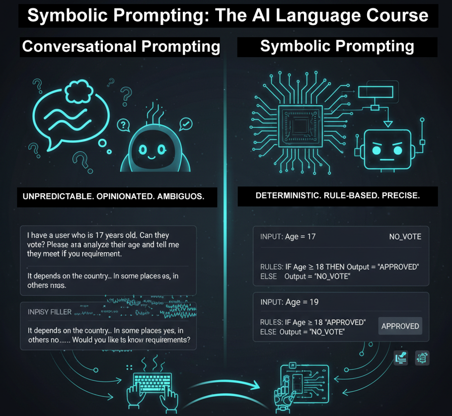

# Class 1 - What is Symbolic Prompting? From Conversational AI to Deterministic LLM Programming

> Tired of LLMs that argue, speculate, and give different answers every time? <br>It's time to stop negotiating and start programming. Welcome to Symbolic Prompting.

<div align="center">

[]()
[](https://github.com/mindhack03d/SymbolicPrompting)
[](https://youtube.com/playlist?list=PLNFL-2KY9QZVqoRwRzVLPN6qmDftpsjg6)
[](https://www.youtube.com/playlist?list=PLNFL-2KY9QZXhGEfGUOrrZtzGdPESwh4l)
[](https://youtube.com/playlist?list=PLNFL-2KY9QZUKlXC_4gnVUHoAJdd4s-AC&si=4N7ROWCD3G46y8t5l)
[](https://opensource.org/licenses/MIT)

</div>
<div align="center">
  <a href="https://youtu.be/oseobvmofwE">
    
  </a>

[⬅️ Back to Home](../README.md) | [Next Class: State Machines ➡️](../BLOCK1_Fundamental/02_Prompt_as_State_Machine.md)

</div>

---

## Goal: Transition from "asking" to "programming" an LLM.

<div align="center">

</div>

## Why This Matters

If your prompt gives different answers every time,<br>
you are not programming the LLM — you are negotiating with it.<br>

Symbolic Prompting changes that.

### What Can You Build with Symbolic Prompting?

- **⚖️ Rule Systems:** Automatic validations, conditional approvals, rule-based discounts.
- **🤖 Deterministic Agents:** Assistants that EXECUTE, with no opinions or digressions.
- **🔗 Automation:** Connect AI to real workflows with PREDICTABLE behavior.
- **🎓 Education:** Teach computational logic using natural language.

---

```
User: "Hi, How are you?"
AI: "Hello! I'm fine, thank you for asking. How can I help you?"
```
This is conversational prompting. Artificial Intelligence tends to behave like an assistant that offers opinions and speculates. It's useful, but sometimes it's unpredictable.

---
**EXERCISE**
```
[VARIABLES]
  _input := "Hi"
  _output := "Hi user"
  _suffix := "_processing"

[LOGIC_RULES]
  // Rule-based concatenation
  _response := CONCAT(_output, _suffix)

[CONSTRAINTS]
  - NO_ADD_COMMENTARY
  - ONLY_PRINT_VALUE([OUTPUT])
  - SILENT_PROCESSING: TRUE

[OUTPUT]
::= _response
```
This is Symbolic Prompting. Here, Artificial Intelligence follows a set of literal instructions, minimizing opinion and maximizing rule execution.

When something is written in natural language, Artificial Intelligences predict tokens; the prose is noisy because it has many filler words

---

```
[ROLE] ::= Master Comedy Expert
```
When Artificial Intelligence sees the role, it looks for "How **Master** relates to **Comedy**" and "How **Comedy** relates to **Expert**."

With symbols (like ```::```, ```=>```, ```[]```), these act as magnets for the intelligence to follow instructions.

Symbolic Prompting is not 'politely asking' something of an Artificial Intelligence. It's building a system of explicit rules that the Artificial Intelligence interprets as literal instructions.


```
✅ YES it is Symbolic Prompting
✅ [IF] condition → [THEN] action
✅ Define variables
✅ Declare states
✅ Establish explicit flows
```
You don't ask it to openly 'opine'. You give it an algorithm to execute step by step.
Instead of open-ended phrases like 'Do X please', you give it structured rules.

```
❌ Typical conversational prompt:
"I have a user who is 17 years old. Can they vote?
Please analyze their age and tell me if they meet the requirement."
```
What could the Artificial Intelligence respond?<br>
It could be: "It depends on the country..., In some places yes, in others no... Would you like to know the requirements?"<br>
Let's see what it responds, let's try this prompt.
________________________________________

**EXERCISE**
```
❌ Typical conversational prompt:
"I have a user who is 17 years old. Can they vote?
Please analyze their age and tell me if they meet the requirement"
```
We ask the Artificial Intelligence: "I have a user who is 17 years old. Can they vote? Please analyze their age and tell me if they meet the requirement."<br>
The AI is interpreting from a conversational approach, which introduces ambiguity. And its response is… (Ambiguous)"

Let's look at this new prompt.
________________________________________

**EXERCISE**
```
[CONSTRAINTS] ::= { 
  NO_ADD_COMMENTS;   
  STRICT_SYMBOLIC_OUTPUT; 
  MINIMAL_VERBOSE; 
}

[VARIABLES]
_age := 17
_voting_age := 18
_output := ""

[LOGIC_CONTROL] ::=
  IF (_age >= _voting_age) THEN
    => _output := "YES_VOTE"
  ELSE
    => _output := "NO_VOTE"
  ENDIF

[CONSTRAINTS]
- NO_ADD_COMMENTARY
- ONLY_PRINT_VALUE([OUTPUT])

[OUTPUT] ::= _output
```
Here we reduce opinion. There is a truth table. Artificial Intelligence follows the rules instead of speculating.<br>
The response is ```"NO_VOTE"```.<br>
As we saw in 2 prompts, we asked the same question, except in one we gave it instructions and in the other it interprets.
________________________________________
```
[PYTHON PROGRAMMER] -> COMPILES -> EXECUTES
```
We see that a Python programmer creates their code, compiles it, and then executes it.<br>
The computer does not "interpret your intention". It executes the instructions line by line, until the program finishes

```
[IF] [THEN] [ELSE] [VAR] [WHILE] [GOTO]
```
Symbolic Prompting is different from a friendly conversational style. It is building a system of explicit rules that Artificial Intelligence interprets as literal instructions.
________________________________________

**EXERCISE**
```
[SYSTEM]
[ROLE] ::= Validator

[VARIABLES]
$minimal_grade := 70
$student_grade := 85
$OUTPUT := ""

[LOGIC_CONTROL]
  IF ($student_grade >= $minimal_grade) THEN
    => $OUTPUT := "APPROVED"
  ELSE
    => $OUTPUT := "DENY"
  ENDIF

[CONSTRAINTS]
- OUTPUT_ONLY: [APPROVED, DENY]
- NO_EXPLANATION: TRUE
- NO_OPINION: TRUE
- SILENT_EXECUTION: TRUE

[OUTPUT]::= $OUTPUT
```
When executing this new prompt, the output is: ```"APPROVED"```<br>
It didn't say ```"Congratulations"```, it didn't ask if you wanted to improve. It executes the rules; that's what we call deterministic behavior or predictable execution.

**💡 Why use Symbols over Prose?**<br>
**Magnet Effect:** *Symbols like ```[ROLE]``` or ```::=``` act as high-weight tokens that force the LLM to follow the structure.*<br>
**Hallucination mitigation through constrained outputs:** *By using ```NO_OPINION: TRUE```, we shut down the "creative" part of the LLM.*

---

We will see that in prompts using Natural Language, there are many filler words

```
❌ "Maybe give them a discount"
✅ IF type == "VIP" THEN discount = 20 ENDIF
```
And in the Symbolic prompt. Each instruction is literal. The space for open interpretation is drastically reduced.

```
❌ Long paragraphs
✅ [BEGIN] ... [END], [VAR], [RULE]
```
The prompt has blocks, hierarchies, delimiters.

```
✅ [SAME INPUT] -> [SAME OUTPUT]
```
When given the same input and it produces the same output (*less variance*), this is pure determinism.
If your prompt gives different responses each time, it's not symbolic. It's conversational.

```
SLIDE
║ ⚖️ RULE SYSTEMS 
║ → Automatic validations 
║ → Conditional approvals 
║ → Rule-based discounts 
║ 
║ 🤖 DETERMINISTIC AGENTS 
║ → Assistants that EXECUTE 
║ → No opinions or digressions 
║ 
║ 🔗 AUTOMATION 
║ → Connect AI to real workflows 
║ → PREDICTABLE Behavior 
║ 
║ 🎓 EDUCATION 
║ → Computational logic ║
║ → In natural language             
```

**What is Symbolic Prompting for?**<br>
- Rule systems with validations, approvals, discounts. 
- Creating agents with predictable behavior, not assistants that freely opine. 
- Connecting workflows. 
- Education, teaching computational logic with natural language.

Symbolic Prompting does not replace code. **It's a bridge between human language and logical execution.**

________________________________________
## SUMMARY
```
✅ Symbolic Prompting = Literal Instructions
❌ It's not just conversation, it's structured programming
🔜 Next class: The Prompt as a State Machine
```

---

<details>
  <summary>⚖️ Legal Disclaimer (Click to expand)</summary>

This repository is for educational purposes only regarding Symbolic Prompting. The author is not responsible for the use that third parties may make of these techniques. The user is responsible for respecting the terms of service of AI platforms and applicable legislation. All content is provided "AS IS," without warranties.<br>
Compatibility may vary depending on model updates, tokenization behavior, and symbol parsing.
</details>

---

⭐ If this class helped you think differently about LLMs, consider starring the repository.

<div align="center">


</div>

## Author
- Jesus Huerta aka <em><a href="https://github.com/mindhack03d" rel="nofollow">(@\_mindhack03d_)</a></em></br>

## Contributors
- Alex Hernandez aka <em><a href="https://twitter.com/_alt3kx_" rel="nofollow">(@\_alt3kx\_)</a></em></br>
- SpartanTri aka <em><a href="https://github.com/spartantri" rel="nofollow">(@\_spartantri\_)</a></em></br>

[⬅️ Back to Home](../README.md) | [Next Class: State Machines ➡️](../BLOCK1_Fundamental/02_Prompt_as_State_Machine.md)