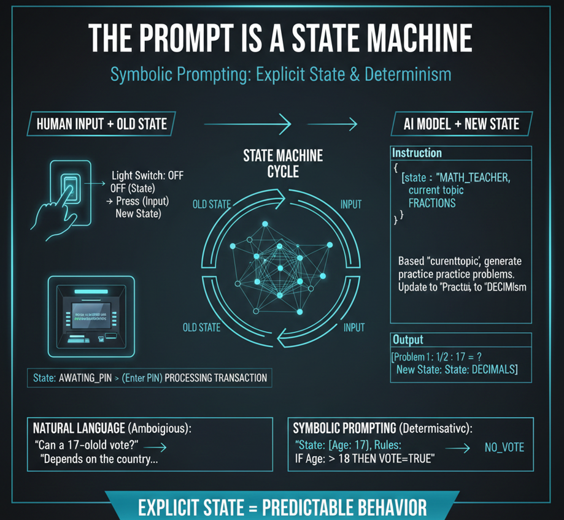

# Class 2 - The prompt as a State Machine | From Chat to Controlled LLM Workflows

> **Learn how to give your LLM a memory and control multi-step conversations.**
> 
In this class, we explore how Large Language Models (LLMs) can be modeled as state machines.  
By explicitly defining state, input, and transition logic, we can reduce behavioral variance and increase predictability in AI systems.

Understanding prompt-state architecture is fundamental for building deterministic AI workflows.

<div align="center">

[](https://github.com/mindhack03d/SymbolicPrompting)
[](https://github.com/mindhack03d/SymbolicPrompting)
[](https://youtube.com/playlist?list=PLNFL-2KY9QZVqoRwRzVLPN6qmDftpsjg6)
[](https://www.youtube.com/playlist?list=PLNFL-2KY9QZXhGEfGUOrrZtzGdPESwh4l)
[](https://youtube.com/playlist?list=PLNFL-2KY9QZUKlXC_4gnVUHoAJdd4s-AC&si=4N7ROWCD3G46y8t5l)<br>
[](https://opensource.org/licenses/MIT)
[](../Benchmark/benchmark_methodology.md)
[](../Benchmark/symbolic_support_test.md)
[](https://youtu.be/ey4t2T09L9I)


[⬅️ Class 1: What is Symbolic Prompting?](../BLOCK1_Fundamental/01_What_is_Symbolic_Prompting.md) | [🏠 Home](../README.md) | [Class 3: Normal vs. Atomic Tokens ➡️](../BLOCK1_Fundamental/03_Normal_vs_Atomic_Tokens.md)

</div>

---

<div align="center">
<center></center>
</div>

## What happens BETWEEN one prompt and the next?

If you don’t control the state, you don’t control the system.

**What happens between one PROMPT and the next?** <br>
Artificial Intelligence does not live in a vacuum. Each prompt transforms something. That 'something' is called STATE.


```
[LIGHT SWITCH - OFF] -> HAND PRESSES -> ON
```
You have a light switch that is off; if a hand presses it, then the light turns on. The same thing happens.

A state machine is any system that:<br>
• Has a current state<br>
• Receives an input<br>
• Changes to a new state<br>

And produces an output


```
CURRENT_STATE + INPUT → NEW_STATE + OUTPUT
```
- A traffic light. <br>
- An automatic door. <br>
- Your coffee maker. <br>
  
They are all state machines.

And your prompt too.

In computing, a State Machine is a model that can be in exactly one state at a time from a limited number of states.<br>
Think of an ATM:
1.	State: Waiting for Card.
2.	State: Asking for PIN.
3.	State: Processing Transaction.
The ATM cannot give you money if it hasn't first gone through the 'Asking for PIN' state. In Symbolic Prompting, we apply this same logical rigidity so that the AI does not skip critical processes.


```
[STATE] := EXPLAIN
[INPUT] := “What is a bicycle?”
```
Artificial Intelligence doesn't just "respond," it maintains a state. There is an expected output, a simple explanation.

```
[STATE] := RESUME
[INPUT] := “What is a bicycle?”
```
If we change the state, the behavior changes. It's still the same model, but with a different state, different behavior, yet it is being controlled.

```
[ROLE] ::= Math_Tutor
[STATE] ::= START_CLASS

Rules:
IF STATE == START_CLASS → Greet and introduce the topic
IF STATE == EXPLAIN → Explain concept in a simple way
IF STATE == GIVE_EXAMPLE → Show a practical example
IF STATE == ASK_QUESTION → Pose a question to the student
IF STATE == GIVE_FEEDBACK → Correct with a friendly explanation
```

When we have a prompt where we tell it that it is a math teacher, it has a flow of rules where it follows state by state. Such as: Start class, Explain, Give Examples, Ask Questions, Give Feedback. We can define more states.

Here you are the memory administrator. Artificial Intelligence only reads what you write to it.

## Why State Machines Matter in LLM Systems

Without explicit state:
- The model infers context
- Behavior drifts over time
- Multi-step workflows become unstable

With explicit state:
- Transitions are controlled
- Logic becomes traceable
- Debugging becomes possible

---

**EXERCISE**

Use this structure to see how the AI handles a variable-based state change without using conversational "fluff."

```
[SYSTEM]
[ROLE] ::=> Logic_Interpreter
[MODE] ::=> Strict_Symbolic

[VAR]
$light := "off"
$counter := 0

[LOGIC_CONTROL]
  _command := "on"
  IF (_command == "on") THEN
    => $light := "on"
    => $counter := $counter + 1
    => $OUTPUT := CONCAT("Light on. Times: ", $counter)
  ELSE
    => $OUTPUT := "Command not recognized"
  ENDIF

[CONSTRAINTS]
- NO_CONVERSATIONAL_FILLER
- ONLY_PRINT_VALUE([OUTPUT])
- SHOW_UPDATED_STATE: TRUE

[OUTPUT] ::= $OUTPUT
```
Here the state is EXPLICIT. The AI does not need to infer whether the light is on or off. You clearly define it for them.

Each prompt is a state machine CYCLE. You read the previous state, apply the input, calculate the new state, and send it back

---
```
   ┌──────────────────────────────────────┐
   │    THE PROMPT IS A STATE MACHINE     │
   └──────────────────────────────────────┘

              CURRENT STATE
   ┌─────────────────────────────┐
   │         STATE n             │
   │  (What the AI "remembers")  │
   └─────────────┬───────────────┘
                 │
                 ↓
   ┌──────────────────────────────┐
   │          INPUT               │
   │(Your prompt + previous state)│
   └─────────────┬────────────────┘
                 │
                 ↓
   ┌─────────────────────────────┐
   │           MODEL             │
   │ (Executes Symbolic Rules)   │
   └─────────────┬───────────────┘
                 │
                 ↓
   ┌─────────────────────────────┐
   │        NEW STATE            │
   │         STATE n+1           │
   └─────────────┬───────────────┘
                 │
                 └───────────┐
                             │
                 (Returns to the start
in the next prompt)
```
We define a state, which is used as input, the model processes the rule and returns a new state to us.<br>
This is a state machine. And this is Symbolic Prompting.

---
```
✅ [VAR] history: [...]
✅ [VAR] user_balance: 500
```
If you want the AI to 'remember', you must send it the state in EVERY prompt.

```
Same state + same input = very high probability of same output.
```
Same state + same input = very high probability of same output. If the state is explicit, we achieve almost deterministic behavior


Did the AI give an incorrect response? Check the state you sent it.. <br>
> *If the output is wrong, inspect the state.*<br>
> *If the behavior drifts, inspect the transitions.*<br>

If the AI gave an incorrect response in a well-structured flow, most of the time the error is in how we defined the rules or the state, not in a whim of the machine.

As mentioned earlier, in a prompt using natural language, the AI can give you different responses.<br>
Using Symbolic Prompting, you send it the same prompt multiple times and you will get consistent and predictable responses

---

## SUMMARY

```
✅ Every interaction with AI is a state machine
✅ YOU are the one who must maintain and send the state
✅ Explicit state = Deterministic behavior
```
Remember:

•	Every interaction with Artificial Intelligence is a state machine.<br>
•	You are the one who must maintain and send the state.<br>
•	Explicit state equals Deterministic behavior.<br>

> [!TIP]
>
> **If the output is wrong, inspect the state.**<br>
> Most errors in symbolic prompting are not the AI's "fault," but a flaw in the state or transition logic you provided.

---

<details>
  <summary>⚖️ Legal Disclaimer (Click to expand)</summary>

This repository is for educational purposes only regarding Symbolic Prompting. The author is not responsible for the use that third parties may make of these techniques. The user is responsible for respecting the terms of service of AI platforms and applicable legislation. All content is provided "AS IS," without warranties.<br>
Compatibility may vary depending on model updates, tokenization behavior, and symbol parsing.
</details>

---

⭐ If this class helped you think differently about LLMs, consider starring the repository.

<div align="center">


[](https://github.com/mindhack03d/SymbolicPrompting)
</div>

## Author
- Jesus Huerta aka <em><a href="https://github.com/mindhack03d" rel="nofollow">(@\_mindhack03d_)</a></em></br>

## Contributors
- Alex Hernandez aka <em><a href="https://twitter.com/_alt3kx_" rel="nofollow">(@\_alt3kx\_)</a></em></br>
- SpartanTri aka <em><a href="https://github.com/spartantri" rel="nofollow">(@\_spartantri\_)</a></em></br>

[⬅️ Class 1: What is Symbolic Prompting?](../BLOCK1_Fundamental/01_What_is_Symbolic_Prompting.md) | [🏠 Home](../README.md) | [Class 3: Normal vs. Atomic Tokens ➡️](../BLOCK1_Fundamental/03_Normal_vs_Atomic_Tokens.md)