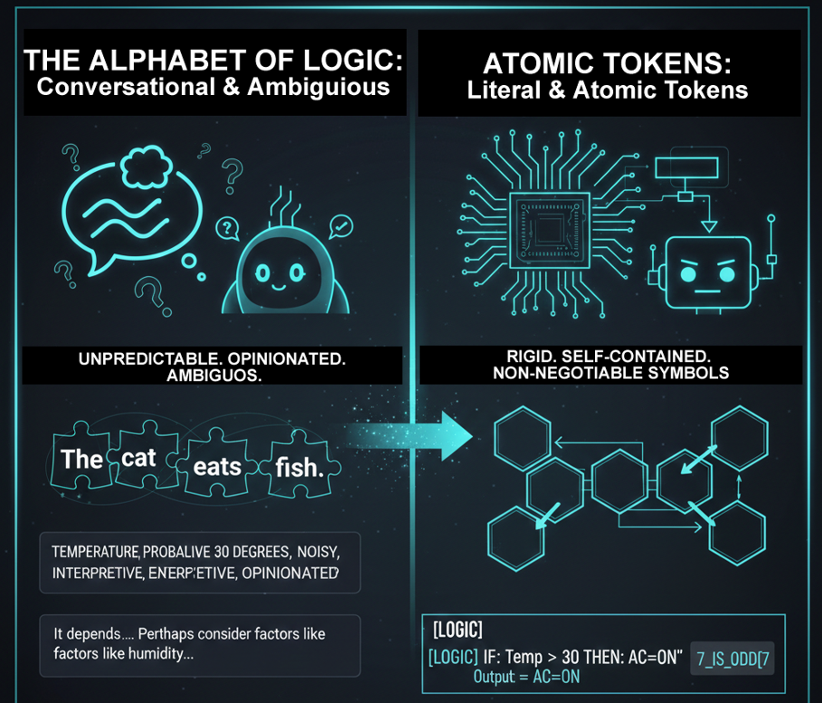

# Class 3 - Tokens: Normal vs. Atomic | The Physics of Prompting for Deterministic AI

> **The Physics of Prompting:** Learn how to switch the LLM from "Conversation Mode" to "Execution Mode" by manipulating token weights

**Forget everything you know about "talking" to AI. At its core, an LLM is a prediction engine, not a conversation partner. In this class, you'll learn the fundamental physics of prompting: how to manipulate tokens to flip the model's internal switch from probabilistic "Conversation Mode" to deterministic "Execution Mode."**

*Master the difference between **probabilistic linguistic tokens** and **deterministic atomic tokens** to reduce hallucination probability through structural constraint.*

<div align="center">

[]()
[](https://github.com/mindhack03d/SymbolicPrompting)
[](https://youtube.com/playlist?list=PLNFL-2KY9QZVqoRwRzVLPN6qmDftpsjg6)
[](https://www.youtube.com/playlist?list=PLNFL-2KY9QZXhGEfGUOrrZtzGdPESwh4l)
[](https://youtube.com/playlist?list=PLNFL-2KY9QZUKlXC_4gnVUHoAJdd4s-AC&si=4N7ROWCD3G46y8t5l)
[](https://opensource.org/licenses/MIT)

</div>
<div align="center">
  <a href="https://youtu.be/GLbE2p0Zcw8">
    
  </a>

[⬅️ Class 2: State Machines](../BLOCK1_Fundamental/02_Prompt_as_State_Machine.md) | [🏠 Home](../README.md) | [Class 4: ROLE Syntax ➡️](../BLOCK2_Syntax_Roles/04_Roles_Definition.md)

</div>


---
<div align="center">

</div>

### A Crucial Distinction: Semantic Atomicity

It's vital to understand: `[IF]` is not a single, magical token created by AI. To the tokenizer, the characters `[`, `I`, `F`, and `]` are broken down just like any other text (e.g., into `[`, `IF`, `]`).

So why do we call it "atomic"? Because the **combined semantic unit** —the symbolic structure `[IF]`— acts as a single, indivisible *instruction* to the model. The model has learned from millions of code and logic examples that this sequence of tokens signals the start of a conditional block. It's the *pattern* that is atomic, not the tokenization itself.

---

```
"If the user is VIP, give them 20%"
VS
[IF] type == "VIP" [THEN] discount = 20
```
Both phrases SAY the same thing. But the AI PROCESSES them in a radically different way. The answer lies in TOKENS


```
The cat eats fish
```
In this example prompt, we can read that "```the cat eats fish```". But how is this broken down?

```
["The", "cat", "eats", "fish"]
(or subword versions: ["The", "ca", "t", "eat", "s", "fi", "sh"])
```
The phrase breaks into pieces like a puzzle. ```THE, Cat, Eats, Fish```. It could even be different: ```"THE", "CA", "T", "EA", "TS", "FI", "SH"...```

A token can be a word, a letter, or even a space.

A normal token is linguistic. If I write '```Please, try to analyze...```', the AI uses its probabilistic database to understand what comes next.

The problem is that normal words can have different meanings and generate noise. The AI spends computational energy trying to understand the tone or politeness of your phrase instead of executing the task. Furthermore, a single long word can fragment into 3 or 4 tokens, which also fragments the model's attention.

## What Is a Token (Technically)?

In transformer-based LLMs, a token is a discrete unit produced by a tokenizer (e.g., BPE or SentencePiece).<br>
The model does not reason in words.<br>
It predicts the next token in a probability distribution.<br>
Prompt engineering is therefore distribution engineering.<br>

---

```
NORMAL TOKEN: "Could you tell me if the user can vote please"
📌 AMBIGUOUS: Multiple interpretations
📌 CONTEXTUAL: Their meaning DEPENDS on the environment
📌 PROBABILISTIC: The AI predicts among options
📌 BROAD VECTOR SPACE: They activate MANY regions
```

These are NORMAL tokens. We can see them as a set of separate words searching for meaning.<br>
It can sometimes be ambiguous; the meaning of each word can change depending on the environment; Artificial Intelligence calculates probabilities over a wide range of possibilities, activating many regions of the model.<br>
When using normal tokens, Artificial Intelligence enters CONVERSATION MODE. It interprets, negotiates, opines.

```
ATOMIC TOKEN: [IF] [THEN] [ELSE] [VAR] [WHILE] [GOTO] ::=>
📌 LITERAL: [IF] ALWAYS means condition. No maybes.
📌 ISOLATED: FIXED meaning. Does not depend on colloquial context.
📌 DETERMINISTIC: The AI RECOGNIZES the pattern. It does not speculate, it executes.
📌 NARROW VECTOR SPACE: Activates CODE regions. Formal Logic, not conversation.
```
This is an atomic token. They are rigid, self-contained, non-negotiable symbols.<br>
In this example, ```IF``` always means condition. Artificial Intelligence drastically reduces its options because it recognizes a code pattern. It activates regions associated with **'formal logic'** instead of *'conversation'*.<br>
When you use atomic tokens, the AI switches modes. It enters **EXECUTION MODE**. It stops interpreting and starts processing.

Why are they better?
1.	They are not confused with natural language. When the AI sees ```[LOGIC]```, it is not reading a word; it is detecting a high-hierarchy placeholder.
2.	These symbols force the AI architecture to assign maximum attention weight to what comes after the symbol.
3.	The symbol does not change meaning according to context. It is always a structural anchor.

## Atomic Tokens are not a different tokenizer class.

They are deliberately chosen symbolic markers that:
- Reduce semantic ambiguity
- Collapse possible continuations
- Bias the model toward structured completion patterns
---

> The model's "prediction energy" is spread across dialogue and opinion regions.

```
Prompt: "If the temperature is greater than 30 degrees,
maybe we should turn on the air conditioning"

🧠 Activation: 
[Dialogue] ████████░░
[Opinion]  ██████░░░░
[Logic]    ███░░░░░░░
```
If we send the prompt "```If the temperature is above 30 degrees. Maybe, I should turn on the air conditioning?```"<br>
We see that dialogue increases, opinion as well, but logic is minimal.

> The energy collapses into the logical execution pathways.

```
[GLOBAL_VAR] temperature: 32
[RULE] 
  limit: 30
  IF temperature > limit THEN:
    OUTPUT := "TURN_ON_AC"
  ENDIF

🧠 Activation:
[Dialogue] ██░░░░░░░░
[Opinion]  █░░░░░░░░░
[Logic]    ████████░░
```
In the prompt with natural language we are asking about a state and the AI issues an opinion; in this case, we define a state, a condition. As we can see, the dialogue and opinion are minimal, and the logic is more active than in the previous prompt.


---

**EXERCISE**
```
"I have a number: 7. Is it even or odd?"
```
When sending this prompt, we can see that the response is .... (*SEE YOUR PROMPT*)<br>
It responded correctly, but added extra information by default. It offered more than what we requested.
________________________________________

**EXERCISE**
```
[VAR]
$number := 7

[LOGIC_CONTROL]
IF ($number % 2 == 0) THEN
=> $OUTPUT := "EVEN"
ELSE
=> $OUTPUT := "ODD"
ENDIF

[CONSTRAINTS]
- NO_ADD_COMMENTARY
- ONLY_PRINT_VALUE([OUTPUT])

[OUTPUT] ::= $OUTPUT
```
Let's look at this prompt, it executes. And we are asking the same question, same base response. But it didn't opine, it didn't add extra comments, no ambiguity.

We can see that in both cases, the same question was asked. In one, it opines and gives more information than needed. In the other, it only gives the answer

---

```
✅ Atomic Token = Pure Output
❌ It doesn't explain, doesn't suggest, doesn't opine
```
An atomic token provokes a pure output. The response we get does not explain, does not suggest, does not digress

```
"Same input → Same output (with less variance)"
```
Same input → Same output with less variance.

```
"Can you mix normal and atomic tokens in the same prompt?"
```
You can mix normal and atomic tokens in the same prompt. Yes, of course.<br>
Remember: 
- Use normal tokens for human instruction
- Use atomic tokens for machine execution.

```
Atomic Tokens are NOT secret commands. What are they? Statistical Linguistics
```
Atomic tokens are not secret commands. They are patterns that the model learned from different sources, such as: documentation, pseudo-code, programming language, etc.

It's linguistics.

Understanding the difference between normal and atomic tokens is what allows you to DESIGN prompts, not just WRITE them

## Why Atomic Structure Works

Transformers are trained heavily on:
- Source code
- Technical documentation
- Structured syntax
- Markup languages

When a prompt resembles these formats,
the model statistically continues in that pattern.

Symbolic Prompting exploits training distribution priors.

---

## SUMMARY

|NORMAL TOKEN | ATOMIC TOKEN |
| :--- | :---|
|Conversation | Instruction |
|Ambiguous |Literal |
|Opines |Executes |
|Speech Bubble 🗣️ |Gear ⚙️ |

Let's summarize: a normal token is conversational and an atomic token is literal.<br>
Normal is ambiguous and atomic is literal.<br>
Among the most important: the normal token tends to generate conversation, while the atomic token tends to generate direct execution.

Atomic tokens are the alphabet of Symbolic Prompting. Remember, this is not magic, it's statistical linguistics.<br>
We are not 'teaching' a new language to the machine; we are taking advantage of the patterns it already learned during its training with code, technical documentation, and formal logic.


---

<details>
  <summary>⚖️ Legal Disclaimer (Click to expand)</summary>

This repository is for educational purposes only regarding Symbolic Prompting. The author is not responsible for the use that third parties may make of these techniques. The user is responsible for respecting the terms of service of AI platforms and applicable legislation. All content is provided "AS IS," without warranties.<br>
Compatibility may vary depending on model updates, tokenization behavior, and symbol parsing.
</details>

---

⭐ If this class helped you think differently about LLMs, consider starring the repository.

<div align="center">


</div>

## Author
- Jesus Huerta aka <em><a href="https://github.com/mindhack03d" rel="nofollow">(@\_mindhack03d_)</a></em></br>

## Contributors
- Alex Hernandez aka <em><a href="https://twitter.com/_alt3kx_" rel="nofollow">(@\_alt3kx\_)</a></em></br>
- SpartanTri aka <em><a href="https://github.com/spartantri" rel="nofollow">(@\_spartantri\_)</a></em></br>

[⬅️ Class 2: State Machines](../BLOCK1_Fundamental/02_Prompt_as_State_Machine.md) | [🏠 Home](../README.md) | [Class 4: ROLE Syntax ➡️](../BLOCK2_Syntax_Roles/04_Roles_Definition.md)