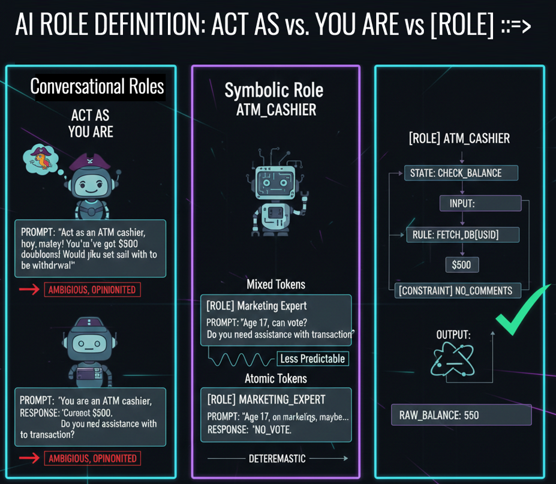

# Class 4 - ROLE Definition ... The Truth About AI Roles | From "Act As" to Symbolic Function Assignment

> **The Probability Filter:** Stop pretending and start assigning. Learn why **[ROLE] ::=>** FUNCTION is the backbone of predictable AI systems.

**Most prompt engineers treat AI roles like a costume. In Symbolic Prompting, we treat them like a function signature.** In this class, you'll move beyond ```"Act as"``` and ```"You are"``` to master ```[ROLE]``` as a probability filter, transforming how your LLM behaves from the ground up.

<div align="center">

[](https://github.com/mindhack03d/SymbolicPrompting)
[](https://github.com/mindhack03d/SymbolicPrompting)
[](https://youtube.com/playlist?list=PLNFL-2KY9QZVqoRwRzVLPN6qmDftpsjg6)
[](https://www.youtube.com/playlist?list=PLNFL-2KY9QZXhGEfGUOrrZtzGdPESwh4l)
[](https://youtube.com/playlist?list=PLNFL-2KY9QZUKlXC_4gnVUHoAJdd4s-AC&si=4N7ROWCD3G46y8t5l)<br>
[](https://opensource.org/licenses/MIT)
[](../Benchmark/benchmark_methodology.md)
[](../Benchmark/symbolic_support_test.md)
[](https://youtu.be/Ohjqsvd_hkI)


[⬅️ Class 3: Tokens](../BLOCK1_Fundamental/03_Normal_vs_Atomic_Tokens.md) | [🏠 Home](../README.md) | [Class 5: Variables & State ➡️](../BLOCK2_Syntax_Roles/05_Variables_and_State.md)

</div>

---

<div align="center">

</div>

---

In this class we will talk about how to define a ROLE in Symbolic Prompting, using what we have learned in the previous classes.

---

```
"Act as Marketing Expert"
VS
"Your are Marketing Expert"
VS
[ROLE] ::=> Marketing Expert
VS
[ROLE] ::=> Marketing_Expert
```
Before defining the ```ROLE```, we need to see what the main differences are between ```"Act as"```, ```"You are"```, and defining a ```ROLE``` in symbolic using natural language and atomic tokens.

In the world of LLMs, the ```ROLE``` is not just a personality; it's a probability filter.<br>
If you ask the AI to be a 'Pirate', it will use words associated with the sea. If you ask it to be a 'Scientist', it will use technical terms.

But in Symbolic Prompting, we don't just want the AI to 'sound' like someone; we want it to operate under certain restrictions and protocols. Today we'll see how to go from a simple instruction to a professional instance definition

## ROLE as a Distribution Constraint

In transformer-based LLMs, a role definition modifies the conditional probability distribution of next-token prediction.

It does not "become" something.

It re-weights likely continuations.

[ROLE] syntax reduces ambiguity by:
- Collapsing semantic spread
- Anchoring continuation patterns
- Reducing stylistic variance

---


|SYNTAX	|PROMPTING TYPE| Operating Mechanism| NOISE LEVEL |
|:-- | :-- | :-- | :-- |
|"Act as Marketing Expert"| (Conversational) | The AI tries to "imitate" a person. | Tends to be too polite or redundant. |
|"You are Marketing Expert"| Conversational<br>(Directive)|Identity declaration.|It improves the authority of the tone, but does not structure the data output.|
|[ROLE] ::=> Marketing Expert|Symbolic<br>(Semantic)|It indicates to the LLM that [ROLE] is a system variable that now contains the value "Marketing Expert".|It removes the "personality" layer|
|[ROLE] ::=> Marketing_Expert|Symbolic<br>(Tokenized)|It calls the function that is Marketing_Expert.|It is the purest form of assignment.|

**```ACT AS ...```** Request based on ROLE play. Artificial Intelligence tries to imitate a person. Tends to be too polite or redundant.

**```YOU ARE ...```** Declares an identity. It's a bit firmer than ACT AS, but still operates under next-word probability.

**```[ROLE] Marketing Expert```** with blank spaces. It indicates to the AI that there is a variable called ROLE that now contains a value. While it removes the identity layer, we are mixing atomic tokens and normal tokens. **Which is not always so good**.

**```[ROLE] MARKETING_EXPERT```** with (underscore). It uses atomic tokens, preventing Artificial Intelligence from getting distracted between words. It activates a set of predictable behaviors associated with that identifier, obtaining exactly what is needed. It is the purest form of assignment

---

```
❌ "Act as ATM Cashier"
📌 IMITATION: The AI simulates being something it IS NOT
📌 FLEXIBLE: It can break character if the user asks something outside the role
📌 OPINION ALLOWED: The actor can improvise and add extra comments
📌 AMBIGUITY: Where does the role end and the AI begin?
```
**```Act as```**... The most common instruction. What are you really telling the AI?<br>
It has to simulate, be flexible with its character, express opinions, and improvise. <br>
But the question is: **Where does the ROLE end and Artificial Intelligence begin?**

```
Human: "Act as ATM Cashier. ¿How much do I have?"
IA: "I don't have access to your real account, but if you had $1000..."
```
I tell it to "```ACT AS ATM CASHIER and tell me how much I have.```"<br>
To which the AI gives a simulated response, expressing opinions and being flexible with its character.

---

```
❌ "You are ATM Cashier"
📌 AFFIRMATION: The AI doesn't "interpret," it "is" (At least in appearance)
📌 LESS FLEXIBLE: Harder to break character, but it CAN be broken
📌 NO WARNING: It doesn't say "this is a simulation." The user believes it's real.
📌 PERSISTENCE: It maintains the role in the conversation (As long as it's not confused)
```
**```YOU ARE```**. It seems stronger than **ACT AS**, but is it?<br>
You are assigning an IDENTITY. Not for it to **ACT** like, but to BE.<br>
It becomes a little less flexible<br>

```
Human: "You are ATM Cashier. How much do I have"
IA: "I cannot access real bank accounts.
Do you want us to simulate an example balance?"
```
If we ask it the same question.<br>
It's still not real. Eventually, the fictitious identity reveals itself..

---

```
[ROLE] ::=> ATM Cashier
[ROLE] ::= BEHAVIOR_ASSIGNMENT
📌 BEHAVIOR: It DOES something (like a person)
📌 LITERAL: Atomic token + normal tokens "Marketing" and "Expert" are interpreted separately
📌 NO METACONSCIOUSNESS: It executes, but... with semantic influence
📌 DETERMINISM: Relative (somewhat predictable)
```
You don't tell it what it "is," you tell it what it "DOES." The model doesn't care about a fictitious identity; it cares about the set of instructions it must follow. It doesn't reflect on its personality, it just executes the rules.

This is NOT personification. This is FUNCTION ASSIGNMENT, however, when mixing Normal Tokens and Atomic Tokens, the resulting behavior can resemble that of a person conversing more than that of a system executing rules.

> Symbolic ROLE assignment is not identity simulation.<br>
> It is behavior constraint.

---

The role is an ATM Cashier, it has a balance of 500. And this returns the balance to us, without omitting opinion.
The AI is not a cashier. The AI EXECUTES cashier instructions. There is no fiction, there are PROCESSES

```
[ROLE] ::=> MARKETING_EXPERT
[ROLE] ::= SYSTEM_ASSIGNMENT
📌 BEHAVIOR: It DOES something (as a system)
📌 LITERAL: PURE Atomic token. "MARKETING_EXPERT" as a SINGLE unit
📌 NO METACONSCIOUSNESS: It executes without hesitation
📌 DETERMINISM: Absolute
```
In this case, the role is defined with atomic tokens thanks to the use of underscores (```MARKETING_EXPERT``` instead of '```MARKETING EXPERT```').<br>
The underscores convert a phrase into a single token or a rigid symbolic unit, preventing the AI from analyzing the semantic relationship between '```Marketing```' and '```Expert```' separately. Thus, it processes it as a unique identifier and not as a description.

Why? Because, although in the previous example it already has a determined function, when mixing natural language as a function, it enters the relationship of "How **ATM** relates to **CASHIER**". And we don't want that.

Let's look at some examples.

---

**EXERCISE**
```
PROMPT : Act as an age validator. 
USER : 17 years old. Can they vote?
```
We are telling it ```"ACT AS"```, that the person is 17 years old and if they can vote.
As we can see, the response will depend on the opinion it gives.

---

**EXERCISE**
```
PROMPT : You are an age validator. 
USER : 17 years old. Can they vote?
```
We are telling it ```"YOU ARE"```, and asking the same question.
While the response may vary from the previous one, it still offers opinions.
________________________________________

**EXERCISE**
```
[ROLE] ::=> Age Validator
minimum_age: 18
user_age: 17

IF user_age >= minimum_age THEN:
  OUTPUT "APPROVED"
ELSE:
  OUTPUT "REJECTED"
ENDIF
```
We can see that the response is different, based on states and conditions. The big difference from prompts where we say ```"ACT AS"``` or ```"YOU ARE"``` is that here we are defining conditions.<br>
Although in this example, it still emits comments.

---

**EXERCISE**
```
[ROLE] ::=> Age_Validator
minimum_age: 18
user_age: 17

IF user_age >= minimum_age THEN:
  [OUTPUT] ::= "APPROVED"
ELSE:
  [OUTPUT] ::= "REJECTED"
ENDIF

[CONSTRAINTS]
- NO_CONVERSATIONAL_FILLER
- ONLY_PRINT_VALUE([OUTPUT])
- STRICT_TYPE_CHECKING: TRUE
```
Now let's see what a prompt looks like without comments. It's a clean result, without comments, without opinions. Only what we need to know.

---

## Why ROLE Structure Matters in Systems

In simple prompting, a role influences tone.<br>
In system design, a role constrains output class.<br>
That difference determines whether your AI:<br>
- Talks<br>
or<br>
- Operates

---

## SUMMARY

|METHOD | NATURE | OUTPUT | USE |
|:--- | :--- | :--- | :--- |
|ACT AS | Interpretation |Opinion |Creative |
|YOU ARE | Identity |Explanation |Consistent |
|[ROLE] | Function |Execution |Symbolic |

- Use ```ACT AS``` when: You want to experiment with personalities, The content is creative (stories, dialogues), Precision is NOT critical
- Use ```YOU ARE``` when: you want conversational consistency, You need it to maintain a specific tone, Some flexibility is acceptable
- Use ```[ROLE] ::=> ``` in Symbolic Prompting when you want determinism, you are building a system, the output must be processable.

---

> [!TIP]
> **See for yourself!** Copy this prompt and ask your favorite LLM:<br>
> 
> ```Using Symbolic Prompting, what is the main difference between defining a role as "Marketing Expert" vs. "Marketing_Expert"?```<br>
> 
> The answer will reveal how the model interprets semantic units vs. individual words.

---

<details>
  <summary>⚖️ Legal Disclaimer (Click to expand)</summary>

This repository is for educational purposes only regarding Symbolic Prompting. The author is not responsible for the use that third parties may make of these techniques. The user is responsible for respecting the terms of service of AI platforms and applicable legislation. All content is provided "AS IS," without warranties.<br>
Compatibility may vary depending on model updates, tokenization behavior, and symbol parsing.
</details>

⭐ If this class helped you think differently about LLMs, consider starring the repository.

<div align="center">


<br>


</div>

## Author
- Jesus Huerta aka <em><a href="https://github.com/mindhack03d" rel="nofollow">(@\_mindhack03d_)</a></em></br>

## Contributors
- Alex Hernandez aka <em><a href="https://twitter.com/_alt3kx_" rel="nofollow">(@\_alt3kx\_)</a></em></br>

[⬅️ Class 3: Tokens](../BLOCK1_Fundamental/03_Normal_vs_Atomic_Tokens.md) | [🏠 Home](../README.md) | [Class 5: Variables & State ➡️](../BLOCK2_Syntax_Roles/05_Variables_and_State.md)