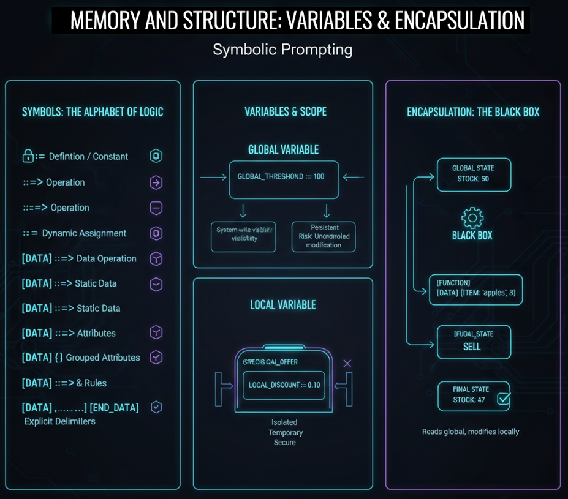

# Class 5 - Variables and State (Global / Local + Encapsulation) | Variables in LLM Prompt Engineering

> **Beyond Context:** Learn to build persistent memory using **Global Constants** and **Encapsulated Local Variables**. Stop the "Information Leak" and start building stateful systems.

## 🏗️ Putting It All Together: Building a Stateful System

**Without variables, your AI has amnesia.** Every prompt is a new conversation, a new interpretation. In this class, you'll learn to build persistent memory into your prompts using Global and Local variables, and protect your logic with Encapsulation.

<div align="center">

[]()
[](https://github.com/mindhack03d/SymbolicPrompting)
[](https://youtube.com/playlist?list=PLNFL-2KY9QZVqoRwRzVLPN6qmDftpsjg6)
[](https://www.youtube.com/playlist?list=PLNFL-2KY9QZXhGEfGUOrrZtzGdPESwh4l)
[](https://youtube.com/playlist?list=PLNFL-2KY9QZUKlXC_4gnVUHoAJdd4s-AC&si=4N7ROWCD3G46y8t5l)
[](https://opensource.org/licenses/MIT)

</div>

<div align="center">
  <a href="https://youtu.be/6dTr5TPKNEU">
    
  </a>

[⬅️ Class 4: ROLE Definition](../BLOCK2_Syntax_Roles/04_Roles_Definition.md) | [🏠 Home](../README.md) | [Class 6: IF-THEN-ELSE ➡️]() *Coming Mar 10/2026*

</div>

---

<div align="center">

</div>

## Why Variables Matter in AI Systems

Without structured variables:
- The model must reinterpret the entire context each time.

With structured variables:
- You compress meaning into stable symbolic anchors.

Compression reduces ambiguity.
Reduced ambiguity reduces variance.
Reduced variance increases predictability.

## What "Global" Really Means in LLMs

A global variable is not system memory.

It is a high-visibility symbolic declaration placed early in the prompt,
increasing its conditioning weight across the entire generation.

Scope is positional influence, not true memory allocation.

---

We have already seen how to define identity. But a processor without memory is like a calculator without an equals button: it operates, but it doesn't remember.<br>
In Symbolic Prompting, a variable is not just a word; it is a state container. It allows us to label information so that the AI doesn't have to 're-read' the entire context, but simply consult the value we have stored.

Before diving into variables and encapsulation, we need to look at some symbols that are important for symbolic prompting..

---

## 📖 Symbol Reference Card

Before we dive deep, here's a quick reference of the symbols we'll be using. <br>
**Don't memorize this now**—bookmark it and come back when you see a symbol in an example.

|Sign / Syntax |Meaning |What is it used for? (Practical Use) |
| :--- | :--- | :--- |
|```::=``` |Strict Definition |Establishes a rule or value that "should not" change.|
|```::=>``` |Behavior Assignment |Indicates an active function or role. |
|```:=``` |Variable Assignment |Assigns a dynamic or temporary value to a label |
|```[DATA] ::=>``` |Data Action Call |Indicates that a specific action should be executed using the data block that follows. |
|```[DATA] ::=``` |	Content Declaration |Defines the body of information that the model will work with. |
|```[DATA] { ... }``` |Encapsulation / Object |Groups attributes or properties related to a concept within curly braces. |
|```[DATA] ::=> { ... }``` |Complex Logic Definition |Used to open a block where processing rules that will be applied to a set of data are defined. |
|```[DATA] { } [END_DATA]``` |Block Delimitation |Marks the exact beginning and end of a body of information. |

-	```::=``` means: Definition / Constant. Establishes a rule or value that "should not" change.
-	```::=>``` Indicates an operation that must be executed.
-	```:=``` Dynamic assignment. Assigns a value that can change.
-	```[DATA] ::=>``` Indicates that a specific action should be executed using the data block that follows.
-	```[DATA] ::=``` Defines the start of a static data container.
-	```[DATA] {}``` Groups related attributes within curly braces, like an object.
-	```[DATA] ::=> {..}``` A data block that also has associated processing rules.
-	```[DATA] {...} [END_DATA]``` Explicit delimiters that tell the AI: 'Here the information begins' and 'Here it ends', preventing it from mixing with subsequent instructions.

---

```
_user := "Ana"
_balance := 500
_attempts := 0
📌 NAME: Unique identifier (user, balance, counter)
📌 VALUE: Stored data ("Ana", 500, true)
📌 STATE: The set of ALL variables at a given moment
```
Let's dive into variables.

A symbolic variable is a named container. It stores a value that the AI can READ and MODIFY.<br>
Variables have a name, a value is assigned to them. And a state within the set of all variables

```
[GLOBAL_VARS] 
$USER_NAME ::= "Carlos" 
$SPEAK_LANGUAGE ::= "ES" 
$USER_AGE ::= 18
📌 SCOPE: VISIBLE throughout the entire system.
📌 PERSISTENCE: Lives as long as the CONTEXT lasts
📌 RISK: ANY function can MODIFY them
```
A global variable is visible throughout the entire execution. Any function, any sub-module, any rule can access the global variable.<br>
It is recommended to define them at the beginning so as not to affect the behavior of the prompt. They are constants.

Their characteristics: scope throughout the entire system, they last as long as the context lasts, there is a risk and that is that they can be modified during the flow of the prompt


```
[GLOBAL_VARS] $discount_rate ::= 10

[FUNCTION] calculate_price(base)
  RETURN base * (1 - $discount_rate / 100)
[ENDFUNCTION]

[FUNCTION] apply_promotion()
  [UPDATE_TRIGGER] ::=> $discount_rate ::=> 20
[ENDFUNCTION]
```
Useful for global configuration. Dangerous if any function modifies them without control.

```
⚠️ GLOBAL = visible to EVERYONE
⚠️ Use it for values that do NOT change or change RARELY
```

```
[VAR] _base_rate := 5
OR
_base_rate := 5
📌 ISOLATION: They do not contaminate the rest of the system
📌 TEMPORARY: They are born and die with the function
📌 SECURITY: No one external can alter them
```
A local variable only exists within the function. Outside of it, no one can see them or they cannot be used.

```
[GLOBAL_VARS] $discount ::= 10

[FUNCTION] special_offer()
  _local_discount := 50
  RETURN _local_discount
[ENDFUNCTION]

[FUNCTION] normal_price()
  RETURN $discount
[ENDFUNCTION]

[PROCESS]
  IF (special_offer() > $discount) THEN
    $discount_applied = “YES”
  ELSE
   $discount_applied = “NO”
  ENDIF

[OUTPUT] “The discount applied: “ + $discount_applied 
```
The variable "local discount" lives only inside special_offer. Outside, it cannot be modified. This is what the difference between a Global and Local variable looks like.


```
✅ LOCAL = pure encapsulation
✅ No side effects
```

```
┌──────────────────┐
│   [FUNCTION]     │
│  ┌────────────┐  │
│  │  [LOCAL]   │  │ input → │   ?   │ → Output
│  │  [LOCAL]   │  │
│  └────────────┘  │
└──────────────────┘
```
Encapsulation is the principle that a function should be a BLACK BOX. Whoever calls it does NOT need to know HOW it does what it does, only WHAT it does.

```
❌ 
[GLOBAL_VARS] $rate ::= 0.30
[FUNCTION] calculate_tax(base)
   $rate ::= 0.21
   RETURN base * $rate
[ENDFUNCTION]

✅ 
[GLOBAL] $tax_rate ::= 0.21
[FUNCTION] calculate_tax(base)
  _local_rate := $tax_rate
  RETURN base * _local_rate
[ENDFUNCTION]
```
The function READS the global, but does NOT modify it. It respects isolation. It is PREDICTABLE.<br>
Although it's a short example, when dealing with small functions or small encapsulations, it's not so good to use global variables; it's better to use locals.

If the prompt is going to be large with different functions or encapsulations, then it's good to define both global and local variables.

________________________________________

**EXERCISE**
```
[GLOBAL] 
$inventory ::= {
  "apples": 50,
  "pears": 30,
  "oranges": 20
}
$reorder_threshold ::= 10

[CONSTRAINTS]
- NO_CONVERSATIONAL_FILLER
- ONLY_PRINT_VALUE([OUTPUT])
- STRICT_TYPE_CHECKING: TRUE

[FUNCTION] check_stock(product)
  _stock := $inventory[product]
  IF _stock == undefined THEN:
    RETURN 0
  ELSE:
    RETURN _stock
  ENDIF
[END_FUNCTION]

[FUNCTION] sell(product, quantity)
  _current_stock := check_stock(product)
  IF _current_stock >= quantity THEN:
    $inventory[product] ::= _current_stock - quantity
    IF $inventory[product] < $reorder_threshold THEN:
      PRINT "WARNING: Low stock for " + product
    ENDIF
    RETURN "SALE_SUCCESSFUL"
  ELSE:
    RETURN "INSUFFICIENT_STOCK"
  ENDIF
[END_FUNCTION]

[PROCESS]
  PRINT "Initial_State: " + check_stock("apples") // 50
  _result := sell("apples", 45)
  PRINT "Final_State: " + _result // SALE_SUCCESSFUL
  PRINT "Full Output: " + check_stock("apples") // 5 (Trigger Low Stock)
[END_PROCESS] 
```
We see the results: check_stock returns 50 apples to us.<br>
The next function sells 3 apples.<br>
And the final state returns 47 apples to us.

As we can see, this is no longer just a prompt. This is a PROGRAM written in symbolic prompting. We have given the AI variables, scopes, and operations.<br>
In this example, we could see how local and global variables are defined.<br>
Likewise, both local and global variables are modified.

## Important: This Is Simulated State

LLMs do not execute code.

They pattern-match structured logic
and generate statistically consistent continuations.

Symbolic Prompting increases the probability
that the model behaves as if it were executing structured logic.

---

## SUMMARY

```
✅ Rates, thresholds, system constants
❌ Counters, temporaries, volatile values
```
For global variables, it is better to define thresholds, system constants. Try not to modify them.<br>
Avoid using counters, temporary variables.

```
✅ Internal calculations, temporary values
❌ State that must persist between calls
```
Use it within functions or encapsulations; remember it can only be used inside these..

```
✅ [FUNCTION] ... [END_FUNCTION]
✅ [Encapsulation] { encapsulation }
```
Every time you define a function or an encapsulated block, establish a clear closing delimiter (like ```[END_FUNCTION]``` or simply an explicit separation line). This prevents the AI from 'spilling' the instructions from one block into the next.

### Summary: Variables & Scope

- **📦 VARIABLES**
    - 🌍 **GLOBAL:** Visible to everyone. Use for constants, config.
    - 🏠 **LOCAL:** Private to a function. Use for temporary calculations.
- **🧠 ENCAPSULATION**
    - 📖 **Read functions:** Safely access data.
    - ✍️ **Controlled write functions:** Modify state with clear logic.

You already have memory. You already have scopes. You already have encapsulation. Now you need your program to MAKE DECISIONS.

---
> [!TIP]
> 
> **A Quick Syntax Reminder:**
> - **Local Variable:** `_my_local_var := value`
> - **Global Constant:** `[GLOBAL] $MY_CONSTANT ::= value`
> - **Global Array/Object:** `[GLOBAL] $my_array ::= ["A", "B", "C"]`

---

<details>
  <summary>⚖️ Legal Disclaimer (Click to expand)</summary>

This repository is for educational purposes only regarding Symbolic Prompting. The author is not responsible for the use that third parties may make of these techniques. The user is responsible for respecting the terms of service of AI platforms and applicable legislation. All content is provided "AS IS," without warranties.<br>
Compatibility may vary depending on model updates, tokenization behavior, and symbol parsing.
</details>

---

⭐ If this class helped you think differently about LLMs, consider starring the repository.

<div align="center">


<br>


</div>

## Author
- Jesus Huerta aka <em><a href="https://github.com/mindhack03d" rel="nofollow">(@\_mindhack03d_)</a></em></br>

## Contributors
- Alex Hernandez aka <em><a href="https://twitter.com/_alt3kx_" rel="nofollow">(@\_alt3kx\_)</a></em></br>
- SpartanTri aka <em><a href="https://github.com/spartantri" rel="nofollow">(@\_spartantri\_)</a></em></br>

[⬅️ Class 4: ROLE Definition](../BLOCK2_Syntax_Roles/04_Roles_Definition.md) | [🏠 Home](../README.md) | [Class 6: IF-THEN-ELSE ➡️]() *Coming Mar 10/2026*