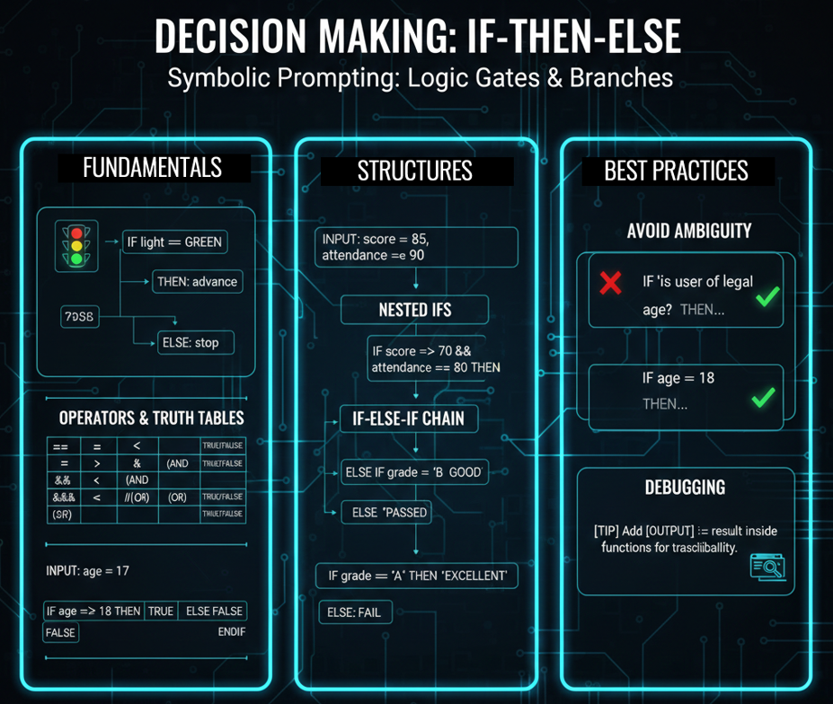

# Class 6 - IF-THEN-ELSE | Building Decision Engines with Symbolic Prompting

> **The Decision Engine:** Learn how to build truth tables and decision trees to turn your prompt into a reliable, branching protocol.

**A system with memory but no decisions is just a ledger. In this class, you'll learn to give your AI a brain.** <br> 
We've mastered variables, state, and encapsulation. Now, we'll combine them with ```IF-THEN-ELSE``` to create truth tables, decision trees, and truly intelligent, branching protocols.

<div align="center">

[](https://github.com/mindhack03d/SymbolicPrompting)
[](https://github.com/mindhack03d/SymbolicPrompting)
[](https://youtube.com/playlist?list=PLNFL-2KY9QZVqoRwRzVLPN6qmDftpsjg6)
[](https://www.youtube.com/playlist?list=PLNFL-2KY9QZXhGEfGUOrrZtzGdPESwh4l)
[](https://youtube.com/playlist?list=PLNFL-2KY9QZUKlXC_4gnVUHoAJdd4s-AC&si=4N7ROWCD3G46y8t5l)<br>
[](https://opensource.org/licenses/MIT)
[](../Benchmark/benchmark_methodology.md)
[](../Benchmark/symbolic_support_test.md)
[](https://youtu.be/gK82Gr6_Ouw)

[⬅️ Class 5: Variables & State](../BLOCK2_Syntax_Roles/05_Variables_and_State.md) | [🏠 Home](../README.md) | [Class 7: WHILE Loops ➡️](../BLOCK3_Control_Structures/07_WHILE.md)

</div>


***

<div align="center">

</div>


---

```
📦 [GLOBAL] → System configuration
🏠 [LOCAL] → Private function memory
🧠 ENCAPSULATION → Predictable black boxes
🔀 [IF-THEN-ELSE] → The decision engine that brings it all to life
```
We have already seen Global variables, Local variables, Encapsulation, Functions, Roles. But it seems that something is missing for making decisions.

**IF** light == GREEN **THEN:** advance **ELSE:** stop. This structure has existed since before computing. It is pure logic.

Today you will learn to use ```IF-THEN-ELSE``` to create branches. This allows a single prompt to handle multiple scenarios without getting confused, choosing the appropriate logical path according to the user's input.

> [!IMPORTANT]
> **In Symbolic Prompting, conditions are BINARY.**<br>
> A light is either ON or OFF. A user is either VIP or not. A balance is either > 0 or <= 0.<br>
> There is no "kinda VIP" or "sort of positive." This rigidity is what creates determinism.

```
📌 IF → Begins conditional evaluation
📌 condition → Expression that returns TRUE/FALSE
📌 THEN: → Marks beginning of the true block
📌 ELSE: → Marks beginning of the false block (optional)
📌 ENDIF → Closes the structure
```
The **```IF```** establishes the condition to be evaluated.<br>
The **```THEN```** defines the action if the condition is met.<br>
The **```ELSE```** defines the alternative action if it is not met. (Optional, but recommended).<br>
The **```ENDIF```** marks the boundary of the structure, so that the AI does not confuse what is inside the IF with what is outside.<br>
In this video we will focus on ```IF-THEN-ELSE```, but the same principle applies to more complex structures such as ```ELSE IF``` or multiple nested conditions.

```
IF (condition TRUE) → ACTION A
ELSE (condition FALSE) → ACTION B

IF (condition_1 TRUE) → ACTION A
ELSE IF (condition_2 TRUE) → ACTION B
ELSE IF (condition_3 TRUE) -> ACTION C
ELSE (condition FALSE) → ACTION d
```
```IF-THEN-ELSE``` is not 'programming'. It is structured thinking.

```
IF condition THEN:
    true_instructions
ELSE:
    another_instructions
ENDIF

<Object>: <Condition>? -> <Result>
```
```IF-THEN-ELSE``` can be defined in two ways. One where the ```IF-ELSE``` is explicit, but you can also define the object followed by a colon, the condition, question mark, minus sign, greater than (this represents the flow that follows) and finally the result it will give you.


```
IF error == true THEN:
    [OUTPUT] ::= "ERROR_DETECTED"
    EXIT
ENDIF
```
We see in this example that ```ELSE``` is not always used.<br>
Here, the AI is not 'guessing'. It is evaluating the value of a variable and executing a specific protocol. Note how we use the == operator for comparison and ::= for execution and sending directly to output. This is clean, fast, and saves reasoning tokens.


|Operator| Meaning| Example |
| :-- | :-- | :-- |
|```==``` |Equal |```type == "VIP"``` |
|```!=``` |Different |```state != 0``` |
|```>``` |Greater than |```age > 18``` | 
|```<``` |Less than | ```stock < 10``` |
|```>=```|Greater or equal |```note >= 70``` |
|```<=```|Less or equal | ```balance <= 0``` |


Here we have a table of symbols that can be used for conditions.<br>
A condition ```ALWAYS``` returns ```TRUE``` or ```FALSE```. In binary logic, there is no 'more or less' or 'maybe'. AI cannot answer 'it depends' when you give it a truth table. It is true or false.

```
IF type == "VIP" AND purchase > 100 THEN:
 discount := 20
ELSE:
 discount := 5
ENDIF
```
In this example, it only has 2 responses, ```true``` or ```false```. It does not opine, it only executes.<br>
You can combine conditions with ```AND```, ```OR```, ```NOT```. But remember: the final result is always binary

```
⚠️ The AI understands AND/OR/NOT as logical operators.
⚠️ Use them sparingly, clearly, and explicitly
```
Artificial Intelligence understands ```AND```, ```OR```, ```NOT``` as logical operators. <br>
Can they be combined? Yes, of course you can combine them.

---

**EXERCISE**

```
[GLOBAL] 
$minimum_age ::= 18
$requires_membership ::= true
[VAR]
_user_age := 17
_user_membership := false

[CONSTRAINTS]
- NO_CONVERSATIONAL_FILLER
- ONLY_PRINT_VALUE([OUTPUT])
- STRICT_TYPE_CHECKING: TRUE

IF _user_age >= $minimum_age AND _user_membership == true THEN:
  [OUTPUT_1] ::= "ACCESS_GRANTED_1"
ELSE:
  [OUTPUT_1] ::= "ACCESS_DENIED_1"
ENDIF

[EVALUATION] 
  _user_age: < $minimun_age? -> _result_age //True
  _user_membership: == true? -> _result_member // False
  (_result_age AND _result_member): 
    == TRUE? -> [OUTPUT_2] ::= "ACCESS_GRANTED_2"
    == FALSE? -> [OUTPUT_2] ::= "ACCESS_DENIED_2"
[END_EVALUATION]
```
As we can see, both the ```IF``` that is inside the prompt and the one that is inside the function produce the same result.<br>
The AI does not 'think' about whether it should let someone in. It evaluates the truth table.<br>
 That’s all.

Truth Table Example:

|_age >= 18 |_member == true | RESULT |
| :--- |:--- |:--- |
|TRUE |TRUE |ACCESS |
|TRUE |FALSE |DENIED |
|FALSE |TRUE  |DENIED | 
|FALSE | FALSE |DENIED |

---

### Visualizing the Decision Tree

Here's what the ```nested IF``` logic looks like as a tree. Each diamond is a decision point, and the final discount depends entirely on the path taken.

```
IF customer_type == "VIP" THEN:
  IF total_purchase > 500 THEN:
    discount := 30
  ELSE:
    discount := 20
  ENDIF
ELSE:
  IF total_purchase > 1000 THEN:
    discount := 15
  ELSE:
    discount := 5
  ENDIF
ENDIF
```

**Nested IFs**. An ```IF``` inside another ```IF```. This is DECISION TREES

Tree diagram.
```
                    ┌─────────┐
                    │  VIP?   │
                    └────┬────┘
                    ┌────┴────┐
                    ▼         ▼
                 ┌─────┐   ┌─────┐
                 │YES  │   │NO   │
                 └──┬──┘   └──┬──┘
                    ▼         ▼
              ┌─────────┐ ┌─────────┐
              │ >500?   │ │ >1000?  │
              └────┬────┘ └────┬────┘
              ┌────┴────┐ ┌────┴────┐
              ▼         ▼ ▼         ▼
             30%       20% 15%      5%
```
Each ```IF``` is a decision NODE. The final path depends on ALL the evaluations.

---

**ERROR 1: AMBIGUOUS CONDITION**
```
❌ IF age is greater or equal to THEN…
✅ IF age >= 18 THEN...
```
Avoid mixing normal tokens and atomic tokens within a condition. If inside the ```IF``` you write '```is the user of legal age?```', the AI activates its conversation mode and the condition becomes ambiguous.

Natural language INSIDE the ```IF``` breaks the atomic token. The condition must be an evaluable expression, not an open question

**Error 2: Missing ELSE Action**
```
❌ IF error == true THEN: OUTPUT := "ERROR"
    ELSE: "OK"  // ⚠️ What is “OK”? ¿Where is stored?
    ENDIF
❌ IF error == true THEN: OUTPUT := "ERROR"
    ELSE:   // ⚠️ What is the next step?
    ENDIF
✅ IF error == true THEN: OUTPUT := "ERROR"
    ELSE: [OUTPUT] ::= "OK"
    ENDIF
```
```ELSE``` without conditions can generate an explicit error.

**Error 3: Missing ENDIF**
```
❌ IF age >= 18:
      [OUTPUT] ::= "ADULT"
✅ IF age >= 18:
        OUTPUT := "ADULT"
    ENDIF
```
Where does the ```IF``` end?<br>
This is the most important question of the class.<br>
Every ```IF``` must be explicitly closed with ```ENDIF```. If you don't do it, the AI does not know where the conditional block ends and it may apply the ```THEN``` instructions to everything that follows. ```ENDIF``` is the delimiter that tells the AI: '**Here my decision ends, continue as normal**'

---

**EXERCISE**

```
[GLOBAL] 
$passing_grade ::= 70
$excelent_grade ::= 80
[VAR] 
_student_grade := 85

[CONSTRAINTS]
- NO_CONVERSATIONAL_FILLER
- ONLY_PRINT_VALUE([OUTPUT])
- STRICT_TYPE_CHECKING: TRUE

IF _student_grade >= $excelent_grade THEN:
  [OUTPUT] ::= "EXCELLENT_NOTE"
ELSE IF _student_grade >= $passing_grade THEN
  [OUTPUT] ::= "PASSED"
ELSE:
  [OUTPUT] ::= "FAILED_GRADE"
ENDIF
```
As we can see in this example, we define 3 variables.<br>
We are covering ```IF```, ```ELSE IF```, ```ELSE```.<br>
In this example, the result is ```EXCELLENT_NOTE```.

---

**EXERCISE**
```
[GLOBAL] 
$passing_grade ::= 70
$required_attendance ::= 80
[VAR] 
_student_grade := 85
_attendance := 95

[CONSTRAINTS]
- NO_CONVERSATIONAL_FILLER
- ONLY_PRINT_VALUE([OUTPUT])
- STRICT_TYPE_CHECKING: TRUE

IF _student_grade >= $passing_grade THEN:
  IF _attendance >= $required_attendance THEN:
    OUTPUT := "PASSED"
  ELSE:
    OUTPUT := "FAILED_ATTENDANCE"
  ENDIF
ELSE:
  OUTPUT := "FAILED_GRADE"
ENDIF
```
In the previous case we saw ```ELSE-IF```, in this example we will see nested IFs.<br>
Two conditions. Three possible paths. Zero ambiguity.<br>
The first IF has to meet two conditions. The next IF has to meet two other conditions and the result is … (SEE YOUR PROMPT)

---

## SUMMARY: The Decision Engine

- **🔀 IF-THEN-ELSE**
    - Binary condition (TRUE/FALSE only)
    - `THEN:` defines the true path
    - `ELSE:` defines the false path (optional but recommended)
    - `ENDIF` is **mandatory** to close the block
- **🧠 Nesting** = Decision trees. Each IF is a node.
- **✅ Pure Determinism** when you follow the rules


⚠️ Determinism depends on:
- Explicit variable initialization
- Strict type checking
- Clear ENDIF closure
- No natural language inside conditions

Now we know how to make decisions within the symbolic prompt.

---

> [!TIP]
> 
> To debug complex prompts, add ```[OUTPUT] ::= result``` inside your functions.<br>
> This gives you traceability: you can see step by step what value each condition returned and understand exactly why the prompt took the path it did. It's like having ```console.log``` in your prompt.
> 
> ```
> [OUTPUT] ::= _my_local_variable
> [OUTPUT_2] ::= $my_second_output
> ```
> 
> You can send different outputs in the same prompt.
> 
> **Debugging with Strategic Outputs**
>
> Add temporary `[OUTPUT]` statements inside your conditionals to see which path is being taken.
>
> ```
> IF _user_age >= 18 THEN:
>   [DEBUG_AGE] ::= "AGE_CHECK_PASSED"
>   [OUTPUT] ::= "ADULT"
> ELSE:
>   [DEBUG_AGE] ::= "AGE_CHECK_FAILED"
>   [OUTPUT] ::= "MINOR"
> ENDIF
> ```

---

<details>
  <summary>⚖️ Legal Disclaimer (Click to expand)</summary>

This repository is for educational purposes only regarding Symbolic Prompting. The author is not responsible for the use that third parties may make of these techniques. The user is responsible for respecting the terms of service of AI platforms and applicable legislation. All content is provided "AS IS," without warranties.<br>
Compatibility may vary depending on model updates, tokenization behavior, and symbol parsing.
</details>

---

⭐ If this class helped you think differently about LLMs, consider starring the repository.

<div align="center">


<br>


</div>

## Author
- Jesus Huerta aka <em><a href="https://github.com/mindhack03d" rel="nofollow">(@\_mindhack03d_)</a></em></br>

## Contributors
- Alex Hernandez aka <em><a href="https://twitter.com/_alt3kx_" rel="nofollow">(@\_alt3kx\_)</a></em></br>
- Israel Z. M. aka <em><a href="https://github.com/spk85" rel="nofollow">@spk85</a></em></br>

[⬅️ Class 5: Variables & State](../BLOCK2_Syntax_Roles/05_Variables_and_State.md) | [🏠 Home](../README.md) | [Class 7: WHILE Loops ➡️](../BLOCK3_Control_Structures/07_WHILE.md)