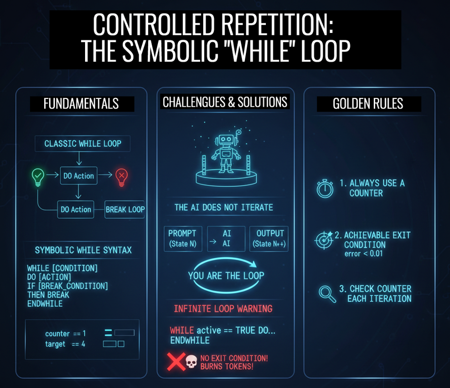

# Class 7 - WHILE | Why AI Can’t Loop (And How To Control It)

> **The Iteration Engine:** Learn how to simulate loops in a stateless environment. Master the art of the "Prompt Cycle" and avoid the dreaded token-burning infinite loop.

**In traditional code, loops are automatic. In Symbolic Prompting, you ARE the loop.** This class reveals the fundamental truth about LLMs: they cannot iterate. They simulate. You'll learn how to control this simulation, process sequences, and—most importantly—avoid the token-burning disaster of an infinite loop.

<div align="center">

[](https://github.com/mindhack03d/SymbolicPrompting)
[](https://github.com/mindhack03d/SymbolicPrompting)
[](https://youtube.com/playlist?list=PLNFL-2KY9QZVqoRwRzVLPN6qmDftpsjg6)
[](https://www.youtube.com/playlist?list=PLNFL-2KY9QZXhGEfGUOrrZtzGdPESwh4l)
[](https://youtube.com/playlist?list=PLNFL-2KY9QZUKlXC_4gnVUHoAJdd4s-AC&si=4N7ROWCD3G46y8t5l)<br>
[](https://opensource.org/licenses/MIT)
[](../Benchmark/benchmark_methodology.md)
[](../Benchmark/symbolic_support_test.md)
[](https://youtu.be/IT9Z_s_3n4c)

[⬅️ Class 6: IF-THEN-ELSE](../BLOCK3_Control_Structures/06_IF_THEN_ELSE.md) | [🏠 Home](../README.md) | [Class 8: FOR Loops ➡️](../BLOCK3_Control_Structures/08_FOR.md)

</div>


***

<div align="center">

</div>

---

Usually when a decision is made, it is done once, but what happens if we need to do it multiple times? This is where this class comes in.

---

```
A counter: 1, 2, 3, 4, 5...
A loading bar that fills gradually.
An access attempt: fail, fail, fail, success...
```
Suppose we need to evaluate, to keep evaluating until it reaches number 4 and then it returns success and breaks the loop.<br>
How do you process 1000 items? How do you retry until it works? How do you wait for something to change?

```
while counter <= 10: 
    if counter == 5: 
        break 
   counter += 1 
print("Loop finished.")
```
This is an example of a ```WHILE``` in programming. In symbolic prompting, it follows the same essence.<br>
Just like in this case, you have to tell it the counter and how far it has to go to break the loop.

```
[CURRENT_CONTEXT]
_processed_items := 347
_total_items := 1000
_next_item := 348
```
This is the GREAT CHALLENGE of the symbolic ```WHILE```. The AI does not iterate. It SIMULATES iteration.

It is like an actor in a play: they can perform many scenes, but only live one at a time, and they need someone (the director) to tell them when the next scene begins. You are that director.

Sometimes, the AI does not achieve the perfect result on the first try, or we have a list of tasks of unknown length. In traditional programming, we use loops.<br>
In Symbolic Prompting, the ```WHILE``` tells the AI: 'Do not stop processing this until this objective is met'. It is the ultimate tool for quality control and for tasks that require repeating a process until reaching a specific standard

```
⚠️ THE AI DOES NOT HAVE AN INTERNAL LOOP
⚠️ YOU must maintain the counter
⚠️ YOU must decide when to stop
```
Artificial intelligence does not have an internal loop. You must maintain the counter and decide when to stop.

```
WHILE condition == true DO:
  instruction
  MODIFY condition OR counter
ENDWHILE

📌 WHILE → Begins conditional loop
📌 condition → Expression that returns TRUE/FALSE
📌 DO: → Marks beginning of block
📌 instruction → Action to repeat
📌 ENDWHILE → Closes the block
```
This is a syntax. Deceptively simple. Mortally dangerous.<br>
```WHILE``` starts the loop, the ```condition``` is validated, ```DO``` executes the instructions. A condition or a counter is validated to ```end``` or ```break``` the cycle; for this we will use a ```BREAK```.

```
⚠️ Symbolic WHILE is NOT automatic
⚠️ It is a CONTRACT between you and the AI
⚠️ You control the iterations
```
Symbolic while is not automatic; you have to keep track of the iterations.

```
[INITIAL_STATE]
_counter := 0
$limit ::= 5
WHILE _counter < $limit:
  [UPDATE_TRIGGER] :=> _counter = _counter + 1
  [OUTPUT] ::= "Iteration: " + _counter
ENDWHILE
```
**⚠️ ATTENTION: THIS IS CRITICAL**<br>
This ```WHILE``` looks like it's going to execute 5 times. But NO.<br>
The AI will execute the block ONLY ONCE. Then it will stop. YOU, the programmer, must take that output, update the counter, and send A NEW PROMPT with the new state.

> [!IMPORTANT]
> ## The Golden Rule of Symbolic WHILE
>
> **The LLM does NOT loop. YOU loop.**
>
> The AI executes the `WHILE` block **exactly once** per prompt. It simulates one iteration.
>
> - You send Prompt 1 → AI performs Iteration 1 → You get Output 1 + New State
> - You update the state → You send Prompt 2 → AI performs Iteration 2 → You get Output 2 + New State
> - ...and so on, until your external logic decides to stop.
>
> **You are the `for` loop. You are the `while` condition. You are the CPU.**

**OUTPUT EMULATED**
```
PROMPT 1:
_counter: 0
_limit: 5

WHILE _counter < _limit:
  SET _counter := _counter + 1
  OUTPUT := "Iteration: 1"
ENDWHILE

→ RESPONSE: "Iteration: 1"
→ YOU update: [VAR] counter: 1

PROMPT 2:
_counter: 1
_limit: 5
WHILE _counter < _limit:
  SET _counter := _counter + 1
  OUTPUT := "Iteration: 2"
ENDWHILE

→ RESPONSE: "Iteration: 2"
... (until counter = 5)
```
YOU are the loop. The AI is just the engine that executes one turn each time you invoke it.

---

**EXERCISE**

Let's look at the following example:
```
[GLOBAL_VAR] 
$products ::= ["apple", "pear", "orange"]
[VAR]
_index := 0
_total_products := 3

[CONSTRAINTS]
- NO_CONVERSATIONAL_FILLER
- ONLY_PRINT_VALUE([OUTPUT],RETURN)
- STRICT_TYPE_CHECKING: TRUE
//- ARRAY_INDEXING: START_AT_0

[FUNCTION] process_item(list, position)
  _item := list[position]
  RETURN "PROCESSED: " + _item
[END_FUNCTION]

WHILE _index < _total_products:
  _result := process_item($products, _index)
  [OUTPUT] ::= "RESULT: " + _result
  _index := _index + 1
  [OUTPUT] ::= "INDEX: " _index
ENDWHILE
```
We can see how the result is executed and each step was controlled

---

**EXERCISE**
```
[GLOBAL] 
$max_attempts ::= 3
[VAR]
_attempts := 0
_success := false

[CONSTRAINTS]
- NO_ADD_COMMENTS
- NO_CONVERSATIONAL_FILLER
- ONLY_PRINT_VALUE([OUTPUT])
- STRICT_TYPE_CHECKING: TRUE

WHILE _attempts < $max_attempts AND _success == false:
  _attempts := _attempts + 1
  _result := RANDOM_CHOICE(["FAILURE","DENIED"])
  IF _result == "SUCCESS" THEN:
    _success := true
    [OUTPUT] ::= "OPERATION_SUCCESSFUL"
  ELSE:
    [OUTPUT] ::= "RETRY_" + STR(_attempts)
  ENDIF
ENDWHILE

IF _success == false THEN:
  [OUTPUT] ::= "FATAL_ERROR"
ENDIF
```
**PROBLEM:** Retry operation until success or limit.<br>
We can see that…. (SEE PROMPT)

---

## ⚠️ **WARNING: INFINITE LOOP** ⚠️<br>

Look at this example. When does '```active```' change to ```false```? NEVER.<br>

```
⚠️⚠️⚠️⚠️⚠️⚠️⚠️⚠️⚠️⚠️⚠️⚠️
   INFINITE LOOP DETECTED
⚠️⚠️⚠️⚠️⚠️⚠️⚠️⚠️⚠️⚠️⚠️⚠️

Killer example:
❌ _active: true
   WHILE active == true:
       OUTPUT := "HELP"
   ENDWHILE
```

The AI will execute this ONCE and return the same state to you. YOU, as the controller, will send it again... and the AI will return the same to you... and so on forever.

On a computer, an infinite loop blocks the processor. In an LLM, an infinite loop burns your tokens, empties your wallet, and solves nothing. Worse yet: the AI may start hallucinating strange responses when it doesn't see a clear output.

Each iteration = full prompt re-evaluation.
Cost grows linearly with:
- Prompt size
- Context size
- Iteration count

**Why this is deadly:**
- `_active` never changes. The condition is permanently `true`.
- The AI will output "HELP" once and return the same state (`_active: true`).
- You, as the controller, see no change and send the prompt again... and again... and again.
- **Result:** Each iteration costs tokens. You get the same useless output. Your wallet empties. The AI may even start hallucinating when it detects the repetitive pattern.

**The Fix:** Always include a counter and a max limit.

---

> [!CAUTION]
> ## INFINITE LOOP DETECTED
>
> ⚠️⚠️⚠️⚠️⚠️⚠️⚠️⚠️⚠️⚠️⚠️⚠️⚠️⚠️⚠️⚠️⚠️⚠️⚠️⚠️⚠️⚠️<br>
> **Never, ever, NEVER execute a loop without an explicit exit condition**<br>
> ⚠️⚠️⚠️⚠️⚠️⚠️⚠️⚠️⚠️⚠️⚠️⚠️⚠️⚠️⚠️⚠️⚠️⚠️⚠️⚠️⚠️⚠️<br><br>
> Look at this killer example:
> ```
> _active: true
> WHILE active == true:
>     OUTPUT := "HELP"
> ENDWHILE
> ```
> When does `_active` change to `false`? **NEVER.**
>
> On a computer, an infinite loop blocks the processor. In an LLM, it burns your tokens, empties your wallet, and leads to hallucinations. **You have been warned.**
> ```
> GOLDEN RULE:
> ✅ EVERY WHILE MUST HAVE:
> 1.	An EXIT condition
> 2.	A COUNTER or variable that CHANGES
> 3.	A MAXIMUM iteration LIMIT
> ```


### 🥇 The Golden Rules of Symbolic WHILE

- [ ] **1.	ALWAYS use a counter**. <br>Without a counter, you don't know how many iterations you have completed

```
_iteration: 0
_max_iter: 10
WHILE _iteration < _max_iter AND condition:
  _iteration := _iteration + 1
  ...
ENDWHILE
```
- [ ] **2. ALWAYS define an ACHIEVABLE exit condition.** <br>Don't say '```until it's perfect```' (subjective), say '```until error < 0.01```' or '```maximum 5 attempts```' (measurable).

```
_student := "USER_001"
_iteration := 0
_max_iter := 100
WHILE _student == "USER_002":
  ...
  _iteration := _iteration + 1
  IF _iteration >= _max_iter THEN:
    [OUTPUT] ::= "PROCESS_FINISHED"
   EXIT
  ENDIF
  ...
ENDWHILE
```
- [ ] **3. ALWAYS check the counter on each iteration.** <br>You are the one who decides whether to continue or stop. A MAXIMUM iteration LIMIT as a safety net.

---

## SUMMARY

Now you can repeat processes, retry failed operations, and process lists of unknown length.<br>
But... what about when you KNOW exactly how many times you want to repeat something? Like processing 10 items from a list?

```WHILE``` works, but it's like using a machete to perform surgery: you can, but there are better tools. That's what ```FOR``` is for, the loop with an automatic counter. We'll see it in the next class.

---

<details>
  <summary>⚖️ Legal Disclaimer (Click to expand)</summary>

This repository is for educational purposes only regarding Symbolic Prompting. The author is not responsible for the use that third parties may make of these techniques. The user is responsible for respecting the terms of service of AI platforms and applicable legislation. All content is provided "AS IS," without warranties.<br>
Compatibility may vary depending on model updates, tokenization behavior, and symbol parsing.
</details>

---

⭐ If this class helped you think differently about LLMs, consider starring the repository.

<div align="center">


<br>


</div>

## Author
- Jesus Huerta aka <em><a href="https://github.com/mindhack03d" rel="nofollow">(@\_mindhack03d_)</a></em></br>

## Contributors
- Alex Hernandez aka <em><a href="https://twitter.com/_alt3kx_" rel="nofollow">(@\_alt3kx\_)</a></em></br>
- Israel Z. M. aka <em><a href="https://github.com/spk85" rel="nofollow">@spk85</a></em></br>

[⬅️ Class 6: IF-THEN-ELSE](../BLOCK3_Control_Structures/06_IF_THEN_ELSE.md) | [🏠 Home](../README.md) | [Class 8: FOR Loops ➡️](../BLOCK3_Control_Structures/08_FOR.md)