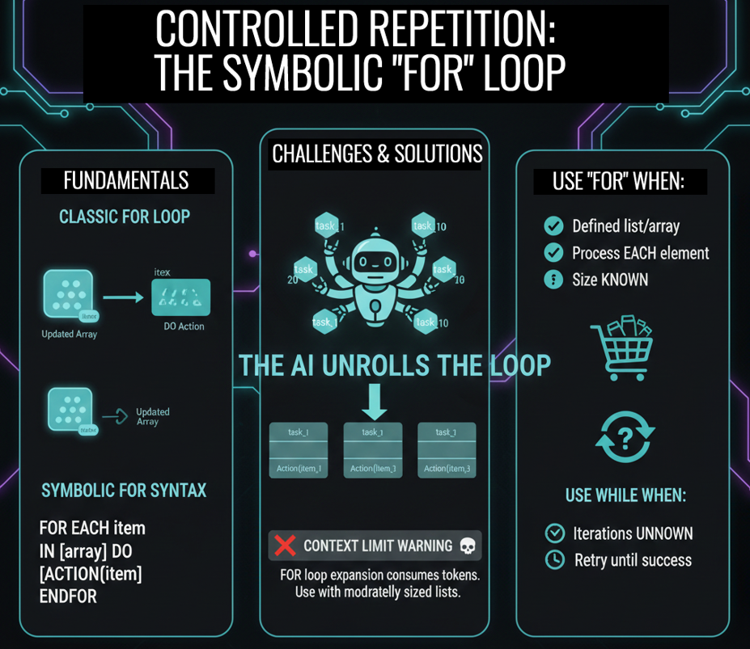

# Class 8 - FOR | How LLMs Process Lists (And Why They Skip Items)

> **The Abstraction Power:** Move from manual counters to automated collection processing. Learn how the LLM "unrolls" logic to handle lists, arrays, and matrices in a single pass.

**```WHILE``` gives you control. ```FOR``` gives you power.** When you have a list of items to process—a shopping cart, an inventory, a matrix of data—managing a manual counter is tedious and error-prone. In this class, you'll learn how ```FOR``` automates collection processing through a mechanism called "unrolling," and why it's the right tool for batch operations.

<div align="center">

[](https://github.com/mindhack03d/SymbolicPrompting)
[](https://github.com/mindhack03d/SymbolicPrompting)
[](https://youtube.com/playlist?list=PLNFL-2KY9QZVqoRwRzVLPN6qmDftpsjg6)
[](https://www.youtube.com/playlist?list=PLNFL-2KY9QZXhGEfGUOrrZtzGdPESwh4l)
[](https://youtube.com/playlist?list=PLNFL-2KY9QZUKlXC_4gnVUHoAJdd4s-AC&si=4N7ROWCD3G46y8t5l)<br>
[](https://opensource.org/licenses/MIT)
[](../Benchmark/benchmark_methodology.md)
[](../Benchmark/symbolic_support_test.md)
[](https://youtu.be/hmbU1BqWPcE)

[⬅️ Class 7: WHILE Loops](../BLOCK3_Control_Structures/07_WHILE.md) | [🏠 Home](../README.md) | [Class 9: GOTO ➡️](../BLOCK3_Control_Structures/09_GOTO.md)

</div>

---

<div align="center">

</div>

---
In the previous video we learned to ```REPEAT```. But ```WHILE``` is like a Swiss army knife: it serves for everything, but for specific tasks there are better tools.<br>
When you KNOW exactly what you want to process and you KNOW exactly how many elements there are, ```WHILE``` is AWKWARD.

> ```WHILE``` is powerful, but it's like using a manual screwdriver when you have 100 screws. It works, but it's tedious. When you know exactly what you're working with—a list, an array, a collection—you need a tool that handles the repetition for you. That tool is ```FOR```.

| Feature | WHILE | FOR |
| :--- | :--- | :--- |
| **Iteration Model** | Multi-prompt (YOU are the loop) | Single-prompt (AI unrolls) |
| **Counter** | Manual (`_index := _index + 1`) | Automatic |
| **Best For** | Unknown iterations, retries | Known collections |

---

**WHILE EXAMPLE - READ ARRAY**

```
[VAR]
_list: [A, B, C, D, E]
_index: 0
_total: 5

[LOGIC]
WHILE _index < _total:
  process(_list[_index])
  _index = _index + 1
ENDWHILE
```
When we have arrays, it is not necessary to define variables to validate the limit.<br>
It works, but you have to define variables and keep a counter.

```
FOR EACH item IN list:
  process(item)
ENDFOR

📌 FOR → Begins iteration over collection
📌 temporary_variable → Name that EACH element receives
📌 IN → Separator (atomic token)
📌 collection → List, array or set to iterate
📌 : → Beginning of block
📌 ENDFOR → Closes the structure
```

```FOR``` is ```ABSTRACTION```. You don't worry about HOW it iterates, you worry about WHAT is done with each element.<br>
In traditional programming, ```FOR``` hides the complexity of the counter. In Symbolic Prompting, it does something similar: you tell the AI 'process this list' and it takes care of applying the rules to each element, one by one, without you having to manage an index manually.

When you give an AI a list of 10 tasks in a single paragraph, it is very likely to skip number 7 or mix number 3 with number 4. This happens due to attention fragmentation.

The ```FOR``` loop solves this by forcing the AI to focus on one element at a time. It's like telling it: 'Take this list, grab the first object, do this to it, save it, and move on to the next'.

And that's how the ```FOR``` syntax is defined.

```
FOR EACH product IN ["bread", "milk", "eggs"]:
  OUTPUT := "BUY: " + product
ENDFOR
```
In this example we have 3 elements that we need to read. We do not initialize variables, we do not worry about the number of elements.

```
//EXPECTED OUTPUT
BUY: bread
BUY: milk
BUY: eggs
```
The AI executes the block ONCE ```FOR EACH``` ELEMENT. Automatically. You don't need a manual counter.

> ⚠️ FOR does NOT create runtime iteration.<br>
> It creates structured attention over each element.

The AI UNROLLS the loop. This means it is not 'going around' like a traditional program, but rather it expands the code.

If you have 3 elements, the AI acts as if you had manually written the same instructions 3 times in a row, once for each element. There is no real 'iteration' in the computational sense, there is PROMPT EXPANSION.

It's like instead of saying 'wash the dishes 10 times', you write a recipe that applies to each dish individually. The AI understands them as separate tasks, not as a cycle

---

**EXERCISE**
```
[GLOBAL] $cart ::= [
  {"product": "apple", "price": 1.5, "quantity": 4},
  {"product": "pear", "price": 1.2, "quantity": 3},
  {"product": "orange", "price": 1.8, "quantity": 2}
]
[VAR] 
_total := 0

[CONSTRAINTS]
- NO_CONVERSATIONAL_FILLER
- ONLY_PRINT_VALUE([OUTPUT])
- STRICT_TYPE_CHECKING: TRUE

FOR EACH item IN $cart:
  _subtotal := item.price * item.quantity
  _total := _total + _subtotal
  [OUTPUT] ::= item.product + ": $" + STR(_subtotal)
ENDFOR
[OUTPUT] ::= "TOTAL: $" + STR(_total)
```
We can see the output is being generated correctly.<br>
In this exercise we create an array and access its content.

```FOR``` processes ```EACH``` element, accumulates results in a global variable, and reports progress. ALL in a single prompt.

---

**⚠️ Warning:** If your list is very large (more than 50 elements), you may approach the model's context limit. Symbolic FOR expands the instructions, and that consumes tokens. Use it with moderately sized lists

### 💰 Token Cost: WHILE vs. FOR

Understanding the cost model helps you choose the right tool.

**WHILE (Multi-Prompt):**
`Cost ≈ (Prompt Tokens + Output Tokens) × Iterations`
- You pay the full prompt cost *every time*.
- Good for: operations where you need human-in-the-loop validation between steps.

**FOR (Single-Prompt Unrolling):**
`Cost ≈ Prompt Tokens + (Instruction Tokens × List Length)`
- You pay once, but the prompt "expands" internally.
- Good for: batch processing of known lists within context limits.

**Rule of Thumb:** Use `FOR` for lists under 50 items. For larger lists, consider `WHILE` with batched processing or an external script.

---

**EXERCISE**

**PROBLEM:** Extract only products with low stock
```
[GLOBAL] $inventory: [
  {"product": "apple", "stock": 45, "minimum": 20},
  {"product": "pear", "stock": 8, "minimum": 15},
  {"product": "orange", "stock": 32, "minimum": 25},
  {"product": "banana", "stock": 5, "minimum": 10}
]
[VAR] 
_reorder: []

[CONSTRAINTS]
- NO_CONVERSATIONAL_FILLER
- ONLY_PRINT_VALUE([OUTPUT])
- STRICT_TYPE_CHECKING: TRUE

FOR item IN $inventory:
  IF item.stock < item.minimum THEN:
    _reorder := _reorder + [item.product]
    [OUTPUT] ::= "REORDER: " + item.product
  ENDIF
ENDFOR
[OUTPUT] ::= "ORDER_REQUIRED: " + STR(_reorder)
```
We see that the execution is taking place, we create an array where our order was updated..

---

**EXERCISE**<br>
**PROBLEM:** Process a two-dimensional matrix
```
[GLOBAL] $matrix: [
  [1, 2, 3],
  [4, 5, 6],
  [7, 8, 9]
]
FOR row IN matrix:
  FOR number IN row:
    OUTPUT := number * 2
  ENDFOR
ENDFOR
```
Sometimes we need to read a 3 by 3 table, a two-dimensional matrix.<br>
```FOR``` inside ```FOR```. First it goes through rows, then numbers inside each row.<br>
We have the expected output..

---

|CRITERIA |WHILE |FOR |
| :--- | :--- | :--- |
|Do you know how many iterations? |Not always |Yes (collection length) |
|Does it depend on a dynamic condition? |✅ Yes |❌ No |
|Do you process a known collection? |❌ Awkward |✅ Natural |
|Manual index control? |✅ Necessary |❌ Automatic |
|Infinite loop risk |⚠️ High |✅ Low |
|Readability? |Medium |High |

**WHEN TO USE EACH ONE?**<br>
Use ```FOR``` when:<br>
• You have a defined list, array or collection<br>
• You want to process EACH element individually<br>
• The size of the collection is KNOWN<br>
• Example: Apply discount to all products in the cart

```
✅ USE FOR when:
• You have a list, array or collection
• You want to process EACH element
• The collection has a known size
✅ USE WHILE when:
• You don't know how many iterations you need
• You depend on an external condition
• You are waiting for a state change
```
Use WHILE when:<br>
• You DON'T know how many iterations you need<br>
• You depend on a condition that changes over time<br>
• You need to retry until something happens<br>
• Example: Retry a payment until it is successful (max 3 attempts)

```
WHILE (control structure requiring multiple prompts):
[YOU] Prompt 1 (counter=1) → [AI] → [YOU] Prompt 2 (counter=2) → [AI] ...

FOR (expansion in a single prompt):
[YOU] Single prompt with FOR → [AI] processes element1, element2, element3... in ONE response
```
### 🥇 GOLDEN RULES:

•	In WHILE: ALWAYS define a limit or exit condition<br>
•	In FOR: Make sure the list is not too large for the context"

> [!WARNING]
> **Context Limit Risk**
>
> `FOR` unrolls your logic for *each* element. A list of 100 items with a 50-token instruction block becomes 5,000 tokens of expanded logic.
>
> - **Small lists (< 50 items):** `FOR` is perfect.
> - **Medium lists (50-200 items):** Use with caution; monitor token usage.
> - **Large lists (> 200 items):** Consider `WHILE` with batched processing or an external script.

---

## SUMMARY

We already know how to make decisions with ```IF-THEN-ELSE```.<br>
We already know how to repeat processes with ```WHILE```.<br>
We already know how to go through lists with ```FOR```.<br>
But there is a type of flow control that is different: the direct jump.<br>
Sometimes, when a condition is met, we don't want to repeat or decide: we want to GO DIRECTLY to another section of the prompt. Like a logical teleportation.<br>
In the next class we will see ```GOTO```: the most primitive flow control... and the most dangerous

---

<details>
  <summary>⚖️ Legal Disclaimer (Click to expand)</summary>

This repository is for educational purposes only regarding Symbolic Prompting. The author is not responsible for the use that third parties may make of these techniques. The user is responsible for respecting the terms of service of AI platforms and applicable legislation. All content is provided "AS IS," without warranties.<br>
Compatibility may vary depending on model updates, tokenization behavior, and symbol parsing.
</details>

---

⭐ If this class helped you think differently about LLMs, consider starring the repository.

<div align="center">


<br>


</div>

## Author
- Jesus Huerta aka <em><a href="https://github.com/mindhack03d" rel="nofollow">(@\_mindhack03d_)</a></em></br>

## Contributors
- Alex Hernandez aka <em><a href="https://twitter.com/_alt3kx_" rel="nofollow">(@\_alt3kx\_)</a></em></br>


[⬅️ Class 7: WHILE Loops](../BLOCK3_Control_Structures/07_WHILE.md) | [🏠 Home](../README.md) | [Class 9: GOTO ➡️](../BLOCK3_Control_Structures/09_GOTO.md)