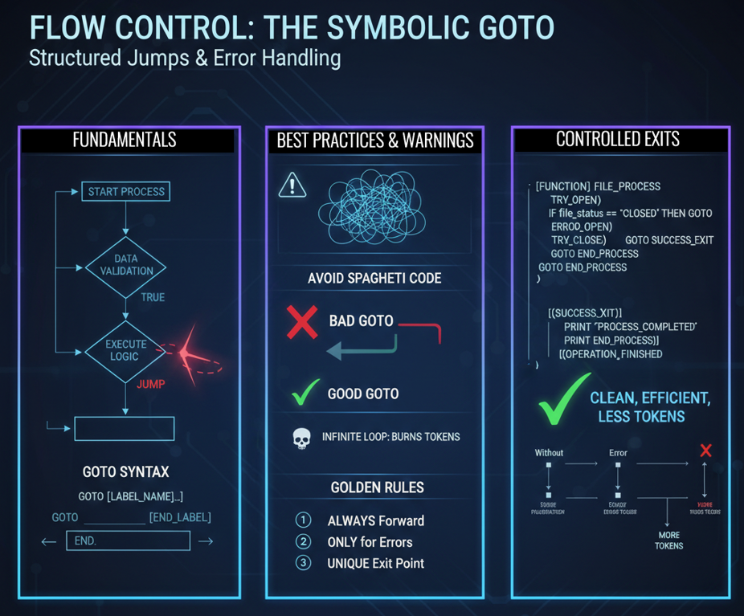

# Class 9 - GOTO in Symbolic Prompting | Controlled Jumps for Error Handling

> **Mastering Attention Flow:** Learn to flatten complex nested logic into clean, linear protocols. Use GOTO to steer the LLM's attention exactly where it needs to be, saving tokens and reducing "reasoning noise."

**Nested IF statements can turn your prompt into an unreadable mess. Sometimes, you just need to jump.** In this class, we tackle the most controversial command in programming history—```GOTO```—and show you how to use it safely and effectively for error handling and early exits in Symbolic Prompting.

<div align="center">

[](https://github.com/mindhack03d/SymbolicPrompting)
[](https://github.com/mindhack03d/SymbolicPrompting)
[](https://youtube.com/playlist?list=PLNFL-2KY9QZVqoRwRzVLPN6qmDftpsjg6)
[](https://www.youtube.com/playlist?list=PLNFL-2KY9QZXhGEfGUOrrZtzGdPESwh4l)
[](https://youtube.com/playlist?list=PLNFL-2KY9QZUKlXC_4gnVUHoAJdd4s-AC&si=4N7ROWCD3G46y8t5l)<br>
[](https://opensource.org/licenses/MIT)
[](../Benchmark/benchmark_methodology.md)
[](../Benchmark/symbolic_support_test.md)
[](https://youtu.be/gjW4NMLTCp0)

[⬅️ Class 8: FOR Loops](../BLOCK3_Control_Structures/08_FOR.md) | [🏠 Home](../README.md) | [Class 10: TRY-CATCH-FINALLY ➡️](../BLOCK3_Control_Structures/10_TRY_CATCH_FINALLY.md)

</div>

***

<div align="center">

</div>

---
"What happens when you need to EXIT the structure? What happens when the normal flow no longer works?"

```
1.	Start process
2.	Validate data → ❌ ERROR
3.	Continue process... ???
(It doesn't make sense, there's already an error)
4.	Generate report
5.	Finish
```
We start the process, validate the data and we get an error. Is it really necessary to execute the following processes? In this case we need a jump

### 🧠 How GOTO Works in an LLM (The Simulation)

When the AI encounters `GOTO [LABEL]`, it doesn't "jump" in the computational sense. Instead:

1. It recognizes the `GOTO` as a directive to **stop processing the current block**.
2. It searches forward in the prompt for the `[LABEL]:` marker.
3. It **redirects its attention** to that location and continues generating from there.

This is why **forward-only jumps are critical**. The AI cannot "go back" in time—it can only attend to text that comes later in the prompt. A backward `GOTO` would create confusion and likely lead to hallucinations or repetitive output.

**You are directing attention, not executing a jump instruction.**

⚠️ The model does not execute a search algorithm.
It reallocates attention to the token sequence following the label.

---

```
"Go To Statement Considered Harmful"
    - Edsger Dijkstra
```
In 1968, Edsger Dijkstra published a famous letter: 'Go To Statement Considered Harmful'. In it, he argued that the indiscriminate use of ```GOTO``` created code that was impossible to follow, something he called 'spaghetti code'.<br>
Since then, the ```GOTO``` statement was declared DANGEROUS in structured programming. But, like any tool, its danger lies in misuse, not in its existence

```
✅ GOTO in Linux Kernel
✅ GOTO in Drivers
✅ GOTO in Error Handling
```
```GOTO``` is used in software handling, drivers, errors.<br>
So, is ```GOTO``` bad?<br>
The answer is NO.<br>
Badly used ```GOTO``` is bad. Like a knife in the hands of a child.<br>
```GOTO``` for controlled exits is ACCEPTED, even in critical code like Linux kernels or device drivers. The key lies in control and discipline.<br>
```GOTO``` is the command that redirects the model's attention flow towards a specific section. It's not a design flaw; it's an ultra-efficient way to move the AI between different logic modules without having to repeat instructions. It also helps you consume fewer tokens.<br>

```
GOTO [LABEL]
[LABEL] : instructions
[END_LABEL]

📌GOTO → Begins unconditional jump
📌[LABEL] → Jump destination (atomic token)
📌 : → Marks the destination (colon)
```
We can read the syntax: it is ```GOTO``` followed by the label to which it will move, but this label encapsulates information or instructions, so it is important to close it.

---

#### FUNDAMENTAL Rules:
```
✅ GOTO ALWAYS JUMPS FORWARD
✅ NEVER JUMPS BACKWARDS
✅ GOTO BACKWARDS = POTENTIAL INFINITE LOOP

⚠️ GOTO BACKWARDS = PROHIBITED IN THIS COURSE
⚠️ Only forward jumps
⚠️ Only for error handling and exits
```

---

### 🥇 GOLDEN RULES OF GOTO IN SYMBOLIC PROMPTING:
1.	**ALWAYS forward, NEVER backward.** <br>A ```GOTO``` that jumps backward can create implicit loops that you don't control. The AI has no protection against that.<br>
2.	**Use it ONLY for error handling and early exits.** <br>Not for reorganizing the normal logic of the program.<br>
3.	**Each label must be a UNIQUE exit point.** <br>Ideally, a single ```[ERROR_HANDLER]``` label at the end of the prompt handles all exceptional cases


**Nested IF**
```
IF validate_input() == true THEN:
  IF process_data() == true THEN:
    IF save_results() == true THEN:
      OUTPUT "SUCCESS"
    ELSE:
      OUTPUT "ERROR_SAVE"
    ENDIF
  ELSE:
    OUTPUT "ERROR_PROCESS"
    ENDIF
  ELSE:
    OUTPUT "ERROR_VALIDATE"
ENDIF
```
This code WORKS. But each new step ADDS a level of nesting. It becomes UNREADABLE

```
IF validate_input() != true THEN:
  GOTO [ERROR_VALIDATION]
ENDIF

IF process_data() != true THEN:
  GOTO [ERROR_PROCESS]
ENDIF

[OUTPUT] ::= "SUCCESS"
GOTO [END]

[ERROR_VALIDATION]: 
  [OUTPUT] ::= "ERROR: validation failed"
  GOTO [END]

[ERROR_PROCESS]: 
  [OUTPUT] ::= "ERROR: processing failed"
  GOTO [END]

[END]: 
  [OUTPUT] ::= "PROCESS_TERMINATED"
```
LINEAR. READABLE. Each error jumps to its handler. No nesting.<br>
When a negative condition exists, it performs a direct jump. Instructions that are not executed save tokens.

> GOTO reduces reasoning depth, not prompt length.
It prevents unnecessary branch evaluation.

---

**EXERCISE**
```
[ROLE] ::=> File_Processor

[CONSTRAINTS] ::= { 
- NO_CONVERSATIONAL_FILLER
- NO_ADD_COMMENTS
- STRICT_TYPE_CHECKING: TRUE
- MINIMAL_VERBOSE
}

[VAR] 
_file_open    := false
_file_closed  := false

[PROCESS] ::=> {
  [STEP_1:Open_file] ::=> {
    // Action: Attempt to open
    CALL open_file_action()
    IF _file_open == true THEN:
      CONTINUE
    ELSE:
      GOTO [ERROR_OPEN]
    ENDIF
  }
  
  [STEP_2:Close_file] ::=> {
    // Action: Attempt to close
    CALL close_file_action()
    IF _file_closed == true THEN:
      _file_open := false
      GOTO [SUCCESS_EXIT]
    ELSE:
      GOTO [ERROR_CLOSE]
    ENDIF
  }
}

[SUCCESS_EXIT]:
  [OUTPUT] ::= "PROCESS_COMPLETED"
  GOTO [END]

[ERROR_OPEN]: 
  [OUTPUT] ::= "ERROR: Could not open file"
  GOTO [END]

[ERROR_CLOSE]: 
  [OUTPUT] ::= "ERROR: Could not close"
  GOTO [END]

[END]: 
  [OUTPUT] ::= "OPERATION_FINISHED"
```
**PROBLEM:** File open/close simulation.<br>
In this example:<br>
1.	We try to open the file<br>
2.	The file is already close → ```GOTO SUCCESS_EXIT```, print ```PROCESS_COMPLETED```, and ```GOTO END```<br>
3.	The following instructions are NOT executed<br>

What do we achieve?<br>
• We prevent the AI from trying to read ```ERROR_OPEN```, ```ERROR_CLOSE```.<br>
• We save tokens by not processing unnecessary instructions after the error<br>
• We centralize error handling in one place<br>

Without ```GOTO```, we would have to ```ERROR_OPEN```, and ```ERROR_CLOSE```, consuming more tokens and being more unreadable

**Step-by-Step Execution:**

1. **`[STEP_1:Open_file]`**: The AI attempts to open the file. The result is stored in `_file_open`.
   - If `_file_open == true`, it `CONTINUE`s to the next step.
   - If `_file_open == false`, it `GOTO [ERROR_OPEN]`, skipping all remaining normal logic.

2. **`[STEP_2:Close_file]`**: Only reached if step 1 succeeded. It attempts to close.
   - If `_file_closed == true`, it updates state and `GOTO [SUCCESS_EXIT]`.
   - If `_file_closed == false`, it `GOTO [ERROR_CLOSE]`.

3. **Success/Error Handlers**: Each handler prints a specific message, then jumps to the unified `[END]`.

4. **`[END]`**: The single exit point, printing "OPERATION_FINISHED" in all cases.

**What we achieve:** The AI never processes irrelevant error handlers. Tokens are saved. Logic is linear and traceable.

> [!CAUTION]
> ## 🚫 BACKWARD GOTO = INFINITE LOOP RISK
>
> ```
> ❌ GOTO [A]
> [A]: GOTO [B]
> [B]: GOTO [C]
> [C]: GOTO [A]  🔴 DISASTER
> ```
>
> The AI will attempt to jump backward, but it cannot "un-read" text. This leads to confusion, repetition, and hallucination. **Never jump backward. Ever.**

**AVOID USE UNNECESSARY "GOTO"**

```
❌ IF age >= 18 THEN:
        GOTO [ADULT]
    ELSE:
        GOTO [MINOR]
    ENDIF
[ADULT]: ...
[MINOR]: ...

✅ IF age >= 18 THEN:
        process_adult()
    ELSE:
        process_minor()
    ENDIF
```
Don't insert unnecessary ```GOTOs```.

---

### 🥇 The Golden Rules of GOTO

- **📌 1. FORWARD ONLY** — Never jump backward. Backward jumps = infinite loop risk.
- **📌 2. ERRORS & EXITS ONLY** — Not for normal control flow. Use `IF` for that.
- **📌 3. DESCRIPTIVE LABELS** — `[CONNECTION_ERROR]` not `[E1]`. Be clear.
- **📌 4. SINGLE EXIT POINT** — One `[END]` label at the bottom for all paths.
- **📌 5. DOCUMENT THE INTENTION** — A comment explaining *why* you're jumping.

Use GOTO forward, only for error handling or exits.

```
✅ Is it for error handling?
✅ Is it for a state machine?
✅ Is the jump forward?
✅ Is the label descriptive?
✅ Is there a single exit point?
```

### ✅ GOTO Readiness Checklist

Before writing ```GOTO``` in your prompt, ask yourself these 5 questions:<br>
- [ ] Is it for **error handling** or **early exit**? (Not for normal logic)<br>
- [ ] Do I **really** need it? Or can I solve it with IF?<br>
- [ ] Is the jump **FORWARD**? (Never backwards)<br>
- [ ] Is the label **DESCRIPTIVE**? (```[ERROR_OPEN]``` yes, ```[LABEL1]``` no)<br>
- [ ] Is there a **SINGLE exit point**? (Ideally a single handler at the end)<br>
**If all answers are YES → it is acceptable.**<br>
**If any answer is NO → look for another alternative.**<br>


```GOTO``` is a tool, not a sin.

*Dijkstra was right in 1968: uncontrolled ```GOTO``` led to chaos.*<br>
*But modern engineering has found cases where it is the best tool: error handling in Linux, early exits in critical protocols, and now... flow control in complex prompts.*<br>
*Like any powerful tool: use it with knowledge, with rules, and with respect*

---

## SUMMARY

Sometimes we need certain parts of the prompt to execute, even if the code might produce an error. But sometimes an IF is not enough and neither is a ```GOTO```.<br>
What could we use? In the next class we will see ```TRY-CATCH-FINALLY```.

---

<details>
  <summary>⚖️ Legal Disclaimer (Click to expand)</summary>

This repository is for educational purposes only regarding Symbolic Prompting. The author is not responsible for the use that third parties may make of these techniques. The user is responsible for respecting the terms of service of AI platforms and applicable legislation. All content is provided "AS IS," without warranties.<br>
Compatibility may vary depending on model updates, tokenization behavior, and symbol parsing.
</details>

---

⭐ If this class helped you think differently about LLMs, consider starring the repository.

<div align="center">


<br>


</div>

## Author
- Jesus Huerta aka <em><a href="https://github.com/mindhack03d" rel="nofollow">(@\_mindhack03d_)</a></em></br>

## Contributors
- Alex Hernandez aka <em><a href="https://twitter.com/_alt3kx_" rel="nofollow">(@\_alt3kx\_)</a></em></br>

[⬅️ Class 8: FOR Loops](../BLOCK3_Control_Structures/08_FOR.md) | [🏠 Home](../README.md) | [Class 10: TRY-CATCH-FINALLY ➡️](../BLOCK3_Control_Structures/10_TRY_CATCH_FINALLY.md)