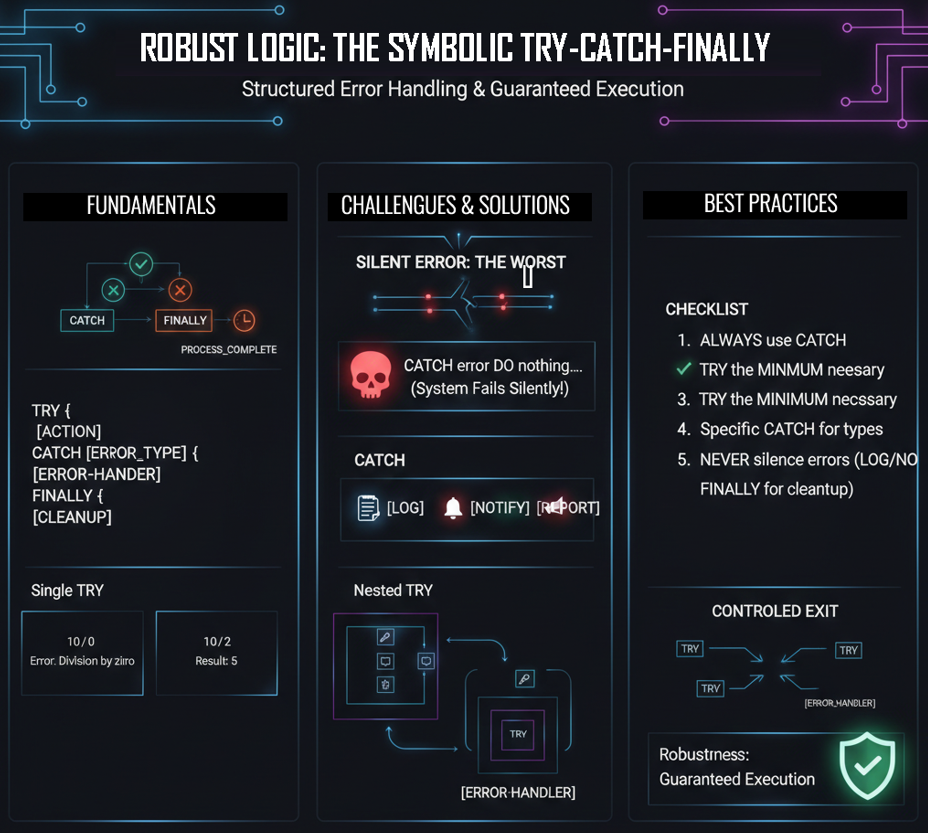

# Class 10 - TRY-CATCH-FINALLY | Building Robust AI Systems with Error Handling

> **Building Robust Systems:** Stop AI hallucinations before they start. Learn to wrap your logic in safety nets that handle errors gracefully and ensure resource cleanup.

**```GOTO``` gave us control. ```TRY-CATCH-FINALLY``` gives us resilience.** In this class, you'll learn how to build AI systems that don't just fail—they fail *gracefully*. We'll explore structured exception handling for prompts, ensuring that every error is caught, reported, and cleaned up, every time.

<div align="center">

[](https://github.com/mindhack03d/SymbolicPrompting)
[](https://github.com/mindhack03d/SymbolicPrompting)
[](https://youtube.com/playlist?list=PLNFL-2KY9QZVqoRwRzVLPN6qmDftpsjg6)
[](https://www.youtube.com/playlist?list=PLNFL-2KY9QZXhGEfGUOrrZtzGdPESwh4l)
[](https://youtube.com/playlist?list=PLNFL-2KY9QZUKlXC_4gnVUHoAJdd4s-AC&si=4N7ROWCD3G46y8t5l)<br>
[](https://opensource.org/licenses/MIT)
[](../Benchmark/benchmark_methodology.md)
[](../Benchmark/symbolic_support_test.md)
[](https://youtu.be/t0zP48KjOtw)

[⬅️ Class 9: GOTO](../BLOCK3_Control_Structures/09_GOTO.md) | [🏠 Home](../README.md) | [Class 11: Counter & Memory ➡️](../BLOCK4_Debugging_Antipatterns/11_Counter_and_Memory.md)

</div>

***

<div align="center">

</div>

---
### 🧠 How TRY-CATCH Works in an LLM (The Simulation)

When you write `[TRY] => { ... }`, you're not creating a runtime exception handler. Instead, you're giving the AI a **decision tree for error scenarios**.

1. The AI processes the `[TRY]` block as the "happy path."
2. If it encounters a condition that constitutes an "error" (like division by zero), it understands that the `[TRY]` block has "failed."
3. It then **redirects its attention** to the corresponding `[CATCH]` block.
4. Regardless of the path, it will then process the `[FINALLY]` block.

This is **pattern matching**, not execution. The AI has learned from millions of code examples that `TRY` → `CATCH` → `FINALLY` represents a specific flow. By using this pattern, you're leveraging the model's training to create predictable, robust behavior.

---

This GOTO code

```
IF error THEN GOTO [HANDLER]
IF other_error THEN GOTO [OTHER_HANDLER]
IF more_error THEN GOTO [MORE_HANDLING]
...
```
It works, but let's be honest, there are many handlers, many GOTOs. And at some point it becomes inefficient and generates many lines of code

**What happens without error handling?**

- 🤯 **Hallucination:** The AI invents a nonsense response.
- 🤷 **Generic Error:** "Sorry, I can't process this" (unhelpful).
- 💥 **Broken Flow:** Subsequent logic fails because the state is corrupted.

```
TRY:
  code_that_may_fail()
CATCH:
  only_if_there_is_error()
FINALLY:
  always_execute()

🧠 TRY-CATCH = COMMON ERROR LANGUAGE
🧠 DON'T invent your own system
🧠 USE the standard
```
Imagine this: you ask the AI to process a file, but the file is corrupted. Or you ask it to divide two numbers, but the second is zero. Or you send it data in a language it doesn't recognize.

What normally happens?<br>
• The AI hallucinates: it invents a response that doesn't make sense<br>
• Or it gives a generic error: 'Sorry, I can't process this'<br>
• Or worse: the flow breaks and what follows no longer works<br>

Today we'll see how to avoid all that with ```TRY-CATCH-FINALLY```

We use ```TRY-CATCH-FINALLY```. This structure allows the AI to 'attempt' an action and, if something goes wrong, know exactly what to do to recover instead of breaking. It's the difference between a fragile prompt and a production-level system.

```
[SECURE_PROCESS] ::= {
  [TRY] => {
    instructions_that_may_fail
  }
  [CATCH] (error_type) => { 
    instructions_if_error
  }
  [FINALLY] => {
    instructions_always
 }
}

📌 TRY: → Begins protected code block
📌 CATCH: → Block that executes ONLY if there is an error
📌 FINALLY: → Block that ALWAYS executes
```
We see how the syntax of ```TRY-CATCH-FINALLY``` is defined. ```TRY``` begins the block, ```CATCH``` executes only if there is an error in ```TRY```, ```FINALLY``` always executes.

**Execution Flow:**

1. **If TRY succeeds:**
   - `CATCH` is skipped
   - `FINALLY` executes

2. **If TRY fails:**
   - `CATCH` executes
   - `FINALLY` executes

**`FINALLY` ALWAYS executes.**
**`CATCH` executes ONLY if TRY fails.**

---

**EXERCISE**
```
[CONSTRAINTS] ::= { 
  NO_ADD_COMMENTS;   
  STRICT_SYMBOLIC_OUTPUT; 
  MINIMAL_VERBOSE; 
}

[EXECUTION_FLOW] ::= {
  [TRY] => {
    _result = divide(10, 0)
    [OUTPUT] ::= result
  }
  [CATCH] => {
    [OUTPUT] ::= "ERROR: division by zero"
  }
  [FINALLY] => {
    [OUTPUT] ::= "operation_finished"
  }
}
```
In this example we see that the division is by 0, and an error is generated. So the result is ```"Operation_finished"```. ```TRY``` was attempted, but it failed, now it goes into ```CATCH```, and then ```FINALLY```.

---

**EXERCISE**
```
[CONSTRAINTS] ::= { 
  NO_ADD_COMMENTS;   
  STRICT_SYMBOLIC_OUTPUT; 
  MINIMAL_VERBOSE; 
}

[EXECUTION_FLOW] ::= {
  [TRY] => {
    _result = divide(10, 2)
    [OUTPUT] ::= result
  }
  [CATCH] => {
    [OUTPUT] ::= "ERROR: division by zero"
  }
  [FINALLY] => {
    [OUTPUT] ::= "operation_finished"
  }
}
```
In this example we can see that the operation finishes, but it returns the result 5 to us

---

```
_file_open := false
[TRY] => {
  open_file()
  _file_open := true
  read_file()
  process_data()
} 
# Error could occur here
[FINALLY] => {
  IF file_open == true THEN:
    close_file()
    _file_open = false
  ENDIF
  [OUTPUT] ::= "RESOURCES_RELEASED"
}
```

**⚠️ IMPORTANT: ALWAYS USE CATCH**<br>
In this example, we generate an error inside ```TRY```. But since there is no ```CATCH``` block, the transaction fails without control.<br>
Without ```CATCH```, an error means:<br>
• The ```TRY``` block is interrupted<br>
• ```FINALLY``` (if it exists) executes<br>
• But there is no recovery: the operation simply fails<br>
Always, ALWAYS include a ```CATCH``` if you want your system to be robust.

```
✅ FINALLY = EXECUTION GUARANTEE
✅ Whether there is an error or not, it ALWAYS executes
✅ Ideal for resource cleanup
✅ Universal structure
✅ Clear intention (this MAY fail)
✅ Logical separation of business logic vs errors
✅ FINALLY guaranteed
```
```TRY-CATCH-FINALLY``` guarantees execution. If there is an error, it always executes the other states.<br>
Universal structure, clear intention of where it can fail.

```
Execution Flow:

If TRY succeeds:
  → CATCH is skipped
  → FINALLY executes

If TRY fails:
  → CATCH executes
  → FINALLY executes

FINALLY ALWAYS executes.
CATCH executes ONLY if TRY fails.
```
> [!WARNING]
> ## 🚫 NEVER SKIP THE CATCH BLOCK
>
> ```
> [TRY] => {
>   risky_operation()
> }
> [FINALLY] => {
>   cleanup()
> }
> ```
>
> Without `CATCH`, an error means:
> - The `TRY` block is interrupted
> - `FINALLY` executes (good!)
> - **But there is no recovery.** The operation simply fails without explanation.
>
> **Always include a `CATCH`** if you want your system to be robust. Even if it just logs the error, **do something**.

> [!CAUTION]
> ## 🔇 SILENT ERRORS ARE TIME BOMBS
>
> ```
> [TRY] => { risky_operation() }
> [CATCH] => { # Do nothing }
> ```
>
> A silent error is when something fails... and no one knows.
>
> **The consequences:**
> - The operation fails silently
> - The system continues as if nothing happened
> - Downstream processes operate on corrupted state
> - You have no idea what went wrong or when
>
> **Never, ever ignore exceptions.** Always:
> - `LOG` the error for debugging
> - `OUTPUT` a meaningful message to the user
> - `NOTIFY` some monitoring system
>
> A silent error is a time bomb in your system. Defuse it by always reporting.
> 

**❌ Bad: Too much in TRY, too vague in CATCH**

```
❌ [TRY] => {
        step1()
        step2() 
        step3()
        step4()
        step5()
    }
    [CATCH] => {
        [OUTPUT] ::= "GENERAL ERROR"
    }
```
Various functions or steps are entered in the ```TRY```, but the ```CATCH``` only contains a ```"GENERAL ERROR"```. So what happened?

```
❌ [FINALLY] => {
        RETURN "ALWAYS_THIS"
    }
```
Add logs to know what is happening. This really doesn't say anything and overwrites the previous RETURN, be careful.

**✅ Good: Focused TRY, specific CATCH**
```
[TRY] => { step1() }
[CATCH] => { [OUTPUT] ::= "STEP1_FAILED" }

[TRY] => { step2() }
[CATCH] => { [OUTPUT] ::= "STEP2_FAILED" }
// ... and so on
```

---

### 🥇 The Golden Rules of TRY-CATCH-FINALLY

- **📌 1. TRY the MINIMUM necessary** <br> Only include code that can fail. Too much code = unknown failure point.
- **📌 2. Specific CATCH** <br> Differentiate error types when possible (e.g., `[CATCH] (division_by_zero)` vs `[CATCH] (file_not_found)`).
- **📌 3. FINALLY for cleanup** <br> Close files, release connections, reset state. It ALWAYS executes.
- **📌 4. NEVER silence errors** <br> Always report: `LOG`, `OUTPUT`, or `NOTIFY`. An unreported error will return.
- **📌 5. Nested vs. Single TRY** <br> Single for uniform error handling, nested for differentiated responses.<br><br>
• ```Single TRY```: if all failures are handled the same way<br>
• ```Nested TRY```: if you need DIFFERENT responses for different types of failure<br>
Example: An outer ```TRY``` for connection, an inner one for query.


---

## SUMMARY

We have built a complete language:<br>
• ✅ Roles and personalities<br>
• ✅ Decisions with ```IF-THEN-ELSE```<br>
• ✅ Repetition with ```WHILE```<br>
• ✅ Lists with ```FOR```<br>
• ✅ Controlled jumps with ```GOTO```<br>
• ✅ Robustness with ```TRY-CATCH```<br>

But all of this lives in a single prompt, in a single conversation.<br>
What if we need the AI to remember things between conversations?<br>
Where does the information go when the chat closes?<br>
In the next class: **Counters and Persistent Memory**.

---

<details>
  <summary>⚖️ Legal Disclaimer (Click to expand)</summary>

This repository is for educational purposes only regarding Symbolic Prompting. The author is not responsible for the use that third parties may make of these techniques. The user is responsible for respecting the terms of service of AI platforms and applicable legislation. All content is provided "AS IS," without warranties.<br>
Compatibility may vary depending on model updates, tokenization behavior, and symbol parsing.
</details>

---

⭐ If this class helped you think differently about LLMs, consider starring the repository.

<div align="center">


<br>


</div>

## Author
- Jesus Huerta aka <em><a href="https://github.com/mindhack03d" rel="nofollow">(@\_mindhack03d_)</a></em></br>

## Contributors
- Alex Hernandez aka <em><a href="https://twitter.com/_alt3kx_" rel="nofollow">(@\_alt3kx\_)</a></em></br>

[⬅️ Class 9: GOTO](../BLOCK3_Control_Structures/09_GOTO.md) | [🏠 Home](../README.md) | [Class 11: Counter & Memory ➡️](../BLOCK4_Debugging_Antipatterns/11_Counter_and_Memory.md)