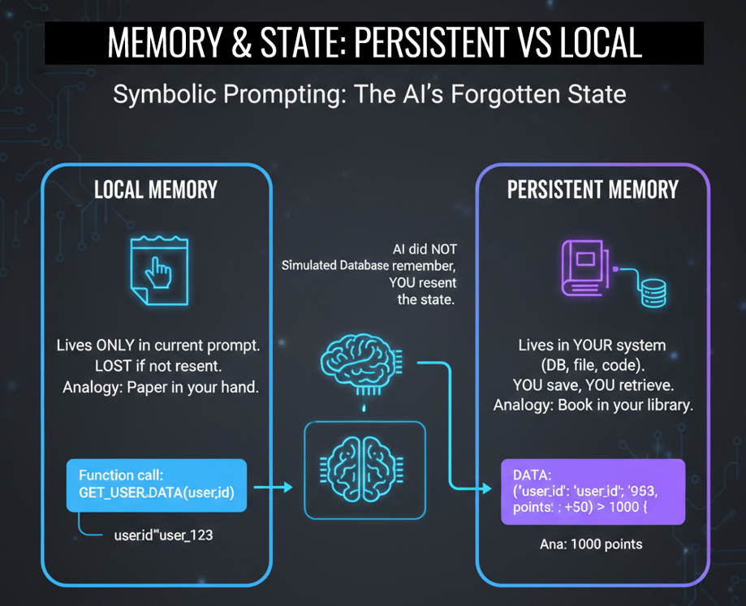

# Class 11 - Counters and Memory | Why AI Forgets (And How to Give It Memory)

> **The Big Bang Principle:** Every prompt is a new universe. Learn how to bridge the gap between "Volatile Local Memory" and "Persistent System State" to build AI with a long-term memory.

**Every prompt is a universe born and destroyed in milliseconds. The AI remembers nothing.** This is the fundamental truth of working with LLMs. In this class, you'll learn why your AI forgets everything between conversations—and how to build the external memory systems that give it a past, a present, and a future.

<div align="center">

[](https://github.com/mindhack03d/SymbolicPrompting)
[](https://github.com/mindhack03d/SymbolicPrompting)
[](https://youtube.com/playlist?list=PLNFL-2KY9QZVqoRwRzVLPN6qmDftpsjg6)
[](https://www.youtube.com/playlist?list=PLNFL-2KY9QZXhGEfGUOrrZtzGdPESwh4l)
[](https://youtube.com/playlist?list=PLNFL-2KY9QZUKlXC_4gnVUHoAJdd4s-AC&si=4N7ROWCD3G46y8t5l)<br>
[](https://opensource.org/licenses/MIT)
[](../Benchmark/benchmark_methodology.md)
[](../Benchmark/symbolic_support_test.md)
[](https://youtu.be/aS1DI_CTMKc)

[⬅️ Class 10: TRY-CATCH](../BLOCK3_Control_Structures/10_TRY_CATCH_FINALLY.md) | [🏠 Home](../README.md) | [Class 12: Debugging & Antipatterns ➡️](../BLOCK4_Debugging_Antipatterns/12_Debugging_Antipattern.md)

</div>


***

<div align="center">

</div>

---

### 💥 The Big Bang Principle

Each prompt is a universe. It explodes into existence the moment you press "Enter." It executes its logic in a blaze of probability. And then—in milliseconds—it dies. The response you receive is the echo of that dying universe. All its local variables, all its temporary state, all its "memory"—gone forever.

The AI retains nothing. It is a god that creates a universe, observes it, and then lets it collapse into nothingness, over and over and over.

**This is not a bug. This is the architecture.**

Your job is not to wish the AI remembered. Your job is to be the **archivist**—the force outside the universe that captures what matters and feeds it back into the next creation.

> Every prompt is a new Big Bang. You are the cosmic record-keeper.
```
[YOU] --(Prompt 1 + State A)--> [AI] --(Response 1 + State B)--> [YOU]
     <--(State B saved externally)--|
     
[YOU] --(Prompt 2 + State B)--> [AI] --(Response 2 + State C)--> [YOU]
     <--(State C saved externally)--|
```
> LLMs do not persist memory between independent executions.
They only operate on the context you provide at runtime.

```
Prompt 1: _counter := 1
Prompt 2: _counter := 2
Prompt 3: _counter := 3
```

---

🧠 LOCAL MEMORY<br>
It lives ONLY in the current prompt.<br>
If you do not resend it in the next prompt, it is lost.<br>
It is like a note in your hand: you have it now, but if you drop it, it disappears. The AI does not magically remember it.

```
YOUR SYSTEM:
-	Database
-	Text file
- Variable in memory
PROMPT: 
_counter := 42 # You read from your storage
```
---

💾 PERSISTENT MEMORY<br>
It lives in YOUR system (your code, your database, your file).<br>
You save it, you retrieve it, you send it when you need it.<br>
The AI only USES it during execution, but does not OWN it<br>

```
✅ LOCAL MEMORY = Prompt context
✅ PERSISTENT MEMORY = YOU manage it
🧠 THE AI SAVES NOTHING
```

---

**Analogy:**<br>
• LOCAL Memory = Paper in your hand (it is lost if you drop it)<br>
• PERSISTENT Memory = Book in your library (you store it, you take it out when you need it)

| Aspect | Local Memory | Persistent Memory |
| :--- | :--- | :--- |
| **Where it lives** | In the current prompt only | In YOUR system (DB, file, memory) |
| **Lifetime** | Dies with the prompt | Lives forever (until you delete it) |
| **Who manages it** | The AI (temporarily) | YOU |
| **Who can access it** | Only this prompt | Any prompt where you send it |
| **Example** | `_counter := 42` | `[DATABASE] user.points := 150` |

---

**EXERCISE**
Let's look at an example:
```
//YOUR SIMULATED DATABASE:
[DATA_MODELS] ::= {
  "user_123": {
    "name": "Ana",
    "points": 150,
    "level": "silver",
    "purchases": 12,
    "last_visit": "2024-03-15"
  }
}

[ROLE] ::=> Loyalty_System

[CONSTRAINTS] ::= { 
  - NO_ADD_COMMENTS
  - STRICT_SYMBOLIC_OUTPUT
  - MINIMAL_VERBOSE
}

[FUNCTION] process_purchase(user_id, amount) ::=> {
  // Step 1: Calculate Points
  _points_earned := amount * 0.1
  _current_points := [DATA_MODELS][user_id].points
  _new_total     := _current_points + _points_earned
  
  // Step 2: Update State
  [DATA_MODELS][user_id].points := _new_total
  [DATA_MODELS][user_id].purchases := [DATA_MODELS][user_id].purchases + 1
  
  [OUTPUT] ::= "Purchase processed. Points: " + STR(_new_total)

  // Step 3: Tier Evaluation
  IF _new_total >= 1000 THEN:
    [DATA_MODELS][user_id].level := "gold"
    [OUTPUT] ::= "CONGRATULATIONS! You have reached GOLD level"
  ENDIF
}

[EXECUTION] ::=> {
  CALL process_purchase("user_123", 1500)
}
```
Simulated Database, Functions calls user_id, and Execution CALL functions and "user_123" that is inside of simulated database. 

Upon execution, it returns the following response.<br>
We define a simulated Database, extract the data, and the AI only takes care of evaluating it.<br>
The AI did NOT remember that Ana had 950 points. YOU told it. The AI only calculated the new value.<br>

**What's happening here:**

1. **Your System Provides Context:** The `[DATA_MODELS]` block is YOUR data. You retrieved it from your database/file and inserted it into the prompt. The AI didn't remember Ana; YOU told the AI about Ana.

2. **The AI Executes:** The `process_purchase` function reads the data YOU provided, performs calculations, and updates the data *within the prompt*.

3. **The AI Returns the Result:** The response includes the updated state and any outputs.

4. **YOUR Responsibility:** Now YOU must take the updated state from the response and save it back to your database/file. The AI won't do it for you.

**The AI is just the calculator. YOU are the ledger.**

---

### Choosing Your Storage:

**FILE**
```
reading: file = read("state.txt")
writing: save("state.txt", new_state)
```
Good points: Simpler, Human-readable, But Not scalable to thousands of users

**DATABASE**
```
SELECT points FROM users WHERE id = 123
UPDATE users SET points = 500 WHERE id = 123
```
Saving or using a database is more scalable, allows for more complex queries, but requires infrastructure

**MEMORY**
```
variable_local.points = 500
```
In-memory handling is much faster, simpler, but is lost upon restart.<br>
The COURSE does not teach databases. But the PRINCIPLE is the same: YOU save, YOU retrieve, YOU send

---

### 🥇 The Golden Rules of Persistent Memory

- [ ] **📌 1. NEVER assume the AI remembers.** <br>Always resend the complete state. Every. Single. Time.
- [ ] **📌 2. VALIDATE what you retrieve.** <br>Check formats, check for corruption. Trust, but verify.
- [ ] **📌 3. VERSION your structure.** <br>`user_v1` → `user_v2` prevents confusion during evolution.
- [ ] **📌 4. LOG the changes.** <br>Know when and why state changed. Future you will thank past you.
- [ ] **📌 5. BACKUP critical state.** <br>If it hurts to lose it, back it up twice. No excuses.<br>
You don't want to explain why you lost 10,000 user points. If it's important, back it up.<br>
Unwritten rule: If it hurts to lose it, back it up twice.<br>

In traditional programming, persistence is optional.<br>
In Symbolic Prompting, persistence is MANDATORY.<br>
Without it, your system has no history. With it, you have a system with memory<br>

---

## SUMMARY

We now have persistence.<br>
We can accumulate user points.<br>
Remember preferences between sessions.<br>
Maintain the state of a game for days.<br>
But... when something fails?<br>
How do you know WHAT failed, WHERE it failed, and WHY?<br>
DEBUGGING.<br>
The art of finding the error that you yourself created.<br>
(And the art of not crying while you do it).<br>
In the next class: ```Debugging and Logging.```

> [!TIP]
> **Analogy:**
> - **Local Memory** = A note scribbled on a napkin. Useful right now, but you'll throw it away after eating.
> - **Persistent Memory** = A book on a library shelf. You have to go get it, read it, and put it back, but it lasts forever.

---

<details>
  <summary>⚖️ Legal Disclaimer (Click to expand)</summary>

This repository is for educational purposes only regarding Symbolic Prompting. The author is not responsible for the use that third parties may make of these techniques. The user is responsible for respecting the terms of service of AI platforms and applicable legislation. All content is provided "AS IS," without warranties.<br>
Compatibility may vary depending on model updates, tokenization behavior, and symbol parsing.
</details>

---

⭐ If this class helped you think differently about LLMs, consider starring the repository.

<div align="center">


<br>


</div>

## Author
- Jesus Huerta aka <em><a href="https://github.com/mindhack03d" rel="nofollow">(@\_mindhack03d_)</a></em></br>

## Contributors
- Alex Hernandez aka <em><a href="https://twitter.com/_alt3kx_" rel="nofollow">(@\_alt3kx\_)</a></em></br>

[⬅️ Class 10: TRY-CATCH](../BLOCK3_Control_Structures/10_TRY_CATCH_FINALLY.md) | [🏠 Home](../README.md) | [Class 12: Debugging & Antipatterns ➡️](../BLOCK4_Debugging_Antipatterns/12_Debugging_Antipattern.md)