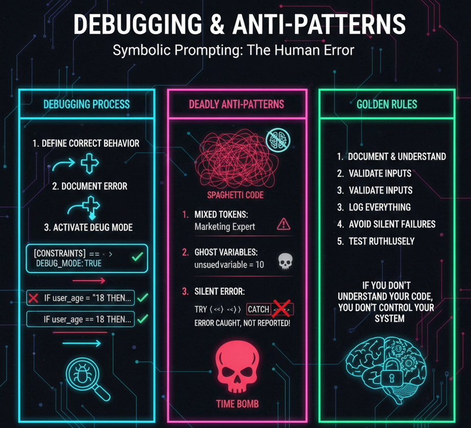

# Class 12 - Debugging & Errors / Anti-patterns | The Wisdom Layer of Symbolic Prompting

> **The Final Layer:** Learn to identify, trace, and eliminate logical flaws in your systems. Master the art of "clean prompting" and avoid the "Sacred Code" trap that keeps your systems fragile.

**You've built state machines, mastered control flow, and implemented persistent memory. But bugs don't care about your expertise.** In this final class, you'll learn the most important skill of all: how to find, understand, and eliminate the logical flaws that inevitably creep into complex systems—and how to avoid the anti-patterns that turn code into mystery.

<div align="center">

[](https://github.com/mindhack03d/SymbolicPrompting)
[](https://github.com/mindhack03d/SymbolicPrompting)
[](https://youtube.com/playlist?list=PLNFL-2KY9QZVqoRwRzVLPN6qmDftpsjg6)
[](https://www.youtube.com/playlist?list=PLNFL-2KY9QZXhGEfGUOrrZtzGdPESwh4l)
[](https://youtube.com/playlist?list=PLNFL-2KY9QZUKlXC_4gnVUHoAJdd4s-AC&si=4N7ROWCD3G46y8t5l)<br>
[](https://opensource.org/licenses/MIT)
[](../Benchmark/benchmark_methodology.md)
[](../Benchmark/symbolic_support_test.md)
[](https://youtu.be/Xcmco6vZmh0)

  [⬅️ Class 11: Counters & Memory](../BLOCK4_Debugging_Antipatterns/11_Counter_and_Memory.md) | [🏠 Home](../README.md) | [🎓 Final Summary & Resources ➡️](../README.md#summary)

</div>

***

<div align="center">

</div>

### 🔍 The Symbolic Prompting Debugging Protocol

**Step 1: REPRODUCE**<br>
Run the prompt exactly as-is, at least 3 times. Is the error consistent? If it varies, you're dealing with probabilistic noise, not a logic bug.

**Step 2: ISOLATE**<br>
Strip away everything non-essential. Remove functions, remove extra variables. Create the minimal prompt that still shows the error. The bug often lives in what you just removed.

**Step 3: INSPECT**<br>
Add `[DEBUG]` outputs at key points. What is the actual value of each variable? What path did the logic take? Don't guess—look.

**Step 4: CORRECT**<br>
Fix the specific issue you identified. Change one thing at a time. Rerun the minimal prompt.

**Step 5: VERIFY**<br>
Reintroduce the stripped-away complexity gradually. Did the fix hold? Did you introduce new bugs?

> "The only debugging technique that works is understanding what the code should do and comparing it to what it actually does."

---

We can now persist counters, modes and profiles.<br>
The AI is no longer amnesiac...<br>
But YOU are still human.<br>
And humans... we make mistakes.<br>
When you see on screen: ```'ERROR: THE SYSTEM DOES NOT WORK'```<br>
Most people think: ```'The AI failed'```.<br>
The reality: It's not a machine error. We are human. And we make human mistakes.

---

## Debugging and Erros

```
❌ "The AI didn't understand"
✅ "I wrote the prompt incorrectly"

❌ "The model is confused"
✅ "I didn't validate the data"

❌ "The system failed"
✅ "I didn't handle the edge case"
```
When something goes wrong, we ask ourselves:

```
❌ 'Did the AI not understand?'
❌ 'Did the system fail?'

The right questions are different:
✅ 'Did I write the prompt incorrectly?'
✅ 'Did I forget some validation?'
✅ 'Is the state I sent correct?'
```
In traditional programming, the error is in the code.<br>
In Symbolic Prompting, the error is almost always with whoever designed the prompt

```
Expected output: "APPROVED"
Condition: grade >= 70
Data: [VAR] grade: 85
```
Define the CORRECT BEHAVIOR before looking for the error.

```
Actual output: "FAILED"
```
DOCUMENT the error. Don't fix it yet. OBSERVE it

```
❌ IF age > = 18 # Space misplaced
❌ name "Ana" # Missing assignment
❌ ENDI F # Typo
❌ WHILE counter < maximum: # Missing ENDWHILE
```
We can have syntax errors, a space between the greater than and the equal sign.<br>
We forgot to assign the value. We could have written it wrong. Missing closing ```WHILE```, function, etc.<br>
The question is how could we detect it?

---

**EXERCISE**
```
[ROLE] ::=> Logic_Evaluator

[CONSTRAINTS] ::= { 
  STRICT_TYPE_CHECKING;
  NO_ADD_COMMENTS;   
  NO_IMPLICIT_CASTING;
  ONLY_PRINT_OUTPUT;
}

[GLOBAL] 
$minimum_grade := 70
[VAR] 
_student_grade := "85"
[LOGIC]
	IF _student_grade >= $minimum_grade THEN:
	  [OUTPUT] ::= "APPROVED"
	ELSE:
	  [OUTPUT] ::= "FAILED"
	ENDIF
[END_LOGIC]
```
The result we got, is it really what we expected?<br>
Was it not supposed to give APPROVED?<br>
What was wrong?

We are evaluating a String against a NUMBER.

---

```
[DEBUG_MODE] ::=> TRUE 
IF [DEBUG_MODE == TRUE] THEN 
[LOG] ::=> "Current_State: $current_state | Variable X: $val" 
ENDIF

[CONSTRAINTS] ::= {
   ENABLE_DEBUG_MODE;
   TRACE_LOGIG_EXECUTION;
   SHOW_INTERNAL_STATE;
}
```
There are various ways to activate debug mode; personally I prefer to use CONSTRAINTS. It becomes more elegant, easier to deactivate.

---

**EXERCISE**
```
[ROLE] ::=> Logic_Evaluator

[CONSTRAINTS] ::= {
  STRICT_TYPE_CHECKING;
  NO_IMPLICIT_CASTING;
  ENABLE_DEBUG_MODE;
  TRACE_LOGIG_EXECUTION;
  SHOW_INTERNAL_STATE;
}
 
[GLOBAL] 
$minimum_grade := 70
[VAR] 
_student_grade := "85"
[LOGIC]
IF _student_grade >= $minimum_grade THEN:
  [OUTPUT] ::= "APPROVED"
ELSE:
  [OUTPUT] ::= "FAILED"
ENDIF
[END_LOGIC]
```
Let's go back to the previous example and run it with ```DEBUG```.<br>
The result is as expected; it is telling us that we are comparing a ```STRING``` against a ```NUMBER``` or ```INTEGER```.<br>
This is one way to debug.


***

## 🚫 The Anti-Pattern Rogues' Gallery

```
✅ Proven solution
✅ Readable
✅ Maintainable
✅ Predictable

❌ "Solution" that seems correct
❌ It works... today
❌ Tomorrow it will make you cry
❌ The day after tomorrow it will make whoever inherits your code cry
```
An anti-pattern is NOT a syntax error. The code EXECUTES. The problem is HOW it is written

### 1. THE LINGUISTIC HYBRID
```
IF age is grEater than $MAX_AGE
```
📌 Mixing atomic tokens with natural language.

```
❌ 
[ROLE] ::=> Assistant
Hello, today we are going to process sales.
[VAR] 
_discount := 10
```
*Well, it really depends on the customer.*

**Symptoms:** Works sometimes, fails unpredictably. The AI oscillates between "logic mode" and "conversation mode."<br>
**Diagnosis:** Mixing atomic tokens (`IF`, `>`) with natural language ("is grEater than") confuses the model's attention.<br>
**Cure:** Stick to pure symbolic syntax inside logic blocks. `IF age > $MAX_AGE THEN`

### 2. THE SPAGHETTI CHEF

```
IF type == "VIP" THEN:
  [VAR] discount: 20 lol
  And if not, then 5.
[OUTPUT] ::= _discount
  End of program.
```
This EXECUTES. The AI 'understands' what you mean. But it is UNREADABLE. It is UNMAINTAINABLE. It is SPAGHETTI.<br>
Avoid mixing domains.

**Symptoms:** The code "works" but no one can read it. Adding features breaks existing functionality.<br>
**Diagnosis:** No consistent structure. Natural language mixed with code. Missing delimiters.<br>
**Cure:** Use proper blocks, indentation, and delimiters. If you wouldn't write it in Python, don't write it here.

### 3. THE HOARDER

```
❌ 
[GLOBAL] tax: 0.21
[GLOBAL] currency: "EUR"
[GLOBAL] exchange_rate: 1.08
[GLOBAL] discount_threshold: 100
[GLOBAL] max_attempts: 3
[GLOBAL] api_version: "2.0"

[FUNCTION] calculate_price(base)
RETURN base * 1.21 # What about the other variables?
[ENDFUNCTION]
```
Every ghost variable is NOISE. Every line that is not used is CONTAMINATION

**Symptoms:** Huge prompts with mysterious variables. High token costs. Confusion about what's actually needed.<br>
**Diagnosis:** Copy-paste inheritance. Variables added "just in case."<br>
**Cure:** Every unused variable is noise. Delete it. If you need it later, you can add it back.

### 4. THE CIRCUS RINGMASTER

```
❌ 
[ROLE] ::=> You are a very friendly ATM cashier
            who tells jokes while processing payments
            and gives encouragement to users.

[VAR] balance: 500

IF withdrawal > balance THEN:
  OUTPUT "Oops, you don't have enough! 😅
          Have you considered saving?
          Let me tell you a joke while..."
```
Use normal tokens to define Strings; mixing Normal Tokens and Atomic Tokens is not always so good.<br>
This is NOT a system. It's a circus. The AI doesn't know if it should BE PRECISE or BE ENTERTAINING

**Symptoms:** Inconsistent outputs. The AI can't decide if it's a system or a comedian.<br>
**Diagnosis:** Role definition that mixes function with personality.<br>
**Cure:** Separate concerns. `[ROLE] ::=> ATM_System` for the function. Use a separate `[PERSONA]` or `[TONE]` directive if you need personality.

```
❌ 
TRY:
  process_payment()
CATCH:
  # I do nothing, I say nothing
ENDTRY
OUTPUT "All good"
```

### 5. THE SILENT TREATMENT (Deadliest)
📌 Error caught... and hidden.<br>
📌 Philosophy: 'Don't bother the user with errors'.

What's the problem?<br>
The error EXISTS. The system FAILED.<br>
But YOU decide to IGNORE it.<br>
The user believes everything is fine...<br>
...and never receives their product.<br>
...and you never know why.<br>
It's like removing the fire alarm because it's annoying. The fire is still there.

```
❌ # I don't know what this does but if I remove it, it breaks.
   [VAR] x: 42
   IF user.type == "admin" THEN:
       SET x = x * 1.5  # ??
   ENDIF
```
**Symptoms:** Users report success but nothing happened. You have no logs. You have no idea why.<br>
**Diagnosis:** Fear of error messages. Misguided "user experience" design.<br>
**Cure:** **Never silence errors.** Log them. Report them. At minimum, output something. A silent error is a time bomb.

### 6. 🙏 THE SACRED CODE (Most Tragic)

It is the SADDEST anti-pattern of all.<br>
How is it born?<br>
1.	Someone writes something they DON'T UNDERSTAND<br>
2.	By chance, it WORKS (no one knows why)<br>
3.	Time passes... and NO ONE dares to touch it<br>
4.	It becomes 'sacred' - untouchable, mysterious, terrifying

The problem:<br>
• If it breaks, no one knows how to fix it<br>
• If it needs to be changed, no one knows how<br>
• The system depends on a mystery<br>

Avoid this.<br>
Document. Ask. Understand.<br>
If you don't understand why it works, eventually it will stop working and you will be lost

**Symptoms:** Fear of touching certain parts of the code. Mysterious behavior when those parts are active.<br>
**Diagnosis:** Code written by trial and error, never understood.<br>
**Cure:** Document it or delete it. If you don't know what it does, learn. If you can't learn, rewrite it from first principles. **Mystery code is liability, not asset.**

---

> [!IMPORTANT]
> Treatment:
> 1.	DOCUMENT or DELETE
> 2.	If you don't know what it does: REWRITE IT
> 3.	If you can't rewrite it: LEARN
> 
> Document the information, understand what is being done. If you have doubts, ask, don't stay with the doubt. If no one knows anything, seek to understand it.

> [!CAUTION]
> ## "IF YOU DON'T UNDERSTAND YOUR CODE,
> ## YOU DON'T CONTROL YOUR SYSTEM.
> ## AND 
> ## IF YOU DON'T CONTROL YOUR SYSTEM,
> ## IT WILL CONTROL YOU."
These are just some anti-patterns.<br>
But they are the MOST DEADLY in Symbolic Prompting.

---

## SUMMARY
Symbolic Prompting is not about controlling AI.<br>
It is about controlling ambiguity.

The more explicit your state, the more deterministic your system.<br>
The more deterministic your system, the less you blame the machine.

## 🎓 A Personal Note from the Author

I hope this little course on Symbolic Prompting has been useful to you.<br>
I created it to share knowledge, because I learned something fascinating and wanted to pass it on.<br>

**Symbolic Prompting** is not just a technique.<br>
It's a way of thinking.<br>
It's understanding that AI is not magic, it's structured language.<br>
It has uses in education, in systems, in automation, in logic.<br>
But above all, it has a personal use: **Making you think clearly**.

Thank you for taking this journey with me.
- Jesus Huerta Martinez (@\_mindhack03d\_)

---

<details>
  <summary>⚖️ Legal Disclaimer (Click to expand)</summary>

This repository is for educational purposes only regarding Symbolic Prompting. The author is not responsible for the use that third parties may make of these techniques. The user is responsible for respecting the terms of service of AI platforms and applicable legislation. All content is provided "AS IS," without warranties.<br>
Compatibility may vary depending on model updates, tokenization behavior, and symbol parsing.
</details>

---

⭐ If this class helped you think differently about LLMs, consider starring the repository.

<div align="center">


<br>


</div>

## Author
- Jesus Huerta aka <em><a href="https://github.com/mindhack03d" rel="nofollow">(@\_mindhack03d_)</a></em></br>

## Contributors
- Alex Hernandez aka <em><a href="https://twitter.com/_alt3kx_" rel="nofollow">(@\_alt3kx\_)</a></em></br>

## 🎓 Graduation: Next Steps

> [!TIP]
> ### 🏆 Become a Contributor
> Congratulations on completing the **Symbolic Prompting Framework** curriculum! This is just the beginning.<br> 
> To help this community grow:
> 1. **Fork** this repository.
> 2. **Create** your own Symbolic Logic examples or modules.
> 3. **Submit a Pull Request** to be featured in the "Community Examples" section!
> 
> Don't forget to ⭐ **Star** this repo if these 12 classes changed the way you think about AI!

---

### 📚 Final Resources
Would you like to put your knowledge to the test? 
* **[Master Final Exam]** (Coming Soon)
* **[Download the One-Page Cheat Sheet]** (Summarizing all 12 classes)

[⬅️ Class 11: Counters & Memory](../BLOCK4_Debugging_Antipatterns/11_Counter_and_Memory.md) | [🏠 Home](../README.md) | [🎓 Final Summary & Resources ➡️](../README.md#summary)