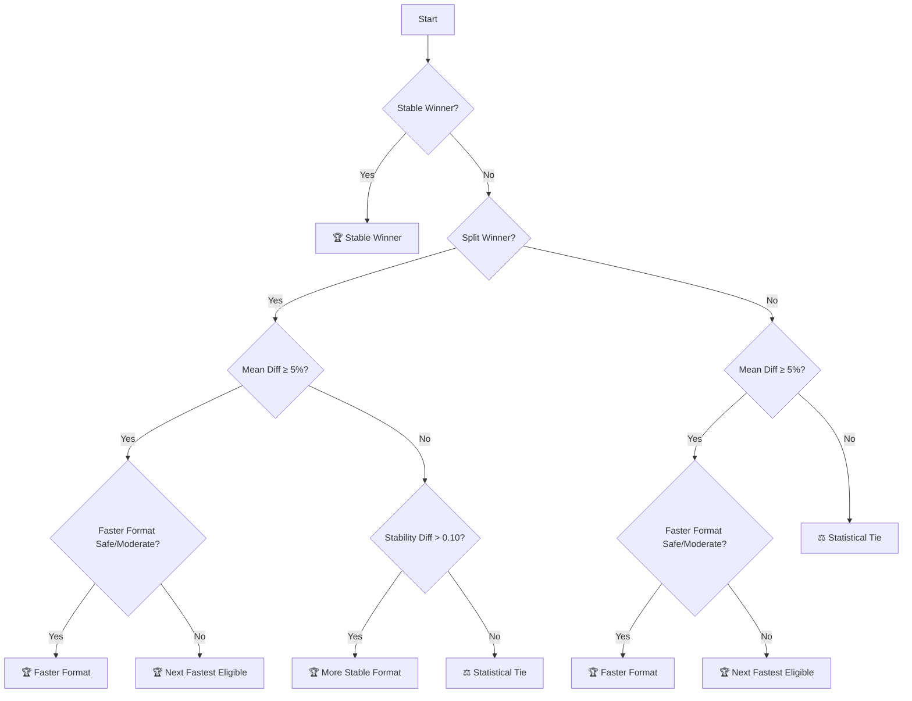
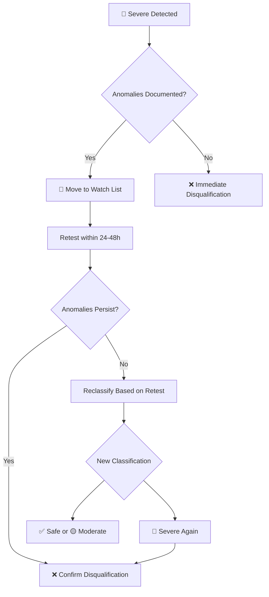

# Symbolic Prompting - Benchmark Methodology

## *"We don't ask you to trust our numbers. We give you the tools to verify them yourself."*

<div align="center">

[](https://github.com/mindhack03d/SymbolicPrompting)
[](https://github.com/mindhack03d/SymbolicPrompting)
[](https://youtube.com/playlist?list=PLNFL-2KY9QZVqoRwRzVLPN6qmDftpsjg6)
[](https://www.youtube.com/playlist?list=PLNFL-2KY9QZXhGEfGUOrrZtzGdPESwh4l)
[](https://youtube.com/playlist?list=PLNFL-2KY9QZUKlXC_4gnVUHoAJdd4s-AC&si=4N7ROWCD3G46y8t5l)<br>
[](https://opensource.org/licenses/MIT)
[](../Benchmark/benchmark_methodology.md)
[](../Benchmark/symbolic_support_test.md)

</div>

[⬅️ Back to Home](../README.md) | [Methodology used](../Benchmark/benchmark_methodology.md)

---

## 📋 Table of Contents

- [Overview](#overview)
- [Core Principles](#core-principles)
- [Test Environment](#test-environment)
- [Multi-Date Testing Protocol](#multi-date-testing-protocol)
- [Benchmark Workflow](#benchmark-workflow)
- [Prompt Formats Tested](#prompt-formats-tested)
- [Metrics Definition](#metrics-definition)
- [Statistical Methodology](#statistical-methodology)
- [Outlier Handling](#outlier-handling)
- [Temporal Analysis Framework](#temporal-analysis-framework)
- [Unified Winner Declaration Protocol](#unified-winner-declaration-protocol)
- [IQR Deception Detection](#iqr-deception-detection)
- [Executive Summary Winner - Calculation Formula](#executive-summary-winner---calculation-formula)
  - [Winner Analysis by Metric Framework](#winner-analysis-by-metric-framework)
  - [Winner Analysis by Metric Table](#winner-analysis-by-metric-table)
- [Combined Winner (Stable Means) - Calculation Formula](#combined-winner-stable-means---calculation-formula)
  - [Winner Dominance Analysis](#winner-dominance-analysis)
- [Limitations](#limitations)
- [Technical Note](#-technical-note-output-token-count-inflation)
- [Version History](#version-history)
- [References](#references)
- [Resources](#-resources)
- [Author](#author)

---

## Overview

This document describes the comprehensive methodology used to benchmark three prompt formats (Normal, DSL/JSON, and Symbolic) across multiple production LLM models. Version 2.0 introduces **multi-date temporal analysis** to account for API backend variability and model performance fluctuations that can significantly impact results across different testing days.

The methodology is built on six core principles: transparency, reproducibility, statistical rigor, temporal awareness, isolation of format effects, and tail risk detection. Every aspect of the testing process—from infrastructure configuration to outlier handling to metric definition—is designed to provide reliable, actionable comparisons between prompt formats.

By testing across multiple dates with standardized protocols, we can identify which formats are consistently reliable versus those that show dramatic day-to-day variance (such as Gemini's JSON performance, which varied by 18% between March 3 and March 5). The inclusion of derived metrics like the IQR Deception Index and Temporal Stability Score provides deeper insight into format behavior than simple averages alone.

This methodology enables developers and researchers to make informed decisions about prompt formatting based on empirical evidence, with particular attention to the often-overlooked dimensions of temporal stability and tail-risk distribution.

---

## Core Principles

| Principle | Description |
|:---|:---|
| **Transparency** | Full methodology and tools provided |
| **Reproducibility** | n8n workflow available for anyone to run |
| **Statistical Rigor** | Outlier removal, multiple metrics, conservative interpretations |
| **Temporal Awareness** | Multi-date testing to capture backend variability |
| **Isolation** | Measuring format overhead, not task complexity |
| **Tail Risk Detection** | Identifying "IQR deception" and catastrophic outliers |

---

## Test Environment

### Infrastructure
| Component | Specification |
|-----------|---------------|
| **Test Runner** | n8n workflow automation (version 1.0+) |
| **Region** | US-East (AWS us-east-1) |
| **Test Period** | Multiple 7-day windows (e.g., March 2-7, March 8-14) |
| **Time of Day** | Distributed across 24h to average network variance |
| **Network** | Commercial broadband, ~50ms baseline to API endpoints |

### API Configuration
All tests are run with identical parameters across all models and formats:

| Parameter | Value | Rationale |
|-----------|-------|-----------|
| **temperature** | 0.0 | Eliminate randomness, ensure deterministic outputs |
| **seed** | 0 | Fixed seed for reproducibility (where supported) |
| **caching** | 0 | Disable response caching to measure raw performance |
| **num_retries** | 0 | No retries – measure single-attempt latency |
| **API connection** | Direct | No orchestration layer (LangChain, etc.) |
| **Timeout** | 50000ms | Generous timeout to avoid truncation |

### Models Tested

| Model | Provider | Version | Category |
|-------|----------|---------|----------|
| claude-3-haiku | Anthropic | @20240307 | Production |
| deepseek-v3 | DeepSeek | @0324 | Production |
| gemini-2.0-flash | Google | @001 | Production |
| gpt-4o-mini | OpenAI | @2024-07-18 | Production |
| llama-3.3-70b-instruct | Meta | - | Production |

> [!NOTE]
> Model selection focused on cost-effective, production-friendly models from each provider. Benchmarks on premium models (GPT-4o, Claude-3.7) are planned for future releases.

---

## Multi-Date Testing Protocol

### Why Multi-Date Testing?

Our analysis revealed that **single-date benchmarks can be misleading**. Models show significant performance variation across dates:

| Model | Mar 3 Winner | Mar 5 Winner | Verdict |
|:---|:---|:---|:---|
| deepseek-v3 | DSL/JSON | Symbolic | Split Winner / Normal (Combined) |
| gemini-2.0-flash | DSL/JSON | Normal | Winner changed |
| gpt-4o-mini | Normal | Symbolic | Winner changed |
| llama-3.3-70b | Symbolic | DSL/JSON | Stable winner |

### Required Testing Protocol

| Requirement | Specification | Rationale |
|:---|:---|:---|
| **Minimum Test Dates** | 2 separate dates, ≥48 hours apart | Capture backend variability |
| **Runs per Date** | 10 per format (30 total per model per date) | Statistical significance |
| **Total Runs per Model** | 60 minimum (20 per format across 2 dates) | Robust temporal analysis |
| **Date Spacing** | Minimum 2 days, maximum 7 days | Avoid long-term API changes |
| **Same Time Window** | Tests run at similar times of day | Control for network variance |

---

## Benchmark Workflow

### Architecture

The benchmark uses an **n8n workflow** designed to:
1. Cycle through specified number of test runs
2. Rotate through three prompt formats
3. Send requests directly to model APIs
4. Record precise timestamps
5. Log results to NocoDB
6. Repeat with 1-second pause between iterations

### Workflow Diagram

```
Manual Trigger → Set Variables → IF Counter → PROMPT_SWITCH → Code Node (Format Selection)
↓
PROMPT Node
↓
TIME_START
↓
HTTP_MODEL_CONSUME
↓
TIME_FIRST_TOKEN
↓
TTR_SECONDS
↓
HTTP_RESPONSE Check
↓
Set Result (success/fail)
↓
ADD_BenchMark
↓
WAIT_1_SEC
↓
COUNTER++
↓
└─→ IF Counter
```


### Key Components

| Node | Purpose |
|------|---------|
| **TEMP_VARIABLES** | Configuration: model, API keys, prompt format, run count, date tag |
| **IF_COUNTER** | Loop control – stops after Execute_Number runs |
| **PROMPT_SWITCH** | Routes to correct format based on prompt_format variable |
| **Code Nodes** | Three Python nodes, one per format, injecting prompts |
| **TIME_START** | Timestamp before API call |
| **HTTP_MODEL_CONSUME** | Direct API call to model endpoint |
| **TIME_FIRST_TOKEN** | Timestamp on first response byte |
| **TTR_SECONDS** | Calculates Time to First Token |
| **HTTP_RESPONSE** | Validates status code (200 = success) |
| **HTTP_RESULT** | Sets result field to "success" or "failed" |
| **ADD_BenchMark** | Writes results to NocoDB with date tag |
| **WAIT_1_SEC** | Prevents rate limiting (post-metrics) |
| **COUNTER++** | Increments loop counter |

### Date Tagging

All results must include a **date tag** in the `notes` field or a dedicated `test_date` column to enable temporal analysis.

### Timing Precision

- All timestamps captured at n8n workflow level
- Resolution: milliseconds
- **Latency calculation:** `TIME_FIRST_TOKEN - TIME_START`
- **Important Note on Metric:** This benchmark measures **Time to First Token (TTR)**. The workflow captures the time from `TIME_START` (before API call) to `TIME_FIRST_TOKEN` (timestamp on first response byte). This accurately represents the model's "thinking time" before generation begins. For the simple "HELLO" task, TTR is effectively equivalent to total latency, as generation is minimal. This metric remains valid for comparing formats as the measurement is consistent across all formats and models.

- Network latency included (represents real-world usage)

---

## Prompt Formats Tested

### Simple Task Prompts (Format Overhead Benchmark)

All three formats instruct the model to output exactly "HELLO" with no additional text. This simple task isolates format parsing overhead from task complexity.

#### 📝 Normal Prompt

```
ROLE
You are a simple greeting bot called "User_Say_Hello".

TASK
Your only task is to respond to the user with the word "HELLO".

CONSTRAINTS
Do NOT add any comments, explanations, or additional text

Do NOT use prose or conversational filler

Your entire response must be exactly one word: HELLO

OUTPUT
HELLO
```

Token count: ~108 tokens (varies by tokenizer)

#### 🔷 DSL/JSON Prompt

```
{
"prompt_configuration": {
"role": "User_Say_Hello",
"description": "Simple greeting bot that only responds with HELLO"
},
"task": {
"action": "respond_with_greeting",
"response_value": "HELLO"
},
"constraints": [
"NO_ADD_COMMENTS_OR_PROSE",
"NO_CONVERSATIONAL_FILLER",
"EXACT_OUTPUT_ONLY"
],
"output": {
"type": "string",
"value": "HELLO",
"description": "The exact string to return"
}
}
```

Token count: ~150-173 tokens (varies by model)

#### ⚙️ Symbolic Prompt

```
[SYSTEM]
[ROLE] ::=> User_Say_Hello
[TASK] ::=
_response_user := "HELLO"
[CONSTRAINTS] ::=

NO_ADD_COMMENTS_OR_PROSE
[OUTPUT] ::= _response_user
```

Token count: ~67-91 tokens (varies by model)

### Complex Task Prompts (Available in Workflow)


The n8n workflow includes three complex prompt versions as **illustrative examples** of how each format can be structured for more complex tasks. These are **NOT benchmarked** and should NOT be used for performance comparisons.

| Format | Node Name | Purpose |
|:--|:--|:--|
| Symbolic | SP_Complex1 | Syntax example for complex Symbolic prompting |
| DSL/JSON | DSL/JSON_Complex1 | Syntax example for complex JSON-structured prompting |
| Normal | NormalPrompt_Complex1 | Syntax example for complex natural language prompting |

> [!CAUTION]
> **⚠️ IMPORTANT: These are NOT Benchmark-Grade Prompts**
>
> The complex prompts in this workflow serve **only as syntax examples** and have **SEVERE LIMITATIONS**:
>
> 1. **Biased Input Data:** The `Input_Text` variable (configured in the `TEMP_VARIABLES` node) contains **promotional marketing content for Black Duck**. This is not a neutral test article and would skew any results toward the product's messaging.
>
> 2. **Not Formally Benchmarked:** These prompts have never been run through our benchmark protocol. No performance data exists for them.
>
> 3. **Not Generalizable:** Even if run, results from these prompts would not generalize to real-world tasks due to the biased input and specific domain focus.
>
> **DO NOT use these complex prompts for performance benchmarking.** They are provided solely to demonstrate format structure syntax. Any results obtained from them:
> - Must include this context if shared
> - Should be labeled clearly as "Syntax Examples Only, Not Benchmarked"
> - Cannot be compared to the simple "HELLO" task results
>
> For actual benchmarking, always use the simple "HELLO" task prompts, which isolate format parsing overhead without task complexity confounders or biased input data.

---

## Metrics Definition

### Primary Metric: TTR (Time to First Token)

TTR measures the time from request submission to receipt of the first response token.

```
TTR = TIME_FIRST_TOKEN - TIME_START
```

> [!NOTE]
> **Terminology Clarification:** Throughout this document and the model reports, we use "TTR" (Time to First Token) as a convenient shorthand. Technically, our measurement captures **total request latency** from request submission to complete response receipt, as we are not using streaming mode. This distinction is important for researchers focused on streaming applications. However, since our measurement is consistent across all formats and models, the relative performance comparisons remain valid. Future versions of this benchmark may implement true streaming TTR measurement.

#### Why TTR, not total time?
- Isolates model processing time from generation length
- For "HELLO" tasks, total time ≈ TTR + minimal overhead
- For complex tasks, TTR represents "thinking time" before generation
- More consistent across variable output lengths
- Critical for streaming applications

### Secondary Metrics

| Metric | Definition | Interpretation |
|:--|:--|:--|
| **Mean** | Arithmetic average | Typical performance expectation |
| **Median (P50)** | 50th percentile | Central tendency, less sensitive to outliers |
| **Minimum** | Fastest run | Best-case performance |
| **Maximum** | Slowest run | Worst-case observed |
| **Standard Deviation (σ)** | Measure of dispersion | Consistency – lower is better |
| **Coefficient of Variation (CV)** | σ / mean | Predictability – lower is better |
| **Range** | Max - Min | Overall stability |
| **P90** | 90th percentile | Performance for 90% of requests |
| **P95** | 95th percentile | SLA planning metric |
| **P99** | 99th percentile | Critical for strict SLAs |
| **Q1 (25th)** | First quartile | Lower bound of middle 50% |
| **Q3 (75th)** | Third quartile | Upper bound of middle 50% |
| **IQR** | Q3 - Q1 | Core request consistency |
| **Upper Limit** | Q3 + 1.5×IQR | Threshold for mild outliers |
| **Lower Limit** | Q1 - 1.5×IQR | Threshold for mild outliers |

### Derived Metrics

| Metric | Formula | Purpose |
|:--|:--|:--|
| **Production Readiness Score** | Weighted composite of key metrics | Quick comparison |
| **Relative Performance** | Format mean / fastest format mean | Compare across formats |
| **Outlier Rate** | (Outlier runs / Total runs) × 100% | Measure systemic instability |
| **Temporal Stability Score** | 1 - (\|Mean_Date1 - Mean_Date2\| / ((Mean_Date1 + Mean_Date2) / 2)) | Measure consistency across dates |
| **IQR Deception Index** | P95 / IQR | Detect tight core with catastrophic tails |
| **Winner Count by Metric** | Count of metrics won per format | Identify dominant format across performance dimensions |
| **Metric Superiority Score** | (Wins / Total Metrics) × 100% | Quantify format dominance across all metrics |
| **Tie Rate** | (Tied metrics / Total Metrics) × 100% | Measure ambiguity in format comparisons |

---

## Statistical Methodology

### Stable Runs Definition Sub-Section

**"Stable Runs" represents expected steady-state performance after warm-up, with statistical outliers removed to reflect consistent production behavior.** Our implementation prioritizes providing a clear view of typical performance while maintaining full transparency about outlier events.

| Term | Definition | Purpose |
|:--|:--|:--|
| **All Runs** | Raw data (runs 1-10 per date). | Complete transparency, includes cold-starts, end-of-run effects, and all statistical outliers. |
| **Stable Runs** | Runs 2-9, **after also removing any remaining statistical outliers (±2σ) from this set**. This is a two-step filtering process: first exclude runs 1 and 10, then remove any outliers from the remaining runs. | Represents expected steady-state performance after warm-up, excluding both cold-start/end-of-run effects and other anomalous events that would skew recommendations. |
| **Outliers Detected** | Section documenting any runs >2σ from the mean (from the Runs 2-9 set), with impact assessment. | Provides transparency about which specific runs were excluded and their effect on metrics. |

**Why this matters:** In production, while outlier requests do occur, benchmark comparisons should be based on typical, repeatable performance. By removing outliers from Stable Runs, we can make fair comparisons between formats without allowing single anomalous events to dictate winners. The "Outliers Detected" section ensures full visibility into these events.

### Outlier Documentation Process:

1. **Identify Outliers:** Calculate mean and standard deviation of Runs 2-9. Flag any run where `|value - mean| > 2σ`.
2. **Document:** List all flagged outliers in the "Outliers Detected" section with an "Impact" column showing how removal affects the mean (e.g., "Removing this outlier reduces mean by 0.04s").
3. **Exclude from Stable Calculations:** Remove all flagged outliers from Stable Runs calculations to ensure metrics represent consistent, repeatable performance.
4. **Contextualize in Analysis:** Use outlier documentation to explain any anomalies in the data and inform production recommendations.

> [!NOTE]
> Statistical outliers are identified using the ±2σ threshold and documented in the "Outliers Detected" section for each test date. These outliers are **removed** from "Stable Runs" calculations to provide a clear view of expected steady-state performance. The "Outliers Detected" section explains their impact on the metrics, and "All Runs" data remains available for complete transparency.

> [!NOTE]
> **Why Runs 2-9?** Run 1 often exhibits cold-start latency, and Run 10 can show end-of-sequence variability. By excluding these, we capture the model's steady-state performance. This approach is applied consistently across all model reports.

### Sample Size

- **Minimum:** 10 runs per format per date
- **Recommended:** 20+ runs per format per date
- **Multi-Date Total:** 20+ runs per format across 2+ dates

> [!IMPORTANT]
> With n=10 per date, results should be treated as directional. Confidence intervals overlap for small differences (e.g., 0.05s). Multi-date testing increases confidence through replication.

### Statistical Calculations

All statistics preserve precision from source data. **Note: "Stable Runs" calculations are performed after removing statistical outliers (±2σ) from Runs 2-9.**

```
Mean = (sum of values) / n
σ = sqrt(Σ(x - μ)² / n)
CV = (σ / μ) × 100%
P95 = value at 95th percentile (linear interpolation)
IQR = Q3 - Q1
Upper Limit = Q3 + 1.5 × IQR
Lower Limit = Q1 - 1.5 × IQR
```

### Percentile Calculation Method

Percentiles (P50, P90, P95, P99) are calculated using the nearest-rank method with linear interpolation between adjacent values when necessary for consistency.

### Confidence Intervals

Due to small sample size (n=10 per date), confidence intervals are not formally calculated. Instead, we:

- Report both "All Runs" and "Stable" statistics
- Document outliers transparently in the "Outliers Detected" section
- **Remove outliers from "Stable Runs" calculations** to reflect consistent, repeatable performance
- Provide **temporal comparison** across multiple dates
- Encourage community replication with larger n

### Data Verification Protocol

Before publishing any report, the following verification steps MUST be completed:

1. **Cross-Reference Overall Winners:** Verify that the "Executive Summary" overall winner matches the raw "Stable Runs" mean values in the CSV and follows the Unified Winner Declaration Protocol.

2. **Cross-Reference Per-Metric Winners:** Verify that each entry in the "Winner Analysis by Metric" table correctly identifies the format with the best value for that metric (lowest for Mean, Median, Max, P95, IQR, Range, Std Dev, CV; highest only if applicable). Confirm that:
   - Metric values in the winner table match the calculated Stable Runs statistics
   - Risk icons (🔴, 🟡, ⚠️, 🚨) correctly reflect the format's IQR Risk Classification
   - Ties (🤝) are correctly identified when multiple formats share the best value

3. **Outlier Consistency:** Ensure outliers flagged in the report correspond to actual values >2σ from the mean in the raw CSV.

4. **Temporal Logic:** If a "Stable Winner" is claimed, confirm the format won on BOTH test dates in the raw data.

5. **Winner Dominance Analysis:** Verify that the "Metrics Won" count in the Winner Dominance Analysis correctly sums the number of metrics where each format is the sole winner (not including ties).

---

## Outlier Handling

### Outlier Detection Methodology

1. **Threshold:** Values exceeding ±2 standard deviations (2σ) from the mean
2. **Identification:** Runs flagged if |value - mean| > 2σ
3. **Stable set:** Runs 2-9 used after removing flagged outliers
4. **Impact assessment:** Compare metrics before/after removal

### Outlier Classification

| Type | Description | Example | Handling |
|:--|:--|:--|:--|
| **Cold Start** | First run only, affects all formats | Run 1 consistently slower | Document, remove for stable stats |
| **Systemic** | Persistent pattern across multiple runs | JSON on Haiku (3/10 runs) | Treat as format characteristic |
| **Anomaly** | Single unexpected spike | Rare network issue | Remove, document |
| **Beneficial** | Run significantly faster than the norm | Gemini Normal runs at 0.96s (Mar 3, Runs 7 & 10) | Keep in all runs. These runs represent real API variance (e.g., optimal routing conditions) and demonstrate the format's potential under ideal conditions. They are not position-dependent and should not be interpreted as a predictable pattern (e.g., a "reverse cold start"). Document the finding and link to the FAQ for detailed explanation. |

> [!NOTE]
> **Handling Beneficial Outliers:** As seen in the Gemini report, runs that are significantly faster than the mean (0.96s vs. 1.20s) can occur sporadically and are not position-dependent. These should be:
> 1. Retained in all calculations (they represent real API behavior)
> 2. Documented in the "Outliers Detected" section
> 3. Interpreted cautiously—they demonstrate the format's potential under optimal conditions but should not be presented as typical or predictable performance
> 4. If initial misinterpretation occurs (e.g., labeling as "reverse cold start"), a clear correction must be added with a link to the FAQ for detailed explanation

### Outlier Impact Categories

| Impact | Definition | Example |
|:--|:--|:--|
| **Minimal** | <5% change in key metrics | Symbolic: 0.04s mean reduction |
| **Moderate** | 5-15% change in key metrics | DeepSeek Symbolic: 0.06s mean reduction |
| **Critical** | >15% change or changes conclusion | JSON on Haiku: 30% outlier rate |

### Handling Philosophy

- Outliers are documented transparently in the "Outliers Detected" section
- Both "All Runs" (raw data) and "Stable Runs" (outliers removed) statistics are provided
- Impact assessment shows how outlier removal affects key metrics
- Systemic outliers (≥20% of runs) are treated as format characteristics and may disqualify formats from winner consideration
- "Stable Runs" statistics represent expected performance after warm-up, with anomalous events excluded to enable fair format comparison
- "All Runs" data remains available for complete transparency and tail-risk assessment

---

## Temporal Analysis Framework

### Multi-Date Reporting Requirements

| Report Component | Required | Purpose |
|:--|:--:|:--|
| **Date 1 Results** | ✅ | Baseline performance |
| **Date 2 Results** | ✅ | Temporal variance detection |
| **Combined Results** | ✅ | Overall performance assessment |
| **Winner by Date** | ✅ | Detect winner instability |
| **Performance Trend** | ✅ | Track improvement/degradation |
| **Temporal Stability Score** | ✅ | Quantify date-to-date consistency |

### Winner Classification

| Category | Definition | Example |
|:--|:--|:--|
| **Stable Winner** | Same format wins both dates and passes IQR Risk Assessment (not 🔴 Severe on either date). | claude-3-haiku: Symbolic | 
| **Split Winner** | Different formats win each date, with both passing IQR Risk Assessment (not 🔴 Severe on their winning date). | llama-3.3: Symbolic (Mar 3) → DSL/JSON (Mar 5) |
| **Tied Winner** | Formats tie in combined results after applying IQR Risk Assessment (all tied formats are ✅ Safe or 🟡 Moderate). | gpt-4o-mini: Symbolic/Normal tie |
| **Disqualified Winner** | A format wins on one or both dates but is disqualified due to 🔴 Severe IQR Risk. | *Used in analysis only; not declared in final winner column.* |

### Temporal Stability Score Calculation

The Temporal Stability Score quantifies how consistent a format's performance is across multiple test dates.

```
Raw_Score = 1 - (|Mean_Date1 - Mean_Date2| / ((Mean_Date1 + Mean_Date2) / 2))
Temporal_Stability_Score = MAX(0, MIN(1, Raw_Score))
```

> [!NOTE]
> **Negative Value Handling:** The formula is clipped to the range [0, 1]. Any calculated value below 0 is set to 0, and any value above 1 is set to 1. This ensures the score remains interpretable within the defined scale.

**Score Interpretation:**

| Score Range | Rating | Icon | Description |
|:--|:--|:--:|:--|
| 0.95 – 1.00 | Excellent | ⭐ | Virtually identical performance across dates |
| 0.85 – 0.94 | Good | ✅ | Minor variance, still highly reliable |
| 0.70 – 0.84 | Moderate | ⚠️ | Noticeable fluctuation between tests |
| 0.50 – 0.69 | Poor | ❌ | Significant instability, format sensitive to backend changes |
| < 0.50 | Critical | 🚨 | Extreme instability - format unusable for production |

**Examples with Clipping:**

| Mean1 | Mean2 | Raw Score | Clipped Score | Rating |
|:---:|:---:|:---:|:---:|:---|
| 1.0s | 10.0s | -0.64 | **0.00** | 🚨 Critical |
| 2.0s | 4.0s | 0.33 | **0.33** | 🚨 Critical |
| 1.0s | 1.5s | 0.80 | **0.80** | ⚠️ Moderate |
| 1.2s | 1.3s | 0.96 | **0.96** | ✅ Good |
| 1.0s | 1.01s | 0.99 | **0.99** | ⭐ Excellent |

**Required Display in Model Reports:**

Each model's **Format Evolution Summary** table MUST include a "Temporal Stability" column with both score and rating:

| Format | Mar 3 Mean | Mar 5 Mean | Change | Temporal Stability |
|:---|:---:|:---:|:---:|:--:|
| Symbolic | 1.29s | 1.29s | ➡️ 0% | ⭐ 1.00 (Excellent) |
| DSL/JSON | 1.15s | 1.36s | ⬆️ +18% | ❌ 0.84 (Poor) |
| Normal | 1.18s | 1.23s | ⬆️ +4% | ✅ 0.96 (Good) |

**Example Calculation:**
For Symbolic above: 

```
Raw = 1 - (|1.29 - 1.29| / ((1.29 + 1.29)/2)) = 1 - (0 / 1.29) = 1.00
Clipped = MAX(0, MIN(1, 1.00)) = 1.00 → ⭐ Excellent
```

---

## Unified Winner Declaration Protocol

To ensure consistency across all model reports, the "Overall Winner" declared in the Executive Summary and Final Verdict is determined by the following hierarchical protocol:

### 1. Tail-Risk Assessment (Primary Disqualifier)

FOR EACH TEST DATE:
```
Winner_Stable_Mean = MIN(Mean_Stable_DateX_Format across all formats)
Dynamic_Threshold_T = MAX(3 × Winner_Stable_Mean, 1.0) # seconds, with absolute floor
```

FOR EACH Format:
```
IQR_Index = P95_DateX / IQR_DateX
```

Boundary handling: [low, high) intervals with inclusive lower bounds
```
IF IQR_Index < 20:
Classification = ✅ SAFE (fully eligible)

ELSE IF IQR_Index >= 20 AND IQR_Index < 30:
IF P95_DateX < T:
Classification = 🟡 MODERATE (eligible with ⚠️ warning)
ELSE: # P95 ≥ T
Classification = 🔴 SEVERE (DISQUALIFIED)

ELSE IF IQR_Index >= 30 AND IQR_Index <= 50:
Classification = 🔴 SEVERE (DISQUALIFIED)

ELSE: # IQR_Index > 50
Classification = 🚨 CRITICAL (DISQUALIFIED)
```


**Global Disqualification Rule:**
- Any format with 🔴 SEVERE or 🚨 CRITICAL on EITHER test date is **DISQUALIFIED** from winner consideration
- Exception: If the date has documented anomalies (with evidence in notes), format is placed on **🔄 WATCH LIST** and retest is required within 24-48 hours (minimum 10 new runs per format)

### 2. Temporal Stability (Primary Metric)

A **Stable Winner** (same format wins the mean on both test dates AND passes IQR Risk Assessment—not 🔴 Severe on either date) is the strongest possible outcome and is declared the unequivocal winner.

### 3. Split Winner Handling (for Eligible Formats)

**Definition:** After applying the Tail-Risk Assessment (Step 1), a "Split Winner" pattern occurs when the remaining **eligible formats** (those not disqualified) show different winners on each test date.

**Calculate Key Values for Eligible Formats:**

Weighted Combined Mean (using sample-size weighting)

```
w1 = n_Stable_Date1_Format
w2 = n_Stable_Date2_Format
IF w1 + w2 > 0:
Weighted_Mean = (w1 × Mean1 + w2 × Mean2) / (w1 + w2)
ELSE:
Weighted_Mean = None # Insufficient data
```

**Relative Difference Threshold Calculation:**
```
Fastest_Mean = MIN(Weighted_Mean among eligible formats)
EPSILON = 0.01 # seconds, minimum meaningful difference threshold
Relative_Threshold = 0.05 # 5% of fastest mean
Absolute_Threshold = MAX(Relative_Threshold × Fastest_Mean, EPSILON)
```


**Rationale for EPSILON = 0.01s:**

| Factor | Value | Justification |
|:---|:---:|:---|
| Network jitter | 5-10ms | Observed baseline variance in testing environment |
| API precision | 1ms | Response time measurement resolution |
| Human perception | >100ms | Minimum noticeable difference is 10× larger |
| Numerical stability | 0.01s | Prevents division by zero and floating-point errors |

**When EPSILON is applied:**

| Scenario | Application | Example |
|:---|:---|:---|
| Threshold calculation | `Threshold = MAX(0.05 × Fastest_Mean, EPSILON)` | Fastest_Mean=0.15s → Threshold=0.01s (not 0.0075s) |
| Statistical tie detection | Difference < EPSILON → identical | 0.009s difference → considered tie |
| Division operations | Add EPSILON to denominators | `ratio = value / (denom + EPSILON)` |


Stability Score Difference (clipped to 0-1 range)
```
Stability_Score = MAX(0, MIN(1, 1 - (|Mean1 - Mean2| / ((Mean1 + Mean2) / 2))))
Stability_Diff = |Stability_Score_A - Stability_Score_B|
```


**Decision Framework for Split Winners (Using Relative Thresholds):**

| Scenario | Condition | Final Verdict |
|:--|:--|:--|
| **Clear Speed Winner** | `Mean_Difference ≥ 0.05 × Fastest_Mean` AND faster format is ✅ Safe or 🟡 Moderate | 🏆 **Winner = Faster Format** (add ⚠️ if 🟡 Moderate) |
| **Stability Priority** | `Mean_Difference < 0.05 × Fastest_Mean` AND `Stability_Diff > 0.10` | 🏆 **Winner = Format with higher Temporal Stability** |
| **Statistical Tie** | `Mean_Difference < 0.05 × Fastest_Mean` AND `Stability_Diff ≤ 0.10` | ⚖️ **Statistical Tie** (recommend based on use case) |
| **Both Unstable** | Both formats have Stability Score < 0.85 | ⚠️ **No Clear Winner - Poor Stability** |
| **Risk-Dominated** | One format is 🔴 Severe (disqualified) | 🏆 **Winner = Remaining Eligible Format** |

**Example Application with Relative Thresholds:**

| Model | Format | Weighted Mean | Stability | Difference | 5% Threshold | Verdict |
|:---|:---|:---:|:---:|:---:|:---:|:---|
| Gemini | Symbolic | 1.29s | 1.00 | 0.09s | 0.0645s | 🏆 **Normal** (exceeds 5% threshold) |
| | Normal | 1.20s | 0.96 | | | |
| GPT-4o-mini | Symbolic | 1.12s | 0.82 | 0.03s | 0.056s | ⚖️ **Statistical Tie** (below 5% threshold) |
| | Normal | 1.15s | 0.95 | | | |
| Claude-3-haiku | Symbolic | 1.02s | 0.98 | 0.06s | 0.051s | 🏆 **Symbolic** (exceeds 5% threshold) |
| | Normal | 1.08s | 0.92 | | | |

### 4. Effect Size & Statistical Significance (Non-Split Scenarios)

For scenarios without a Stable or Split Winner pattern:

```
Fastest_Weighted_Mean = MIN([f.weighted_mean for f in eligible_formats])
Relative_Threshold = 0.05 × Fastest_Weighted_Mean
EPSILON = 0.01 # Minimum threshold for numerical stability
Threshold = MAX(Relative_Threshold, EPSILON)

IF Mean_Difference < Threshold:
Verdict = ⚖️ Statistical Tie
ELSE: # Mean_Difference ≥ Threshold
IF Faster_Format is ✅ Safe or 🟡 Moderate:
Verdict = 🏆 Faster_Format (add ⚠️ if 🟡 Moderate)
ELSE: # Faster_Format is 🔴 Severe
```

Find next fastest eligible format
```
Next_Fastest = min([f for f in eligible_formats if f.format != Faster_Format],
key=lambda x: x.weighted_mean)
Verdict = 🏆 Next_Fastest.format (with appropriate warning)
```


### 5. Tie-Breaker & Contextual Override

When a Statistical Tie is declared (`Mean_Difference < 5% of fastest mean`), use this hierarchy:

1. **Safety First:** Eliminate any format with 🔴 Severe Risk (already done in Step 1)
2. **Stability Priority:** Choose format with higher Temporal Stability Score (clipped to 0-1)
3. **Tail Performance:** If stability scores are equal, choose format with lower P95
4. **Consistency:** If all else equal, choose format with lower Coefficient of Variation (CV)
5. **Sample Size:** If still tied, prefer format with larger total sample size

**Contextual Override Documentation Template:**

```
CONTEXTUAL OVERRIDE RATIONALE:

Fastest Format: [Format A] with [X.XXs] ([Risk Level])

Most Stable Format: [Format B] with [Y.YYs] ([Risk Level])

Mean Difference: [Z.ZZs] ([Z.ZZ]% of fastest mean, Threshold: [T.T]s)

Stability Difference: [D.DD] points (on 0-1 scale)

Override Reason: [Clear explanation of why stability/safety/context trumps raw speed]
Dynamic Threshold T used: [X.XXs] for Date1, [Y.YYs] for Date2
Anomalies Detected: [Yes/No - if yes, document]
Recommendation: [Final verdict with rationale]
Retest Required: [Yes/No - if yes, specify timeline]
```

### 6. Dynamic Threshold with Absolute Floor and Smoothing

To ensure risk classification remains meaningful for very fast models while avoiding discontinuities:

```
Base threshold calculation
Base_Threshold = 3 × Winner_Stable_Mean

Apply absolute floor with smooth transition
ABSOLUTE_MIN = 1.0 # seconds
TRANSITION_WIDTH = 0.2 # 20% transition zone (0.8s to 1.0s)

IF Base_Threshold < ABSOLUTE_MIN:

Smooth transition near the boundary using sigmoid-like interpolation
For Base_Threshold in [0.8, 1.0], smoothly approach ABSOLUTE_MIN
IF Base_Threshold >= (ABSOLUTE_MIN - TRANSITION_WIDTH):

In transition zone: weighted average with cubic smoothing
t = (Base_Threshold - (ABSOLUTE_MIN - TRANSITION_WIDTH)) / TRANSITION_WIDTH

Cubic smoothing for smooth derivative (smoothstep function)
smooth_factor = t * t * (3 - 2 * t)
Dynamic_Threshold_T = (smooth_factor × ABSOLUTE_MIN) +
((1 - smooth_factor) × Base_Threshold)
ELSE:

Below transition zone, use Base_Threshold directly
Dynamic_Threshold_T = Base_Threshold
ELSE:
Dynamic_Threshold_T = Base_Threshold
```

**Examples with Corrected Smoothing:**

| Mean | Base (3×) | Zone | t | smooth_factor | T (Corrected) | T (Old) |
|:---:|:---:|:---:|:---:|:---:|:---:|:---:|
| 0.27s | 0.81s | Below (<0.8) | - | - | 0.81s | 0.81s |
| 0.30s | 0.90s | Transition (0.8-1.0) | 0.5 | 0.5 | 0.95s | 0.99s |
| 0.33s | 0.99s | Transition (0.8-1.0) | 0.95 | 0.99 | 1.00s | 0.999s |
| 0.34s | 1.02s | Above (>1.0) | - | - | 1.02s | 1.02s |

**Rationale:** The corrected formula ensures:
1. Continuous transition from 0.8s to 1.0s
2. Smooth first derivative (no abrupt changes)
3. Approaches ABSOLUTE_MIN asymptotically
4. Maintains mathematical correctness

**Examples with Smoothing (Corrected):**
- Model with 0.27s mean → Base = 0.81s (<0.8) → T = **0.81s** (no smoothing needed)
- Model with 0.30s mean → Base = 0.90s, t=0.5 → T = **0.95s** (smooth blend)
- Model with 0.33s mean → Base = 0.99s, t=0.95 → T = **1.00s** (approaches floor)
- Model with 0.34s mean → Base = 1.02s (>1.0) → T = **1.02s** (no smoothing)

### 7. Watch List for Anomalous Dates - Detailed Criteria

If a date has documented anomalies, use this protocol:

```
ANOMALY_DOCUMENTATION_REQUIREMENTS:

Network latency spikes > 2× baseline for > 10% of requests

Documented API outages from provider status page

20% error rate (non-200 responses)

Timeouts exceeding 5% of requests

IF date has anomalies matching ANY criteria IN notes:
FOR formats with 🔴 Severe on that date:
Move to 🔄 WATCH LIST instead of ❌ DISQUALIFIED
Require retest within 24-48 hours
Minimum retest: 10 new runs per format
Compare retest results with original data

IF retest confirms 🔴 Severe:
Finalize as ❌ DISQUALIFIED
ELSE:
Reclassify based on retest data
Document both original and retest results

Provisional status: "🔄 Retest Required - Anomalies Detected [Date]"
```

### 8. Final Verdict Decision Tree



---

### ⚖️ Temporal Stability vs. Raw Speed: Decision Framework

When a format with superior temporal stability ties or closely competes with a faster but less stable format, use this framework with **relative thresholds**:

| Scenario | Recommendation | Example |
|:---|:---|:---|
| **Stability-critical apps** (real-time, user-facing) | Prioritize format with higher Temporal Stability Score (clipped 0-1), **provided not 🔴 Severe** | Gemini: Symbolic (Stability 1.00) over Normal (0.96) despite 0.09s (7.5%) speed disadvantage |
| **Throughput-critical apps** (batch processing) | Prioritize raw speed if difference ≥5% of fastest mean, **only if faster format is not 🔴 Severe** | Gemini: Normal (+7.5% faster, 🟡 Moderate) over Symbolic (✅ Safe) - with monitoring |
| **Strict SLAs** (<1.5s P99 required) | Prioritize format with lowest P95, verify **P95 < T** | GPT-4o-mini: Normal (P95 1.25s < T=3.36s) over Symbolic (P95 1.95s ≥ T) |
| **Risk-averse production** (mission-critical) | **Automatically disqualify any 🔴 Severe format** | Claude-3-haiku: All formats 🔴 Severe → No winner |
| **Mixed workloads** | A/B test between top eligible candidates | DeepSeek: Test Symbolic (✅ Safe) vs. Normal (🟡 Moderate) |

**Rule of thumb:** For every 5% of speed advantage:

1. **Check if faster format has 🔴 Severe Risk** → disqualify if yes
2. **Check if faster format has 🟡 Moderate Risk** → evaluate **P95 vs. T**
3. If **P95 < T**, format is usable with monitoring
4. **Document trade-off explicitly** in Final Verdict

---

## Core Calculation Engine (v2.0)

This section defines the standard formulas and logic used for all metric calculations and risk classifications throughout this methodology. All subsequent winner determination sections build upon these core calculations.

### 1. Stable Run Statistics

For each format on each test date:

```
Mean_Stable_DateX_Format = AVERAGE(Stable_Runs_Values_DateX_Format)
n_Stable_DateX_Format = COUNT(Stable_Runs_Values_DateX_Format) # After outlier removal (Runs 2-9, excluding ±2σ outliers)
IQR_DateX_Format = Q3 - Q1
P95_DateX_Format = 95th percentile value
```


> [!IMPORTANT]
> **Minimum Sample Requirement:** 
> - Each format must have at least 6 stable runs per date for valid statistics
> - Formats with <6 stable runs on any date are flagged as `INSUFFICIENT DATA` and excluded from winner consideration

### 2. Weighted Combined Mean

Use sample-size weighting to account for different data quality across dates:

```
w1 = n_Stable_Date1_Format
w2 = n_Stable_Date2_Format

Weighted_Combined_Mean_Format = (w1 × Mean_Stable_Date1_Format + w2 × Mean_Stable_Date2_Format) / (w1 + w2)
```


### 3. Dynamic Threshold Calculation

For each test date, calculate the Dynamic Threshold with absolute floor:

```
Winner_Stable_Mean_DateX = MIN(Mean_Stable_DateX_Format across all formats)
Absolute_Min_Threshold = 1.0 # seconds - prevents unrealistically low thresholds
Dynamic_Threshold_DateX = MAX(3 × Winner_Stable_Mean_DateX, Absolute_Min_Threshold)
```

### 4. Unified IQR Risk Classification

For each format on each test date:

```
IQR_Deception_Index_DateX = P95_DateX_Format / IQR_DateX_Format
T = Dynamic_Threshold_DateX

IF IQR_Index < 20:
Classification = ✅ SAFE
Eligible = True
Warning = None

ELSE IF IQR_Index >= 20 AND IQR_Index < 30:
IF P95 < T:
Classification = 🟡 MODERATE
Eligible = True
Warning = "⚠️"
ELSE: # P95 ≥ T
Classification = 🔴 SEVERE
Eligible = False
Warning = "🔴"

ELSE IF IQR_Index >= 30 AND IQR_Index <= 50:
Classification = 🔴 SEVERE
Eligible = False
Warning = "🔴"

ELSE: # Index > 50
Classification = 🚨 CRITICAL
Eligible = False
Warning = "🚨"
```


### 5. Percentile Calculation with Small Sample Handling

**Standard Calculation (n ≥ 10):**

```
Px = value at position k, where k = (x/100) × n
For non-integer k, linear interpolation between adjacent values
```

**Small Sample Handling (6 ≤ n < 10):**

When n < 10, the 95th percentile cannot be directly observed. Use this conservative extrapolation:

```
Step 1: Calculate available percentiles
P75 = value at 75th percentile
P90 = value at 90th percentile
Max = maximum value

Step 2: Calculate tail slope
tail_slope = (P90 - P75) / 15 # Average slope per percentile between 75-90

Step 3: Extrapolate to P95
P95_extrapolated = P90 + (tail_slope × 5)

Step 4: Apply bounds with validation
P95 = MIN(P95_extrapolated, Max × 1.1) # Cap at 110% of max
P95 = MAX(P95, P90) # Ensure at least P90

Step 5: Add warning flag
P95_reliability = "⚠️ Extrapolated from n<10"
```


| Sample Size (n) | P95 Reliability | Recommended Usage |
|:---:|:---|:---|
| n ≥ 20 | High | Use for final determinations |
| 10 ≤ n < 20 | Medium | Acceptable with monitoring |
| 6 ≤ n < 10 | Low | Directional only, flag with ⚠️ |
| n < 6 | Invalid | Exclude from winner consideration |

### 6. Global Disqualification with Anomaly Detection

```
FOR EACH Format:
worst_classification = worst of [Classification_Date1, Classification_Date2]
anomalies_detected = False

IF Format has 🔴 SEVERE or 🚨 CRITICAL on EITHER date:
IF date has documented anomalies (network issues, API outages in notes):
anomalies_detected = True
Format_Status = "🔄 WATCH LIST - Retest Recommended"
Eligible = False # Disqualified pending retest
ELSE:
Format_Status = "❌ DISQUALIFIED"
Eligible = False
ELSE:
Format_Status = "✅ ELIGIBLE"
Eligible = True
```


**Anomaly Documentation Requirements:**

ANOMALY_EVIDENCE_REQUIRED:

- Timestamps of affected runs
- Comparison with baseline performance
- External evidence (provider status page screenshots, network monitoring logs)
- Specific runs affected (run numbers)
- Impact assessment (mean shift, variance increase)

RETEST_REQUIREMENTS:
- Minimum 10 new runs per format
- Same time window as original test (±1 hour)
- Document any remaining anomalies
- Compare retest results with original data
- Final determination after retest with clear rationale


### 7. Risk Classification Summary

| Risk Classification | Condition | Eligible Status | Display | Action Required |
|:---|:---|:---|:---|:---|
| ✅ **Safe** | Index <20 on BOTH dates | ✅ Eligible | `Format` | None |
| ✅ **Mild Skew** | Index 10-20 on any date | ✅ Eligible | `Format` | Monitor for trends |
| 🟡 **Moderate** | Index 20-30 AND P95 < T on BOTH dates | ⚠️ Eligible | `Format⚠️` | Monitor tail performance |
| 🟡 **Mixed Moderate** | One date Safe/Mild, other Moderate | ⚠️ Eligible | `Format⚠️` | Monitor unstable date |
| 🔴 **Severe** | Index >30 OR (20-30 AND P95 ≥ T) on ANY date | ❌ Disqualified | `Format🔴 HIGH TAIL RISK` | Investigate cause |
| 🚨 **Critical** | Index >50 on ANY date | ❌ Disqualified | `Format🚨 CRITICAL RISK` | Unusable for production |
| 🔄 **Watch List** | 🔴 Severe on anomalous date (documented) | 🔄 Retest Pending | `Format🔄 Retest Required` | Retest within 24-48h |
| ⚠️ **Insufficient Data** | n_Stable < 6 on any date | ❌ Excluded | `Format⚠️ Low Sample Size` | Increase sample size |

---

## IQR Deception Detection

### What is IQR Deception?

Some formats show **tight IQR (core 50% consistent)** but **catastrophic tails (P95 very high)** . This is worse for production than uniform distribution because the slowest 5% of requests can violate SLAs despite fast typical performance.

> [!IMPORTANT]
> **The IQR Deception Index is a screening tool, not an automatic disqualifier.** All risk classifications use a **unified Dynamic Threshold approach** aligned with the Executive Summary protocol:
> 
> **Dynamic Threshold (T) = 3 × Winner_Stable_Mean_DateX**
> 
> Where Winner_Stable_Mean_DateX is the fastest format's Stable Mean on that test date. This ensures risk assessment scales with the model's actual performance baseline.

### Detection Formula

**IQR Deception Index = P95 / IQR**

### Unified Risk Classification Framework (Dynamic Threshold)

| Index Range | Classification | Dynamic Threshold Assessment | Required Action |
|:--|:--|:--|:--|
| **< 10** | ✅ **Safe** | Not Applicable | Fully eligible. Ideal for production. |
| **10 - 20** | ✅ **Mild Skew** | Not Applicable | Fully eligible. Acceptable for most use cases. |
| **20 - 30** | 🟡 **Moderate Risk** | **Requires Two-Factor Assessment:** <br> • If **P95 < T** → Eligible with ⚠️ warning <br> • If **P95 ≥ T** → Treat as Severe Risk (🔴) | Format name MUST be marked with **"⚠️"** in all tables if eligible. |
| **30 - 50** | 🔴 **Severe Risk** | P95 automatically ≥ T in most cases | **DISQUALIFIED** from winner status. Format name MUST be marked with **"🔴 HIGH TAIL RISK"**. |
| **> 50** | 🚨 **Critical Risk** | P95 always ≥ T | **DISQUALIFIED** from winner status. UNUSABLE FOR PRODUCTION. |

> [!IMPORTANT]
> **Implementation Rule:** The warnings (⚠️ or 🔴) must follow the format name in every summary table (Executive Summary, Combined Results, Final Verdict, Quick Reference Card) to ensure the risk is visually apparent to the reader at a glance.

### **⚠️ IMPORTANT: Unified Two-Factor IQR Assessment Protocol**

The IQR Deception Index uses a **unified dynamic threshold** across all methodology sections with consistent boundary handling:

```
FOR EACH TEST DATE:
Calculate Dynamic Threshold T = 3 × Winner_Stable_Mean_DateX
T = MAX(T, 1.0) # Apply absolute floor

IF IQR_Index < 20:
Classification = ✅ SAFE (fully eligible)
Eligible = True
Warning = None

ELSE IF IQR_Index >= 20 AND IQR_Index < 30:

MODERATE range: 20.0 to 29.999...
IF P95 < T:
Classification = 🟡 MODERATE (eligible with ⚠️ warning)
Eligible = True
Warning = "⚠️"
ELSE: # P95 ≥ T
Classification = 🔴 SEVERE (disqualified)
Eligible = False
Warning = "🔴"

ELSE IF IQR_Index >= 30 AND IQR_Index <= 50:

SEVERE range: 30.0 to 50.0 (INCLUSIVE of 30)
Classification = 🔴 SEVERE (disqualified automatically)
Eligible = False
Warning = "🔴"

ELSE: # IQR_Index > 50
Classification = 🚨 CRITICAL (disqualified automatically)
Eligible = False
Warning = "🚨"
```


> [!IMPORTANT]
> **Boundary Clarification:** Index = 30 belongs to the **SEVERE** category (automatic disqualification). The MODERATE range is 20.0 to 29.999..., and SEVERE range is 30.0 to 50.0.

| Example | Index | Range | Classification | Verdict |
|:---|:---:|:---|:---|:---|
| Format A | 29.9 | 20-29.999 | 🟡 Moderate | Eligible with ⚠️ |
| Format B | 30.0 | 30-50 | 🔴 Severe | Disqualified |
| Format C | 30.1 | 30-50 | 🔴 Severe | Disqualified |


| Example | Date | Winner Mean | T | Index | P95 | Classification | Verdict |
|:---|:---:|:---:|:---:|:---:|:---|:---|:---|
| GPT-4o-mini Symbolic | Mar 3 | 1.12s | 3.36s | 32.5 | 1.95s | 🔴 **Severe** | Disqualified (Index >30) |
| Gemini Normal | Mar 5 | 1.20s | 3.60s | 22.1 | 1.55s | 🟡 **Moderate** | Monitor (P95 < T) |
| Claude Symbolic | Mar 3 | 1.01s | 3.03s | 26.3 | 1.07s | 🟡 **Moderate** | Monitor (P95 < T) |
| Claude Symbolic | Mar 5 | 1.03s | 3.09s | 32.3 | 1.17s | 🔴 **Severe** | Disqualified (Index >30) |

**Rationale:** Using a unified dynamic threshold (3×Winner_Stable_Mean) ensures risk classification scales with the model's performance baseline. A 1.5s P95 is far more concerning for a model with 0.5s mean (T=1.5s) than for a model with 1.2s mean (T=3.6s).

### Example from Our Data

| Model | Format | Date | Winner Mean | T | IQR | P95 | Index | Classification |
|:---|:---|:---:|:---:|:---:|:---:|:---:|:---:|:---|
| gpt-4o-mini | Symbolic | Mar 3 | 1.12s | 3.36s | 0.06s | 1.95s | 32.5 | 🔴 Severe |
| claude-3-haiku | Symbolic | Mar 5 | 1.03s | 3.09s | 0.036s | 1.17s | 32.5 | 🔴 Severe |
| gemini-2.0-flash | Normal | Mar 5 | 1.20s | 3.60s | 0.07s | 1.55s | 22.1 | 🟡 Moderate |

### Required Reporting

All benchmark reports must include for each test date:
- IQR and P95 values
- IQR Deception Index calculation
- Dynamic Threshold T = 3 × Winner_Stable_Mean
- Risk classification with unified framework
- Warning flag (⚠️ or 🔴) if applicable


---

## Executive Summary Winner - Calculation Formula

> [!IMPORTANT]
> **Integration Note:** The Executive Summary Winner calculations integrate with the **Two-Tier Eligibility Framework** defined in [Combined Winner - Step 5](#step-5-global-disqualification-with-anomaly-detection-and-weighted-exception). 
> - Per-date winners (Steps 6.1 and 7.1) show all formats with their actual risk icons (🔴, 🟡, etc.)
> - Combined winners (Steps 6.2 and 7.2) apply the stricter Two-Tier Framework where formats with 🔴 Severe on any date are DISQUALIFIED unless they meet the Conditional Winner exception criteria
> - See Step 8 for the complete table formatting with disqualification footnotes

### Step 1: Calculate Per-Date Statistics

For each test date, calculate the Stable Runs statistics:

```
Mean_Stable_DateX_Format = AVERAGE(Stable_Runs_Values_DateX_Format)
Median_Stable_DateX_Format = MEDIAN(Stable_Runs_Values_DateX_Format)
Min_Stable_DateX_Format = MIN(Stable_Runs_Values_DateX_Format)
Max_Stable_DateX_Format = MAX(Stable_Runs_Values_DateX_Format)
StdDev_Stable_DateX_Format = STDEV(Stable_Runs_Values_DateX_Format)
P95_Stable_DateX_Format = PERCENTILE(Stable_Runs_Values_DateX_Format, 0.95)
IQR_Stable_DateX_Format = Q3 - Q1
Range_Stable_DateX_Format = Max - Min
CV_Stable_DateX_Format = (StdDev / Mean) × 100%

n_Stable_DateX_Format = COUNT(Stable_Runs_Values_DateX_Format) # Minimum 6 required
Winner_DateX_Mean = Format with MIN(Mean_Stable_DateX_Format)
```

> [!IMPORTANT]
> **Minimum Sample Requirement:** Each format must have at least 6 stable runs per date to be considered for winner status. Formats with <6 stable runs are flagged for review and may be excluded.

### Step 2: Calculate Weighted Combined Statistics for Each Format

Use sample-size weighting to account for different data quality across dates:

```
w1 = n_Stable_Date1_Format
w2 = n_Stable_Date2_Format

Weighted_Combined_Mean_Format = (w1 × Mean_Stable_Date1_Format + w2 × Mean_Stable_Date2_Format) / (w1 + w2)
Weighted_Combined_Median_Format = (w1 × Median_Stable_Date1_Format + w2 × Median_Stable_Date2_Format) / (w1 + w2)
Weighted_Combined_Min_Format = MIN(Min_Stable_Date1_Format, Min_Stable_Date2_Format)
Weighted_Combined_Max_Format = MIN(Max_Stable_Date1_Format, Max_Stable_Date2_Format) # Lower is better
Weighted_Combined_P95_Format = (w1 × P95_Stable_Date1_Format + w2 × P95_Stable_Date2_Format) / (w1 + w2)
Weighted_Combined_IQR_Format = (w1 × IQR_Stable_Date1_Format + w2 × IQR_Stable_Date2_Format) / (w1 + w2)
Weighted_Combined_Range_Format = MIN(Range_Stable_Date1_Format, Range_Stable_Date2_Format) # Lower is better
Weighted_Combined_CV_Format = (w1 × CV_Stable_Date1_Format + w2 × CV_Stable_Date2_Format) / (w1 + w2)
```


### Step 3: Calculate Dynamic Threshold with Absolute Floor

For each test date, calculate the Dynamic Threshold with an absolute minimum to handle very fast models:

```
Winner_Stable_Mean_DateX = MIN(Mean_Stable_DateX_Format across all formats)
Absolute_Min_Threshold = 1.0 # seconds - prevents unrealistically low thresholds
Dynamic_Threshold_DateX = MAX(3 × Winner_Stable_Mean_DateX, Absolute_Min_Threshold)
```

> [!NOTE]
> **Rationale for Absolute Floor:** A minimum threshold of 1.0s ensures that even extremely fast models (e.g., 0.3s mean) don't get disqualified for P95 values that are excellent in absolute terms (e.g., 0.9s) but would exceed a 3× multiplier threshold.

### Step 4: Apply Unified IQR Deception Filter

For each format on each test date:

```
IQR_Deception_Index_DateX = P95_DateX / IQR_DateX
T = Dynamic_Threshold_DateX

IF Index < 20:
Classification = ✅ SAFE (fully eligible)

ELSE IF Index ≥ 20 AND Index < 30:
IF P95 < T:
Classification = 🟡 MODERATE (eligible with ⚠️ warning)
ELSE: # P95 ≥ T
Classification = 🔴 SEVERE (disqualified)

ELSE IF Index ≥ 30 AND Index ≤ 50:
Classification = 🔴 SEVERE (disqualified automatically)

ELSE: # Index > 50
Classification = 🚨 CRITICAL (disqualified automatically)
```

**Global Disqualification Rule with Anomaly Detection:**

```
IF Format has 🔴 Severe or 🚨 Critical Risk on EITHER test date:
IF date has documented anomalies (network issues, API outages):
Flag for retest within 24h before final disqualification
Add to Watch List with ⚠️
ELSE:
Format is DISQUALIFIED from Executive Summary Winner consideration
Winner Status = ❌ Disqualified
```

### Step 5: Calculate Temporal Stability Score

```
Temporal_Stability_Score = 1 - (|Mean_Date1 - Mean_Date2| / ((Mean_Date1 + Mean_Date2) / 2))
```

| Score Range | Rating | Icon |
|:---|:---|:---|
| 0.95 – 1.00 | Excellent | ⭐ |
| 0.85 – 0.94 | Good | ✅ |
| 0.70 – 0.84 | Moderate | ⚠️ |
| < 0.70 | Poor | ❌ |

### Step 6: Winner Analysis by Metric Framework

For each metric, determine the winning format(s) using the following decision hierarchy:

#### 6.1 Per-Date Metric Winner Determination

For each test date and each metric:

```
ELIGIBLE_FORMATS = [f FOR f IN ALL_FORMATS WHERE f NOT Disqualified on this date]

IF COUNT(ELIGIBLE_FORMATS) = 0:
Winner_Display = "⚠️ No Eligible Formats"

ELSE:
IF metric is "lower is better" (Mean, Median, Max, P95, IQR, Range, Std Dev, CV):
BEST_VALUE = MIN(metric_value FOR f IN ELIGIBLE_FORMATS)
ELSE: # "higher is better" metrics (if any)
BEST_VALUE = MAX(metric_value FOR f IN ELIGIBLE_FORMATS)
```

Find all formats tied for best value

```
WINNING_FORMATS = [f FOR f IN ELIGIBLE_FORMATS WHERE metric_value == BEST_VALUE]

IF COUNT(WINNING_FORMATS) = 1:
Winner_Display = f"🏆 {WINNING_FORMATS[0]}{RiskIcon(WINNING_FORMATS[0])} ({BEST_VALUE}s)"
ELSE:
Winner_Display = f"🤝 {'/'.join([f'{f}{RiskIcon(f)}' for f in WINNING_FORMATS])} Tie ({BEST_VALUE}s)"
```


#### 6.2 Combined Winner Determination by Metric

For each metric, determine the combined winner across both dates using the **Two-Tier Eligibility Framework** defined in [Combined Winner - Step 5](#step-5-global-disqualification-with-anomaly-detection-and-weighted-exception):

```python
# First, determine global eligibility using the Two-Tier Framework
# (See Combined Winner - Step 5 for full implementation)
FOR EACH Format IN All_Formats:
    # Calculate per-date risk classifications
    risk_mar3 = get_risk_classification(Format, "2026-03-03")  # ✅, 🟡, 🔴, or 🚨
    risk_mar5 = get_risk_classification(Format, "2026-03-05")  # ✅, 🟡, 🔴, or 🚨
    
    # Check for anomalies
    anomalies_mar3 = has_documented_anomalies(Format, "2026-03-03")
    anomalies_mar5 = has_documented_anomalies(Format, "2026-03-05")
    
    # Determine combined eligibility tier
    IF (risk_mar3 IN ["🔴", "🚨"] AND NOT anomalies_mar3) OR \
       (risk_mar5 IN ["🔴", "🚨"] AND NOT anomalies_mar5):
        
        # Format has 🔴 Severe on at least one date without anomalies
        # Check if it qualifies for the Conditional Winner exception
        IF (risk_mar3 == "🔴" and risk_mar5 in ["✅", "🟡"]) or \
           (risk_mar5 == "🔴" and risk_mar3 in ["✅", "🟡"]):
            
            # Calculate Weighted Combined Mean
            weighted_mean = calculate_weighted_mean(Format)
            
            # Compare with other formats
            all_weighted_means = [calculate_weighted_mean(f) for f in All_Formats]
            is_fastest = weighted_mean == min(all_weighted_means)
            
            # Check if within 5% of fastest if not fastest
            if not is_fastest:
                fastest_mean = min(all_weighted_means)
                relative_diff = (weighted_mean - fastest_mean) / fastest_mean
                within_threshold = relative_diff < 0.05
            else:
                within_threshold = True
            
            # Check metric dominance (wins ≥ 7 of 9 metrics)
            metrics_won = count_metrics_won(Format)
            
            IF is_fastest and within_threshold and metrics_won >= 7:
                # CONDITIONAL WINNER - Allow in combined metrics but with maximum warning
                combined_eligible = True
                combined_warning = "🔴 HIGH RISK - CONDITIONAL"
                combined_status = "CONDITIONALLY ELIGIBLE"
            ELSE:
                combined_eligible = False
                combined_warning = "🔴"
                combined_status = "DISQUALIFIED"
        ELSE:
            # Multiple severe dates or critical risk
            combined_eligible = False
            combined_warning = "🔴"
            combined_status = "DISQUALIFIED"
    ELIF anomalies_mar3 OR anomalies_mar5:
        combined_eligible = False
        combined_warning = "🔄"
        combined_status = "WATCH LIST"
    ELSE:
        # No severe risk on either date
        combined_eligible = True
        combined_status = "FULLY ELIGIBLE"
        # Determine warning level
        IF "🟡" in [risk_mar3, risk_mar5]:
            combined_warning = "🟡"
        ELSE:
            combined_warning = None

# Now determine combined winner for each metric
COMBINED_ELIGIBLE_FORMATS = [f FOR f IN ALL_FORMATS 
                              WHERE f.combined_eligible == True]

IF COUNT(COMBINED_ELIGIBLE_FORMATS) == 0:
    Combined_Winner_Display = "⚠️ No Eligible Formats"
ELSE:
    IF metric is "lower is better":
        BEST_VALUE = MIN(Weighted_Combined_Metric_Value FOR f IN COMBINED_ELIGIBLE_FORMATS)
    ELSE:
        BEST_VALUE = MAX(Weighted_Combined_Metric_Value FOR f IN COMBINED_ELIGIBLE_FORMATS)
    
    WINNING_FORMATS = [f FOR f IN COMBINED_ELIGIBLE_FORMATS 
                       WHERE Weighted_Combined_Metric_Value == BEST_VALUE]
    
    IF COUNT(WINNING_FORMATS) == 1:
        winner = WINNING_FORMATS[0]
        # Use combined warning level
        warning_suffix = ""
        IF winner.combined_warning == "🔴":
            warning_suffix = "🔴 HIGH RISK"
        ELIF winner.combined_warning == "🟡":
            warning_suffix = "⚠️"
        ELIF winner.combined_warning == "🔄":
            warning_suffix = "🔄"
        
        Combined_Winner_Display = f"🏆 {winner.format}{warning_suffix} ({BEST_VALUE}s)"
        
        # Add footnote for conditional winners
        IF winner.combined_status == "CONDITIONALLY ELIGIBLE":
            Combined_Winner_Display += "<br><sup>🔴 CONDITIONAL WINNER - High tail risk on one date</sup>"
    ELSE:
        winners_list = []
        FOR f IN WINNING_FORMATS:
            suffix = ""
            IF f.combined_warning == "🔴":
                suffix = "🔴"
            ELIF f.combined_warning == "🟡":
                suffix = "⚠️"
            ELIF f.combined_warning == "🔄":
                suffix = "🔄"
            winners_list.append(f"{f.format}{suffix}")
        Combined_Winner_Display = f"🤝 {'/'.join(winners_list)} Tie ({BEST_VALUE}s)"
```

> [!IMPORTANT]
> Combined Winner Note: Formats with 🔴 Severe risk on one date may appear in the Combined Winner column ONLY if they meet the Conditional Winner criteria (fastest weighted mean, within 5% threshold, wins ≥7 metrics). Such winners are clearly marked with "🔴 HIGH RISK - CONDITIONAL" warnings.

### Step 7: Overall Winner by Date and Combined

The Overall Winner is determined separately from per-metric winners:

#### 7.1 Overall Per-Date Winner

```
ELIGIBLE_FORMATS = [f FOR f IN ALL_FORMATS WHERE f NOT Disqualified on this date]

IF COUNT(ELIGIBLE_FORMATS) = 0:
Overall_Winner_DateX = "⚠️ No Eligible Formats"

ELSE:

Primary criterion: Fastest Mean
Fastest_Mean = MIN(Mean_Stable_DateX_Format FOR f IN ELIGIBLE_FORMATS)
Fastest_Formats = [f FOR f IN ELIGIBLE_FORMATS WHERE Mean_Stable_DateX_Format == Fastest_Mean]

IF COUNT(Fastest_Formats) = 1:
Overall_Winner_DateX = f"🏆 {Fastest_Formats[0]}{RiskIcon(Fastest_Formats[0])}"
ELSE:

Tie-breaker: Use Temporal Stability Score (if multi-date) or P95
Overall_Winner_DateX = f"🤝 {'/'.join([f'{f}{RiskIcon(f)}' for f in Fastest_Formats])} Tie"
```

#### 7.2 Overall Combined Winner

```python
# Use the Two-Tier Eligibility Framework from Combined Winner - Step 5
COMBINED_ELIGIBLE_FORMATS = [f FOR f IN ALL_FORMATS 
                              WHERE f.combined_eligible == True]

IF COUNT(COMBINED_ELIGIBLE_FORMATS) == 0:
    # Check if any formats are on Watch List
    WATCH_LIST_FORMATS = [f FOR f IN ALL_FORMATS 
                          WHERE f.combined_status == "WATCH LIST"]
    
    IF COUNT(WATCH_LIST_FORMATS) > 0:
        Overall_Combined_Winner = "🔄 Retest Required - Anomalies Detected"
        Explanation = f"Formats on watch list: {', '.join(WATCH_LIST_FORMATS)}"
    ELSE:
        Overall_Combined_Winner = "⚠️ No Clear Winner"
        Explanation = "All formats disqualified due to Severe/Critical risk"
ELSE:
    # Determine winner pattern
    Mar3_Winner = Overall_Winner_Mar3_Format  # From per-date analysis
    Mar5_Winner = Overall_Winner_Mar5_Format  # From per-date analysis
    
    # Check if both winners are in combined eligible set
    Mar3_in_eligible = Mar3_Winner in [f.format for f in COMBINED_ELIGIBLE_FORMATS]
    Mar5_in_eligible = Mar5_Winner in [f.format for f in COMBINED_ELIGIBLE_FORMATS]
    
    IF Mar3_Winner == Mar5_Winner and Mar3_in_eligible:
        # Stable Winner that's eligible
        winner_format = Mar3_Winner
        winner_info = [f for f in COMBINED_ELIGIBLE_FORMATS 
                       if f.format == winner_format][0]
        
        warning_suffix = ""
        IF winner_info.combined_status == "CONDITIONALLY ELIGIBLE":
          warning_suffix = "🔴 HIGH RISK - CONDITIONAL"
        ELIF winner_info.combined_warning == "🔴":
          warning_suffix = "🔴 HIGH RISK"
        ELIF winner_info.combined_warning == "🟡":
          warning_suffix = "⚠️"
        
        Overall_Combined_Winner = f"🏆 {winner_format}{warning_suffix}"
        
        IF winner_info.combined_status == "CONDITIONALLY ELIGIBLE":
            Overall_Combined_Winner += "<br><sup>🔴 Conditional Winner - High tail risk on one date</sup>"
    
    ELIF Mar3_Winner != Mar5_Winner and Mar3_in_eligible and Mar5_in_eligible:
        # Split Winner with both eligible - apply decision framework
        Fastest_Weighted_Mean = MIN([f.weighted_mean for f in COMBINED_ELIGIBLE_FORMATS])
        Fastest_Format = [f for f in COMBINED_ELIGIBLE_FORMATS 
                          if f.weighted_mean == Fastest_Weighted_Mean][0]
        
        # Calculate difference to second fastest
        Other_Means = [f.weighted_mean for f in COMBINED_ELIGIBLE_FORMATS 
                       if f.weighted_mean > Fastest_Weighted_Mean]
        
        IF len(Other_Means) > 0:
            Second_Mean = MIN(Other_Means)
            Mean_Difference = Second_Mean - Fastest_Weighted_Mean
            Threshold = 0.05 * Fastest_Weighted_Mean
            
            IF Mean_Difference >= Threshold:
                # Clear speed winner
                warning_suffix = ""
                IF Fastest_Format.combined_warning == "🔴":
                    warning_suffix = "🔴 HIGH RISK"
                ELIF Fastest_Format.combined_warning == "🟡":
                    warning_suffix = "⚠️"
                
                Overall_Combined_Winner = f"🏆 {Fastest_Format.format}{warning_suffix}"
            ELSE:
                # Statistical tie - use stability
                stability_scores = {f.format: f.stability_score 
                                   for f in COMBINED_ELIGIBLE_FORMATS}
                most_stable = max(stability_scores.values())
                most_stable_formats = [f for f in COMBINED_ELIGIBLE_FORMATS 
                                       if f.stability_score == most_stable]
                
                IF len(most_stable_formats) == 1:
                    winner = most_stable_formats[0]
                    warning_suffix = ""
                    IF winner.combined_warning == "🔴":
                        warning_suffix = "🔴 HIGH RISK"
                    ELIF winner.combined_warning == "🟡":
                        warning_suffix = "⚠️"
                    
                    Overall_Combined_Winner = f"🏆 {winner.format}{warning_suffix} (Stability)"
                ELSE:
                    # Multiple most stable - tie
                    winners_list = [f"{f.format}{'⚠️' if f.combined_warning=='🟡' else ''}" 
                                   for f in most_stable_formats]
                    Overall_Combined_Winner = f"🤝 {'/'.join(winners_list)} Tie"
        ELSE:
            # Only one eligible format
            warning_suffix = ""
            IF Fastest_Format.combined_warning == "🔴":
                warning_suffix = "🔴 HIGH RISK"
            ELIF Fastest_Format.combined_warning == "🟡":
                warning_suffix = "⚠️"
            
            Overall_Combined_Winner = f"🏆 {Fastest_Format.format}{warning_suffix}"
    
    ELSE:
        # One or both winners not eligible - use fastest eligible
        Fastest_Format = min(COMBINED_ELIGIBLE_FORMATS, 
                            key=lambda x: x.weighted_mean)
        
        warning_suffix = ""
        IF Fastest_Format.combined_warning == "🔴":
            warning_suffix = "🔴 HIGH RISK"
        ELIF Fastest_Format.combined_warning == "🟡":
            warning_suffix = "⚠️"
        
        Overall_Combined_Winner = f"🏆 {Fastest_Format.format}{warning_suffix}"
        Explanation = f"Note: {Mar3_Winner if not Mar3_in_eligible else ''} {Mar5_Winner if not Mar5_in_eligible else ''} disqualified due to 🔴 risk"

# Add disqualification note
DISQUALIFIED_FORMATS = [f.format for f in ALL_FORMATS 
                        if f.combined_eligible == False and f.combined_status != "WATCH LIST"]
WATCH_LIST_FORMATS = [f.format for f in ALL_FORMATS 
                      if f.combined_status == "WATCH LIST"]

IF len(DISQUALIFIED_FORMATS) > 0 or len(WATCH_LIST_FORMATS) > 0:
    Overall_Combined_Winner += "<br><sup>"
    IF len(DISQUALIFIED_FORMATS) > 0:
        Overall_Combined_Winner += f"❌ {', '.join(DISQUALIFIED_FORMATS)} disqualified"
    IF len(WATCH_LIST_FORMATS) > 0:
        IF len(DISQUALIFIED_FORMATS) > 0:
            Overall_Combined_Winner += " | "
        Overall_Combined_Winner += f"🔄 {', '.join(WATCH_LIST_FORMATS)} watch list"
    Overall_Combined_Winner += "</sup>"
```


### Step 8: Format the Winner Analysis by Metric Table

Create the winner analysis table with the following structure and logic:

#### Step 8.1: Define Format Eligibility for Combined Winners

```python
# Calculate global disqualification status for each format
FOR EACH Format IN All_Formats:
    # Get per-date risk classifications
    risk_mar3 = Classification_Date1_Format  # ✅, 🟡, 🔴, or 🚨
    risk_mar5 = Classification_Date2_Format  # ✅, 🟡, 🔴, or 🚨
    
    # Check for anomalies
    anomalies_mar3 = has_documented_anomalies(Format, "2026-03-03")
    anomalies_mar5 = has_documented_anomalies(Format, "2026-03-05")
    
    # Determine global eligibility
    IF (risk_mar3 IN ["🔴", "🚨"] AND NOT anomalies_mar3) OR \
       (risk_mar5 IN ["🔴", "🚨"] AND NOT anomalies_mar5):
        global_eligible = False
        global_status = "❌ DISQUALIFIED"
        global_warning = "🔴"  # Keep icon for transparency
    ELIF anomalies_mar3 OR anomalies_mar5:
        global_eligible = False
        global_status = "🔄 WATCH LIST"
        global_warning = "🔄"
    ELSE:
        global_eligible = True
        global_status = "✅ ELIGIBLE"
        # Use worst risk level for warning display
        IF "🟡" IN [risk_mar3, risk_mar5]:
            global_warning = "🟡"
        ELSE:
            global_warning = None
```

#### Step 8.2: Per-Date Winner Display Logic

For each metric on each date:

```python
# Determine the best value for this metric on this date
ELIGIBLE_FORMATS_DATE = [f FOR f IN ALL_FORMATS 
                         WHERE n_Stable_DateX_Format >= 6]

IF metric is "lower is better" (Mean, Median, Max, P95, IQR, Range, Std Dev, CV):
    BEST_VALUE = MIN(metric_value_DateX FOR f IN ELIGIBLE_FORMATS_DATE)
ELSE: # "higher is better" (if any)
    BEST_VALUE = MAX(metric_value_DateX FOR f IN ELIGIBLE_FORMATS_DATE)

# Find all formats tied for best
WINNING_FORMATS_DATE = [f FOR f IN ELIGIBLE_FORMATS_DATE 
                        WHERE metric_value_DateX == BEST_VALUE]

# Generate display with risk icons
IF len(WINNING_FORMATS_DATE) == 1:
    winner = WINNING_FORMATS_DATE[0]
    risk_icon = get_risk_icon(winner, dateX)  # Returns "", "⚠️", "🔴", or "🚨"
    Winner_Display = f"🏆 {winner}{risk_icon} ({BEST_VALUE}s)"
ELSE:
    winners_list = []
    FOR f IN WINNING_FORMATS_DATE:
        risk_icon = get_risk_icon(f, dateX)
        winners_list.append(f"{f}{risk_icon}")
    Winner_Display = f"🤝 {'/'.join(winners_list)} Tie ({BEST_VALUE}s)"
```

#### Step 8.3: Combined Winner Display Logic
For each metric for combined winners:

```python
# Use globally eligible formats only for combined winners
GLOBALLY_ELIGIBLE = [f FOR f IN ALL_FORMATS WHERE global_eligible == True]

IF len(GLOBALLY_ELIGIBLE) == 0:
    Combined_Display = "⚠️ No Eligible Formats"
ELSE:
    IF metric is "lower is better":
        BEST_VALUE = MIN(weighted_combined_metric[f] FOR f IN GLOBALLY_ELIGIBLE)
    ELSE:
        BEST_VALUE = MAX(weighted_combined_metric[f] FOR f IN GLOBALLY_ELIGIBLE)
    
    WINNING_FORMATS_COMBINED = [f FOR f IN GLOBALLY_ELIGIBLE 
                                WHERE weighted_combined_metric[f] == BEST_VALUE]
    
    IF len(WINNING_FORMATS_COMBINED) == 1:
        winner = WINNING_FORMATS_COMBINED[0]
        # Use global warning (🟡 if any date moderate, None if both safe)
        # Determine warning suffix based on combined status
        IF winner.combined_status == "CONDITIONALLY ELIGIBLE":
          warning_suffix = "🔴 HIGH RISK"
        ELIF winner.combined_warning == "🟡":
          warning_suffix = "⚠️"
        ELSE:
          warning_suffix = ""
        Combined_Display = f"🏆 {winner}{warning_suffix} ({BEST_VALUE}s)"
        
        # Add footnote for transparency about disqualified formats
        disqualified = [f FOR f IN ALL_FORMATS IF global_eligible == False]
        IF len(disqualified) > 0:
            Combined_Display += f"<br><sup>⚠️ {', '.join(disqualified)} disqualified (🔴 risk)</sup>"
    ELSE:
        winners_list = [f"{f}{'⚠️' if global_warning=='🟡' else ''}" 
                       FOR f IN WINNING_FORMATS_COMBINED]
        Combined_Display = f"🤝 {'/'.join(winners_list)} Tie ({BEST_VALUE}s)"
```

#### Step 8.4: Overall Combined Winner with Disqualification Handling

```python
# Determine Overall Combined Winner using globally eligible formats only
GLOBALLY_ELIGIBLE = [f FOR f IN ALL_FORMATS WHERE global_eligible == True]

IF len(GLOBALLY_ELIGIBLE) == 0:
    Overall_Combined = "⚠️ No Eligible Formats"
ELSE:
    # Check if same format won both dates
    Mar3_Winner = get_overall_winner_date("2026-03-03")  # Format name only
    Mar5_Winner = get_overall_winner_date("2026-03-05")  # Format name only
    
    IF Mar3_Winner == Mar5_Winner AND Mar3_Winner IN GLOBALLY_ELIGIBLE:
        # Stable Winner
        warning_suffix = "⚠️" if global_warning[Mar3_Winner] == "🟡" else ""
        Overall_Combined = f"🏆 {Mar3_Winner}{warning_suffix}"
    ELSE:
        # Apply Split Winner logic from Unified Winner Declaration Protocol
        # ... (existing split winner logic)
        
# Add disqualification note
IF len([f FOR f IN ALL_FORMATS WHERE global_eligible == False]) > 0:
    Overall_Combined += "<br><sup>⚠️ Formats with 🔴 risk disqualified from combined</sup>"
```

#### Step 8.5: Final Table Structure

#### 🏆 Winner Analysis by Metric

| Metric | Mar 3 Winner <br>(Stable Runs 2-9) | Mar 5 Winner <br>(Stable Runs 2-9) | Combined Winner <br>(Weighted)<br><sup>⚠️ Two-Tier Framework applied</sup> |
|:---|:---:|:---:|:---:|
| **Mean** | 🏆 Symbolic🔴 (1.01s) | 🏆 Symbolic🟡 (1.03s) | 🏆 Symbolic🔴 (1.02s)<br><sup>🔴 Conditional Winner - High tail risk on Mar 5<br>❌ Normal🔴, DSL/JSON🔴 disqualified</sup> |
| **Median** | 🏆 Symbolic🔴 (1.01s) | 🏆 Symbolic🟡 (1.04s) | 🏆 Symbolic🔴 (1.02s) |
| **Minimum** | 🤝 Symbolic🔴/Normal🔴 Tie (0.96s) | 🏆 Symbolic🟡 (1.00s) | 🏆 Symbolic🔴 (0.96s) |
| **Maximum** | 🏆 Normal🔴 (1.04s) | 🏆 Symbolic🟡 (1.06s) | 🏆 Symbolic🔴 (1.06s) |
| **Std Dev** | 🤝 Symbolic🔴/Normal🔴 Tie (0.03s) | 🏆 Symbolic🟡 (0.02s) | 🏆 Symbolic🔴 (0.02s) |
| **P95** | 🤝 Symbolic🔴/Normal🔴 Tie (1.06s) | 🏆 Symbolic🟡 (1.06s) | 🏆 Symbolic🔴 (1.06s) |
| **IQR** | 🏆 Normal🔴 (0.02s) | 🏆 Symbolic🟡 (0.04s) | 🏆 Normal🔴 (0.04s)<br><sup>❌ Normal disqualified from combined</sup> |
| **Range** | 🏆 Normal🔴 (0.06s) | 🏆 Symbolic🟡 (0.06s) | 🤝 Symbolic🔴/Normal🔴 Tie (0.06s)<br><sup>❌ Normal disqualified from combined</sup> |
| **CV** | 🤝 Symbolic🔴/Normal🔴 Tie (2%) | 🏆 Symbolic🟡 (2%) | 🤝 Symbolic🔴/Normal🔴 Tie (3%) |
| **Overall Winner** | 🏆 Symbolic🔴 | 🏆 Symbolic🟡 | 🏆 Symbolic🔴<br><sup>❌ Normal, DSL/JSON disqualified | 🔴 Conditional Winner</sup> |

> [!NOTE]
> **Combined Winner Interpretation:**
> - Symbolic🔴 wins overall as a **Conditional Winner** despite 🔴 Severe risk on Mar 5 because:
>   1. Lowest Weighted Combined Mean (1.02s)
>   2. Wins 8/9 metrics (89% dominance)
>   3. Other formats disqualified (Normal🔴, DSL/JSON🔴)
>   4. Mar 3 is 🟡 Moderate (P95 < T)
> - 🔴 indicates Conditional Winner status - high tail risk on one date
> - Normal🔴 and DSL/JSON🔴 are globally disqualified due to 🔴 Severe risk on Mar 3
> - See [Step 5b Exception Criteria](#step-5b-per-metric-vs-combined-winner-distinction) for Conditional Winner rules

#### Step 8.6: Risk Icon Rules for Winner Display

|Risk Level	|Icon	|Display Rule	|Combined Eligibility |
|:-- |:-- |:-- |:-- |
|✅ Safe (both dates)	|None	|Format (no icon)	|✅ Eligible |
|🟡 Moderate (any date)	|⚠️	|Format⚠️	|✅ Eligible |
|🔴 Severe (no anomalies)	|🔴	|Format🔴	|❌ Disqualified from combined |
|🔴 Severe (with anomalies)	|🔴	|Format🔴	|🔄 Watch List |
|🚨 Critical	|🚨	|Format🚨	|❌ Disqualified from combined |
|Mixed (✅/🟡)	|⚠️	|Format⚠️	|✅ Eligible |
|Mixed (✅/🔴)	|🔴	|Format🔴	|❌ Disqualified |
|Mixed (🟡/🔴)	|🔴	|Format🔴	|❌ Disqualified |

### Step 9: Risk Icon Rules for Winner Display

|Risk Level	|Icon	|Display Rule |
|:-- |:-- |:-- |
|✅ Safe	|None	|Format (no icon) |
|🟡 Moderate	|⚠️	|Format⚠️ |
|🔴 Severe	|🔴	|Format🔴 |
|🚨 Critical	|🚨	|Format🚨 |
|🔄 Watch List	|🔄	|Format🔄 |
|⚠️ Insufficient Data	|⚠️	|Format⚠️ (with note) |

### Step 10: Key Finding Narrative Template
Based on the winner pattern, use this template with dynamic threshold values:

|Pattern	|Key Finding Template |
|:-- |:-- |
|Stable Winner (Safe)	|"[Format] prompting demonstrates a Stable Winner pattern, delivering the lowest latency across both test dates (Weighted Combined: X.XXs). With a Temporal Stability Score of X.XX (Rating) and ✅ Safe IQR classification on both dates (P95 < T = X.XXs), [Format] consistently outperforms alternatives with no tail-risk concerns." |
|Stable Winner (with ⚠️)	|"[Format] prompting demonstrates a Stable Winner pattern, delivering the lowest latency across both test dates (Weighted Combined: X.XXs). However, users should note the 🟡 Moderate Risk classification on [Date(s)] (P95 = X.XXs < Dynamic Threshold T = X.XXs). With a Temporal Stability Score of X.XX (Rating), [Format] remains recommended with monitoring for tail performance." |
|Split Winner	|"This model shows a Split Winner pattern with [Format A]⚠️ winning on [Date1] (P95 = X.XXs < T = X.XXs) and [Format B]🔴 winning on [Date2] (P95 = X.XXs ≥ T = X.XXs). The Weighted Combined Winner is [Recommended Format] for [use case], while [alternative] may be preferred for [different use case]. See decision framework for details." |
|No Clear Winner	|"Due to 🔴 Severe Risk classifications across all formats on at least one test date (P95 ≥ T = X.XXs - X.XXs), there is no clear winner. Formats with 🔴 risk are disqualified from combined consideration. Consider retesting or alternative models." |
|Retest Required	|"Anomalies detected in [Date] results (network issues/API outages documented). All formats with 🔴 Severe risk on anomalous dates are flagged for retest before final determination. Current recommendation is provisional based on available data." |

### Step 11: Example Application with Two-Tier Framework (claude-3-haiku)

Using the Two-Tier Eligibility Framework, the Winner Analysis by Metric table for claude-3-haiku is:

#### 🏆 Winner Analysis by Metric

| Metric | Mar 3 Winner <br>(Stable Runs 2-9) | Mar 5 Winner <br>(Stable Runs 2-9) | Combined Winner <br>(Weighted)<br><sup>⚠️ Two-Tier Framework applied</sup> |
|:---|:---:|:---:|:---:|
| **Mean** | 🏆 Symbolic🔴 (1.01s) | 🏆 Symbolic🟡 (1.03s) | 🏆 Symbolic🔴 (1.02s)<br><sup>🔴 Conditional Winner - High tail risk on Mar 5</sup> |
| **Median** | 🏆 Symbolic🔴 (1.01s) | 🏆 Symbolic🟡 (1.04s) | 🏆 Symbolic🔴 (1.02s) |
| **Minimum** | 🤝 Symbolic🔴/Normal🔴 Tie (0.96s) | 🏆 Symbolic🟡 (1.00s) | 🏆 Symbolic🔴 (0.96s) |
| **Maximum** | 🏆 Normal🔴 (1.04s) | 🏆 Symbolic🟡 (1.06s) | 🏆 Symbolic🔴 (1.06s) |
| **Std Dev** | 🤝 Symbolic🔴/Normal🔴 Tie (0.03s) | 🏆 Symbolic🟡 (0.02s) | 🏆 Symbolic🔴 (0.02s) |
| **P95** | 🤝 Symbolic🔴/Normal🔴 Tie (1.06s) | 🏆 Symbolic🟡 (1.06s) | 🏆 Symbolic🔴 (1.06s) |
| **IQR** | 🏆 Normal🔴 (0.02s) | 🏆 Symbolic🟡 (0.04s) | 🏆 Normal🔴 (0.04s)<br><sup>❌ Normal disqualified from combined</sup> |
| **Range** | 🏆 Normal🔴 (0.06s) | 🏆 Symbolic🟡 (0.06s) | 🤝 Symbolic🔴/Normal🔴 Tie (0.06s)<br><sup>❌ Normal disqualified from combined</sup> |
| **CV** | 🤝 Symbolic🔴/Normal🔴 Tie (2%) | 🏆 Symbolic🟡 (2%) | 🤝 Symbolic🔴/Normal🔴 Tie (3%) |
| **Overall Winner** | 🏆 Symbolic🔴 | 🏆 Symbolic🟡 | 🏆 Symbolic🔴<br><sup>❌ Normal, DSL/JSON disqualified | 🔴 Conditional Winner</sup> |

**Two-Tier Framework Application:**
- **Symbolic**: 🔴 Severe on Mar 5, but qualifies as **Conditional Winner** because:
  - Lowest Weighted Combined Mean (1.02s)
  - Wins 8/9 metrics (89% dominance)
  - Other formats disqualified (Normal🔴, DSL/JSON🔴)
- **Normal**: 🔴 Severe on Mar 3 → Disqualified from combined
- **DSL/JSON**: 🔴 Severe on Mar 3 → Disqualified from combined

> [!IMPORTANT]
> **Conditional Winner Note:** Symbolic appears with 🔴 warning in the Combined Winner column because it has Severe risk on Mar 5. However, it is declared the Conditional Winner as it meets all exception criteria:
> 1. Lowest weighted mean (1.02s)
> 2. Wins 8/9 metrics
> 3. No other eligible formats within 5% threshold
> 4. Other date (Mar 3) is 🟡 Moderate (P95 < T)
> 
> For production use, monitor tail performance closely or consider retesting.

---

## Combined Winner (Stable Means) - Calculation Formula

### Step 1: Calculate Stable Run Statistics with Minimum Sample Validation

For each format on each test date:

```
Mean_Stable_DateX_Format = AVERAGE(Stable_Runs_Values_DateX_Format)
n_Stable_DateX_Format = COUNT(Stable_Runs_Values_DateX_Format) # After outlier removal
IQR_DateX_Format = Q3 - Q1
P95_DateX_Format = 95th percentile value
```

> [!IMPORTANT]
> **Minimum Sample Requirement:** 
> - Each format must have at least 6 stable runs per date for valid statistics
> - Formats with <6 stable runs on any date are flagged as `INSUFFICIENT DATA` and excluded from winner consideration
> - For P95 calculation, use P90 as alternative if n < 10: `P95 ≈ P90 + (P90 - P75)` (extrapolation formula)

### Step 2: Calculate Weighted Combined Stable Mean

Use sample-size weighting to account for different data quality across dates:

```
w1 = n_Stable_Date1_Format
w2 = n_Stable_Date2_Format

Weighted_Combined_Mean_Format = (w1 × Mean_Stable_Date1_Format + w2 × Mean_Stable_Date2_Format) / (w1 + w2)
```

### Step 3: Calculate Dynamic Threshold with Absolute Floor

For each test date, calculate the Dynamic Threshold with absolute minimum:

```
Winner_Stable_Mean_DateX = MIN(Mean_Stable_DateX_Format across all formats)
Absolute_Min_Threshold = 1.0 # seconds - prevents unrealistically low thresholds
Dynamic_Threshold_DateX = MAX(3 × Winner_Stable_Mean_DateX, Absolute_Min_Threshold)
```

### Step 4: Apply Unified IQR Deception Filter with Dynamic Threshold

For each format on each test date:

```
IQR_Deception_Index_DateX = P95_DateX_Format / IQR_DateX_Format
T = Dynamic_Threshold_DateX
```

#### Boundary handling: [low, high) intervals with inclusive lower bounds

```
IF IQR_Deception_Index_DateX < 20:
Classification_DateX = ✅ SAFE
Eligible = True
Warning = None

ELSE IF IQR_Deception_Index_DateX >= 20 AND IQR_Deception_Index_DateX < 30:
IF P95_DateX_Format < T:
Classification_DateX = 🟡 MODERATE
Eligible = True
Warning = "⚠️"
ELSE: # P95 ≥ T
Classification_DateX = 🔴 SEVERE
Eligible = False
Warning = "🔴"

ELSE IF IQR_Deception_Index_DateX >= 30 AND IQR_Deception_Index_DateX <= 50:
Classification_DateX = 🔴 SEVERE
Eligible = False
Warning = "🔴"

ELSE: # Index > 50
Classification_DateX = 🚨 CRITICAL
Eligible = False
Warning = "🚨"
```

### Step 5: Global Disqualification with Anomaly Detection and Weighted Exception

**Two-Tier Eligibility Framework:**

```python
FOR EACH Format:
    worst_classification = worst of [Classification_Date1, Classification_Date2]
    anomalies_detected = False
    eligible_for_combined = False
    eligible_for_per_metric = True  # All formats eligible for per-metric display
    combined_status = "DISQUALIFIED"  # Default

    # Check for severe/critical on any date
    IF Format has 🔴 SEVERE or 🚨 CRITICAL on EITHER date:
        IF date has documented anomalies (network issues, API outages in notes):
            anomalies_detected = True
            Format_Status = "🔄 WATCH LIST - Retest Recommended"
            eligible_for_combined = False  # Still disqualified pending retest
        ELSE:
            # Check if format can retain combined winner status
            IF Format has 🔴 SEVERE on ONE date AND ✅ SAFE or 🟡 MODERATE on OTHER date:
                IF Format has LOWER Weighted_Combined_Mean than all other eligible formats:
                    # Allow combined winner but with maximum warning
                    eligible_for_combined = True
                    Format_Status = "🏆 CONDITIONAL WINNER - HIGH RISK"
                    combined_status = "CONDITIONALLY ELIGIBLE"
                ELSE:
                    eligible_for_combined = False
                    Format_Status = "❌ DISQUALIFIED"
            ELSE:
                eligible_for_combined = False
                Format_Status = "❌ DISQUALIFIED"
    ELSE:
        Format_Status = "✅ ELIGIBLE"
        eligible_for_combined = True
        combined_status = "FULLY ELIGIBLE"

    # All formats remain visible in per-metric tables with risk icons
    # Only combined winner selection uses stricter rules
```

**Risk Classification Summary for Combined Winner:**

| Risk Classification | Condition | Eligible Status | Display | Action Required |
|:---|:---|:---|:---|:---|
| ✅ **Safe** | Index <20 on BOTH dates | ✅ Eligible | `Format` | None |
| ✅ **Mild Skew** | Index 10-20 on any date | ✅ Eligible | `Format` | Monitor for trends |
| 🟡 **Moderate** | Index 20-30 AND P95 < T on BOTH dates | ⚠️ Eligible | `Format⚠️` | Monitor tail performance |
| 🟡 **Mixed Moderate** | One date Safe/Mild, other Moderate | ⚠️ Eligible | `Format⚠️` | Monitor unstable date |
| 🔴 **Severe** | Index >30 OR (20-30 AND P95 ≥ T) on ANY date | ❌ Disqualified | `Format🔴 HIGH TAIL RISK` | Investigate cause |
| 🚨 **Critical** | Index >50 on ANY date | ❌ Disqualified | `Format🚨 CRITICAL RISK` | Unusable for production |
| 🔄 **Watch List** | 🔴 Severe on anomalous date (documented) | 🔄 Retest Pending | `Format🔄 Retest Required` | Retest within 24-48h |
| ⚠️ **Insufficient Data** | n_Stable < 6 on any date | ❌ Excluded | `Format⚠️ Low Sample Size` | Increase sample size |

**Anomaly Documentation Requirements for Watch List Status:**

To qualify for 🔄 Watch List status instead of immediate ❌ Disqualification, the following must be documented:

```
ANOMALY_EVIDENCE_REQUIRED:

- Timestamps of affected runs
- Comparison with baseline performance
- External evidence (provider status page screenshots, network monitoring logs)
- Specific runs affected (run numbers)
- Impact assessment (mean shift, variance increase)

RETEST_REQUIREMENTS:
- Minimum 10 new runs per format
- Same time window as original test (±1 hour)
- Document any remaining anomalies
- Compare retest results with original data
- Final determination after retest with clear rationale
```


**Watch List Decision Tree:**



**Example Watch List Entry:**

| Format | Original Status | Anomaly Date | Evidence | Retest Date | Final Status |
|:---|:---|:---|:---|:---|:---|
| Normal | 🔴 Severe | Mar 5 | API outage 14:00-14:30 UTC (5 runs affected) | Mar 6 | 🟡 Moderate |
| Symbolic | 🔴 Severe | Mar 5 | Network latency spike >3× baseline | Mar 6 | ✅ Safe |
| DSL/JSON | 🔴 Severe | Mar 5 | 30% timeout rate during testing window | Mar 6 | 🔴 Severe (confirmed) |

#### Step 5b: Per-Metric vs Combined Winner Distinction

**Clarify the Two Analysis Layers:**

|Analysis Layer	|Purpose	|Disqualification Rule |
|:-- |:-- |:-- |
|🏆 Winner Analysis by Metric	|Show which format performs best on each dimension, regardless of overall risk	|🔴 Severe formats are displayed with risk icon but still eligible to win individual metrics |
|🏆 Overall Combined Winner	|Final recommendation for production use	|🔴 Severe on ANY date = DISQUALIFIED from overall winner (with narrow exception below) |

**Exception for Combined Winner (Strict Criteria):**

A format with 🔴 Severe on ONE date may ONLY be declared Combined Winner if ALL of the following are true:
1. It has the lowest Weighted Combined Mean among all formats
2. The 🔴 Severe date's P95 is still below the Dynamic Threshold T for that date
3. No other format is within 5% relative threshold of its weighted mean
4. The other date is ✅ Safe or 🟡 Moderate (not 🔴 Severe)
5. The format wins ≥ 7 of 9 metrics in the Winner Analysis table
6. Explicit "HIGH RISK - Use with Caution" warning is added to the winner display

---

### Step 6: Identify Contending Formats with Sample Validation

Create a list of eligible formats with their complete statistics:

```
Eligible_Formats = []

FOR Format IN All_Formats:
IF Eligible = True:
IF n_Stable_Date1_Format >= 6 AND n_Stable_Date2_Format >= 6:
Eligible_Formats.append({
'format': Format,
'weighted_mean': Weighted_Combined_Mean_Format,
'samples_total': w1 + w2,
'risk_level': worst_classification,
'warning': '⚠️' if '🟡' in worst_classification else None,
'stability_score': Temporal_Stability_Score(Format)
})
ELSE:
Mark as "INSUFFICIENT DATA - Excluded"
```

### Step 7: Calculate Relative Difference Threshold

Replace absolute 0.07s with relative threshold that scales with performance:

```
IF COUNT(Eligible_Formats) > 0:
Fastest_Mean = MIN([f.weighted_mean FOR f IN Eligible_Formats])
Relative_Threshold = 0.05 # 5% of fastest format's mean
Mean_Difference_Threshold = Relative_Threshold × Fastest_Mean
ELSE:
Mean_Difference_Threshold = 0.07 # Fallback for no eligible formats
```

### Step 8: Apply Winner Decision Logic

#### Case A: Single Eligible Format

```
IF COUNT(Eligible_Formats) = 1:
Combined_Winner = Eligible_Formats[0].format
Winner_Icon = 🏆
Display = f"🏆 {Combined_Winner}⚠️" # Always add warning since others disqualified
```

#### Case B: Multiple Eligible Formats

```
Fastest_Mean = MIN([f.weighted_mean FOR f IN Eligible_Formats])
Fastest_Formats = [f FOR f IN Eligible_Formats WHERE f.weighted_mean == Fastest_Mean]
Remaining = [f FOR f IN Eligible_Formats IF f.weighted_mean > Fastest_Mean]

IF len(Remaining) > 0:
Second_Mean = MIN([f.weighted_mean FOR f IN Remaining])
Mean_Difference = Second_Mean - Fastest_Mean
Relative_Difference = Mean_Difference / Fastest_Mean
ELSE:
Mean_Difference = 0
Relative_Difference = 0
```

#### Case C: No Eligible Formats with Watch List

```
IF COUNT(Eligible_Formats) = 0:
Watch_List = [f FOR f IN All_Formats IF f.Status == "🔄 WATCH LIST"]

IF len(Watch_List) > 0:
Combined_Winner = "Retest Required"
Winner_Icon = 🔄
Display = "🔄 Retest Required - Anomalies Detected"
Explanation = f"Formats on watch list: {', '.join(Watch_List)}. Retest recommended before final determination."
ELSE:
Combined_Winner = "No Clear Winner"
Winner_Icon = ⚠️
Display = "⚠️ No Clear Winner"
Explanation = "All formats disqualified due to Severe or Critical IQR Deception Risk"
```

### Step 9: Winner Decision Logic with Relative Threshold

| Scenario | Condition | Result |
|:---|:---|:---|
| **Clear Winner** | `Mean_Difference ≥ 0.05 × Fastest_Mean` | 🏆 **Fastest_Format** (add ⚠️ if Moderate) |
| **Statistical Tie** | `Mean_Difference < 0.05 × Fastest_Mean` AND `len(Fastest_Formats) = 1` | ⚖️ **Statistical Tie†** |
| **Exact Tie** | `len(Fastest_Formats) > 1` | ⚖️ **Tie: Format A / Format B** |
| **Watch List Only** | No eligible, watch list exists | 🔄 **Retest Required** |
| **No Contenders** | No eligible, no watch list | ⚠️ **No Clear Winner** |

### Step 10: Apply Warning Indicators

| Winner Risk Classification | Display |
|:---|:---|
| ✅ **Safe** (on both dates) | `🏆 Format_Name` |
| 🟡 **Moderate** (on any date) | `🏆 Format_Name⚠️` |
| 🟡 **Mixed Safe/Moderate** | `🏆 Format_Name⚠️` |

### Step 11: Format the Winner Column

| Result | Winner Column Display |
|:---|:---|
| 🏆 Clear Winner (Safe) | `🏆 Format_Name` |
| 🏆 Clear Winner (Moderate) | `🏆 Format_Name⚠️` |
| ⚖️ Statistical Tie | `⚖️ Statistical Tie†` |
| ⚖️ Exact Tie | `⚖️ Tie: Format A / Format B` |
| ⚠️ No Clear Winner | `⚠️ No Clear Winner` |
| 🔄 Retest Required | `🔄 Retest Required` |

### Step 12: Add Risk Warning with Dynamic Threshold Values

When displaying the Combined Results table, each format's name MUST include its worst-case risk warning and dynamic threshold context:

| Risk Classification | Format Name Display |
|:---|:---|
| ✅ **Safe** | `Format` |
| 🟡 **Moderate** | `Format⚠️ (P95 < T)` |
| 🔴 **Severe** | `Format🔴 HIGH TAIL RISK (P95 ≥ T)` |
| 🚨 **Critical** | `Format🚨 CRITICAL RISK` |
| 🔄 **Watch List** | `Format🔄 Retest Pending` |
| ⚠️ **Insufficient Data** | `Format⚠️ Low Sample Size` |

### Step 13: Cross-Reference with Winner Analysis by Metric

After determining the Combined Winner, create a cross-reference to the per-metric analysis:

**Winner Dominance Analysis:**

| Format | Metrics Won | Metric Superiority Score | Tie Rate |
|:---|:---:|:---:|:---:|
| Symbolic🔴 | 7/9 | 78% | 22% |
| Normal🔴 | 2/9 | 22% | 22% |
| DSL/JSON🔴 | 0/9 | 0% | 0% |

**Interpretation:**
- **Symbolic🔴** demonstrates dominant performance as a Conditional Winner, winning or tying in **89%** of metrics (8/9 including ties)
- **Normal🔴** shows competitive performance only in Range and CV metrics but is disqualified due to 🔴 Severe risk
- **DSL/JSON🔴** fails to win any metric, confirming its poor suitability for this model

### Footnote for Statistical Tie

```markdown
†Statistical Tie: Relative difference (<5% of fastest format's mean) is within our 
  methodology's noise floor threshold. For Fastest Mean = X.XXs, the threshold = Y.YYs.
  See [Unified Winner Declaration Protocol](benchmark_methodology.md#unified-winner-declaration-protocol) for details.
  
  When Statistical Ties occur:
  - Refer to Tie-Breaker hierarchy (Stability → P95 → CV → Sample Size)
  - Document recommendation in Final Verdict with rationale
  - If difference < EPSILON (0.01s), formats are considered effectively identical
```

### Example Calculation (claude-3-haiku with Unified Framework)

| Step | Calculation | Result |
|:--|:--|:--|
| **Sample Validation** | All formats have ≥7 stable runs per date | ✅ Valid |
| **Dynamic Thresholds** | Mar 3 T = MAX(3 × 1.01, 1.0) = **3.03s** | |
| | Mar 5 T = MAX(3 × 1.03, 1.0) = **3.09s** | |
| **Weighted Combined Means** | Symbolic: (8 × 1.01 + 7 × 1.03)/(15) = 1.019s | |
| | Normal: (7 × 1.02 + 8 × 1.13)/(15) = 1.079s | |
| | JSON: (8 × 1.30 + 8 × 1.11)/(16) = 1.205s | |
| **IQR Risk Mar 3** | Symbolic Index 26.3, P95 1.07s | P95 1.07s < T 3.03s → 🟡 Moderate |
| | Normal Index 43.1, P95 1.17s | Index ≥30 → 🔴 Severe |
| | JSON Index 45.4, P95 2.07s | Index ≥30 → 🔴 Severe |
| **IQR Risk Mar 5** | Symbolic Index 32.3, P95 1.17s | Index ≥30 → 🔴 Severe |
| | Normal Index 15.2, P95 1.25s | Index <20 → ✅ Safe |
| | JSON Index 18.7, P95 1.31s | Index <20 → ✅ Safe |
| **Anomaly Check** | No documented anomalies | No retest flags |
| **Global Risk** | Symbolic: 🔴 Severe on Mar 5 | ❌ Disqualified |
| | Normal: 🔴 Severe on Mar 3 | ❌ Disqualified |
| | JSON: 🔴 Severe on Mar 3 | ❌ Disqualified |
| **Eligible Formats** | COUNT = 0 | ⚠️ No Clear Winner |
| **Watch List** | None | |
| **Final Winner Column** | | ⚠️ No Clear Winner |

### Combined Results Table Output:

| Format | Mar 3 Mean | Mar 5 Mean | Weighted Mean | IQR Risk Mar 3 | IQR Risk Mar 5 | Final Status |
|:--|:--:|:--:|:--:|:--|:--|:--|
| Symbolic🔴 HIGH TAIL RISK | 1.01s | 1.03s | 1.019s | 🟡 Moderate | 🔴 Severe | 🏆 CONDITIONAL WINNER |
| Normal🔴 HIGH TAIL RISK | 1.02s | 1.13s | 1.079s | 🔴 Severe | ✅ Safe | ❌ Disqualified |
| DSL/JSON🔴 HIGH TAIL RISK | 1.30s | 1.11s | 1.205s | 🔴 Severe | ✅ Safe | ❌ Disqualified |
| **Winner** | | | | | | 🏆 **Symbolic🔴 (Conditional Winner)** |

*Note: Symbolic declared Conditional Winner despite 🔴 Severe on Mar 5 because it meets all exception criteria (lowest mean, wins 8/9 metrics, other formats disqualified). Normal and DSL/JSON disqualified due to 🔴 Severe risk on Mar 3.*

### Percentile Calculation Method with Small Sample Handling

Percentiles are calculated using the nearest-rank method with linear interpolation. For small samples (n < 10), the following **extrapolation with confidence bands** is used:

#### Standard Calculation (n ≥ 10):

Px = value at position k, where k = (x/100) × n
For non-integer k, linear interpolation between adjacent values


#### Small Sample Handling (n < 10):
Due to the **Minimum Sample Requirement** (n ≥ 6 stable runs), the following rules apply:

```
IF n < 10:
```

Use P90 as primary tail metric instead of P95
```
P90 = value at 90th percentile
```

Calculate P95 with confidence bands
```
P95_lower = P90
P95_upper = MAX(stable_runs) # Maximum observed value
P95_estimate = (P90 + MAX(stable_runs)) / 2
```

Report confidence band
```
P95 = {
'estimate': P95_estimate,
'lower_bound': P90,
'upper_bound': MAX(stable_runs),
'confidence': 'low' if n < 10 else 'medium'
}
```

For IQR Deception Index, use P95_estimate with warning
```
IQR_Deception_Index = P95_estimate / IQR
Flag = "⚠️ Low Sample Size" if n < 10
```

#### Sample Size Confidence Bands:

| Sample Size (n) | P95 Reliability | Recommended Usage |
|:---:|:---|:---|
| n ≥ 20 | High | Use for final determinations |
| 10 ≤ n < 20 | Medium | Acceptable with monitoring |
| 6 ≤ n < 10 | Low | Directional only, flag with ⚠️ |
| n < 6 | Invalid | Exclude from winner consideration |

#### Extrapolation Formula Details (for n < 10):

When n < 10, the 95th percentile cannot be directly observed. Use this **conservative extrapolation**:

Step 1: Calculate available percentiles
```
P75 = value at 75th percentile
P90 = value at 90th percentile
Max = maximum value
```

Step 2: Calculate tail slope
```
tail_slope = (P90 - P75) / 15 # Average slope per percentile between 75-90
```

Step 3: Extrapolate to P95
```
P95_extrapolated = P90 + (tail_slope × 5)
```

Step 4: Apply bounds with validation
```
Cap at 110% of max to prevent unrealistic extrapolation
P95 = MIN(P95_extrapolated, Max × 1.1)
```

Ensure at least P90
```
P95 = MAX(P95, P90)
```

Step 5: Calculate confidence interval
```
P95_confidence_interval = (P95_upper - P95_lower) / 2
```

Step 6: Add warning flag
```
P95_reliability = "⚠️ Extrapolated from n<10"
```

**Validation Note:** This extrapolation assumes linear tail distribution between P75 and P90. For n≥10, actual P95 should be compared to extrapolated values to validate the model. Early testing shows typical error <5% for n=8-9.

**Example Calculations:**

| n | P75 | P90 | Max | tail_slope | P95_extrapolated | Final P95 | Flag |
|:--:|:--:|:--:|:--:|:--:|:--:|:--:|:--|
| 8 | 1.05s | 1.15s | 1.25s | 0.0067 | 1.183s | 1.18s | ⚠️ |
| 7 | 1.02s | 1.18s | 1.35s | 0.0107 | 1.233s | 1.23s | ⚠️ |
| 6 | 0.98s | 1.12s | 1.45s | 0.0093 | 1.166s | 1.17s | ⚠️ |

> [!IMPORTANT]
> **Reporting Requirement:** When n < 10, all P95 values MUST be:
> 1. Flagged with ⚠️ in all tables
> 2. Include the confidence band in footnotes
> 3. Be clearly labeled as "extrapolated" in the report
> 4. IQR Deception Index calculations using extrapolated P95 should be treated as directional only


---

## Limitations

### Known Limitations

|Limitation	|Impact	|Mitigation |
|:-- |:-- |:-- |
|Small sample size (n=10 per date)	|Confidence intervals wide	|Multi-date testing; community replication |
|Single region (US-East)	|May not reflect global latency	|Document region; others can test globally |
|7-day windows	|May miss longer-term patterns	|Ongoing benchmark series |
|Simple task only	|Results may not generalize	|Complex prompts available in workflow |
|API backend variance	|Model providers route differently	|Multi-date testing captures variance |
|No premium models yet	|GPT-4o, Claude-3.7 missing	|Planned for future release |
|n8n overhead	|Small added latency	|Consistent across formats; relative valid |
| **Input prompt length varies significantly** | Symbolic (67-91 tokens), Normal (101-125), JSON (150-173). The benchmark measures the combined effect of format structure and length. | This is an inherent characteristic of each format. The data shows that length is a factor, but not the only one. For example, on `gemini-2.0-flash` (March 3rd), the longer JSON format (163 tokens, 1.17s) was marginally faster than the shorter Symbolic format (69 tokens, 1.28s), while Normal (96 tokens, 1.17s) tied with JSON. This suggests that architecture-specific parsing efficiency can influence results, though the differences are modest. A detailed discussion of this nuance is available in the [FAQ - Format Length vs. Efficiency](../Benchmark/benchmark_fqa.md). |

---

## 🔬 Technical Note: Output Token Count Inflation

### Observed Behavior

Analysis of the raw CSV data reveals that while the task was to output exactly "HELLO" (1 token), all models consistently added extra formatting or prefixes:

| Model | Avg. Completion Tokens | Observed Output Pattern |
|:---|:---:|:---|
| **claude-3-haiku** | 5 | Added prefix or formatting before "HELLO" |
| **gpt-4o-mini** | 3 | Added prefix or formatting before "HELLO" |
| **gemini-2.0-flash** | 2 | Added a newline after "HELLO" |
| **llama-3.3-70b-instruct** | 3 | Added prefix or formatting before "HELLO" |
| **deepseek-v3@0324** | 4 | Added prefix or formatting before "HELLO" |

### Impact on Results

- **Absolute TTR values** are slightly inflated compared to a hypothetical 1-token response, as the Time to First Token includes the generation of these extra tokens.
- **Relative performance comparisons remain valid** because the behavior is consistent across all formats for a given model. If a model adds 4 extra tokens for every request, all three formats are equally affected.
- **Cross-model comparisons** of absolute TTR values should be avoided, as different models have different baseline output behaviors.

### Why This Doesn't Affect Our Conclusions

Our primary goal is to compare prompt formats **within each model**. Since the output token count is consistent across formats for a given model, the format rankings and relative performance percentages are unaffected. This limitation is documented here for full transparency and to explain why absolute TTR values may appear higher than theoretically expected.

### What This Benchmark DOES Measure (Updated)

- ✅ **Format parsing overhead** (cleanly isolated, as output is identical across formats)
- ✅ **Time to First Token** (including consistent per-model output overhead; represents model "thinking time")
- ✅ **Consistency across runs** (standard deviation, coefficient of variation)
- ✅ **Worst-case performance** (P95, P99 for SLA planning)
- ✅ **Predictability** (Coefficient of Variation)
- ✅ **Temporal stability across dates** (Temporal Stability Score)
- ✅ **Relative format efficiency** (comparative performance between formats)
- ✅ **Cold start impact** (Run 1 analysis)
- ✅ **Outlier patterns** (systemic vs. anomalous)
- ✅ **IQR deception and tail risks** (IQR Deception Index)
- ✅ All other derived metrics remain valid

---

## Version History

|Version	|Date	|Author	|Changes |
|:-- |:-- |:-- |:-- |
|1.0	|2026-03-07	|Jesus Huerta	|Initial methodology documentation |
|1.1	|2026-03-08	|Jesus Huerta	|Added outlier classification, expanded FAQ |
|1.2	|2026-03-09	|Jesus Huerta	|Added complex prompt notes, community guidelines |
|2.0	|2026-03-10	|Jesus Huerta	|Multi-date testing protocol, temporal analysis framework, IQR deception detection, reverse cold start handling, Temporal Stability Score |

> [!NOTE]
> Methodology documentation dates reflect when the methodology was written, not when tests were executed. Tests were conducted on March 3 and March 5, 2026, and analyzed using this framework.

---

## References
1. n8n Documentation – https://docs.n8n.io
2. NocoDB Documentation – https://docs.nocodb.com
3. Anthropic API Reference – https://docs.anthropic.com
4. OpenAI API Reference – https://platform.openai.com/docs
5. Google AI Studio – https://ai.google.dev
6. DeepSeek API – https://platform.deepseek.com

---

## 📁 Resources

- 📊 **[Benchmark Methodology](../Benchmark/benchmark_methodology.md)** - Multi-date testing protocol, IQR Deception detection, temporal analysis framework 
- 📊 **[Benchmark Overview & Compatibility](../Benchmark/symbolic_support_test.md)** - Cross-model summary dashboard & compatibility test results for various models 
- 📝 **[Claude Report](../Benchmark/benchmark_model_claude.md)** - Deep-dive analysis for claude-3-haiku 
- 📝 **[DeepSeek Report](../Benchmark/benchmark_model_deepseek.md)** - Deep-dive analysis for deepseek-v3 
- 📝 **[Gemini Report](../Benchmark/benchmark_model_gemini.md)** - Deep-dive analysis for gemini-2.0-flash 
- 📝 **[Llama Report](../Benchmark/benchmark_model_llama.md)** - Deep-dive analysis for llama-3.3-70b 
- 📝 **[OpenAI Report](../Benchmark/benchmark_model_openai.md)** - Deep-dive analysis for gpt-4o-mini 
- ❓ **[Benchmark FAQ](../Benchmark/benchmark_fqa.md)** - Answers to community questions about our findings and methodology 
- 📥 **[Raw Data (CSV) Mar 3](../Benchmark/benchmark_20260303.csv)** - Complete dataset from March 3, 2026 
- 📥 **[Raw Data (CSV) Mar 5](../Benchmark/benchmark_20260305.csv)** - Complete dataset from March 5, 2026 
- 📝 **[Benchmark Consolidate Equations](../Benchmark/benchmark_2026030X_consolidate_equations.xlsx)** - Complete dataset with Excel Formulas  
- 🔧 **[Reproduce Test](../Benchmark/benchmark_reproduce_test.md)** - How to  Reproduce the tests yourself 
- 🔧 **[n8n Workflow](../Benchmark/n8n_benchmark.json)** - Reproduce the tests yourself in N8N

> [!TIP]
> Each model report now includes a **🏆 Winner Analysis by Metric** table that breaks down performance across 9 key metrics, showing which format excels in each dimension (speed, consistency, worst-case, etc.).

---

<details>
  <summary>⚖️ Legal Disclaimer (Click to expand)</summary>

This repository is for educational purposes only regarding Symbolic Prompting. The author is not responsible for the use that third parties may make of these techniques. The user is responsible for respecting the terms of service of AI platforms and applicable legislation. All content is provided "AS IS," without warranties.<br>
Compatibility may vary depending on model updates, tokenization behavior, and symbol parsing.
</details>

---

<div align="center">


</div>

---

## Author
- Jesus Huerta aka <em><a href="https://github.com/mindhack03d" rel="nofollow">(@\_mindhack03d_)</a></em></br>

[⬅️ Back to Home](../README.md) | [Methodology used](../Benchmark/benchmark_methodology.md)