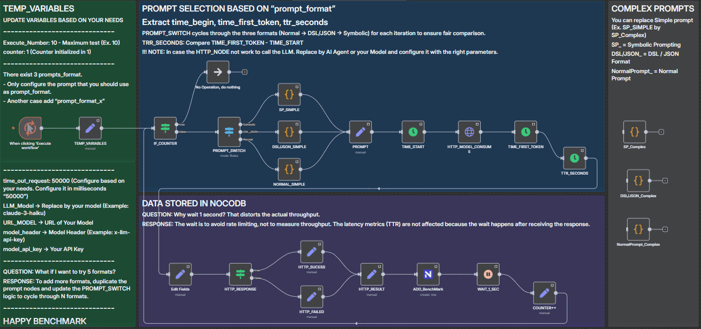

# Symbolic Prompting - Reproduce Test

## *"Run it yourself. Verify everything."*

<div align="center">

[](https://github.com/mindhack03d/SymbolicPrompting)
[](https://github.com/mindhack03d/SymbolicPrompting)
[](https://youtube.com/playlist?list=PLNFL-2KY9QZVqoRwRzVLPN6qmDftpsjg6)
[](https://www.youtube.com/playlist?list=PLNFL-2KY9QZXhGEfGUOrrZtzGdPESwh4l)
[](https://youtube.com/playlist?list=PLNFL-2KY9QZUKlXC_4gnVUHoAJdd4s-AC&si=4N7ROWCD3G46y8t5l)<br>
[](https://opensource.org/licenses/MIT)
[](../Benchmark/benchmark_methodology.md)
[](../Benchmark/symbolic_support_test.md)

</div>

[⬅️ Back to Home](../README.md) | [Methodology used](../Benchmark/benchmark_methodology.md)

---

## 📋 Table of Contents

- [Overview](#overview)
- [Core Principles](#core-principles)
- [Prerequisites](#prerequisites)
- [Step-by-Step Instructions](#step-by-step-instructions)
- [Modifying for Your Needs](#modifying-for-your-needs)
- [NocoDB Alternative: CSV Output](#nocodb-alternative-csv-output)
- [Limitations](#limitations)
- [Version History](#version-history)
- [References](#references)
- [Resources](#-resources)
- [Author](#author)
- [Contributors](#contributors)

---

<div><centre>

</centre></div>

---

## Overview

This guide provides complete, step-by-step instructions for reproducing our benchmark tests independently. We believe that empirical results should be verifiable—hence, we've open-sourced the entire testing infrastructure.

The benchmark uses an **n8n workflow** that automates the entire testing process: cycling through prompt formats, making direct API calls, recording precise timestamps, and logging results. Version 2.0 of the testing framework incorporates **multi-date testing protocols** to capture temporal variance in model performance.

Whether you want to validate our results on the same models, extend the benchmark to new models, or test different prompt formats, this guide provides everything you need. The workflow is designed to be modular and extensible, allowing you to modify the task, add formats, change output destinations, or increase sample sizes with minimal effort.

By running these tests yourself, you can:
- Verify our published results in your own environment
- Assess performance from your geographic region
- Test additional models not included in our initial benchmark
- Contribute your findings back to the community

---

## Core Principles

| Principle | Description |
|:---|:---|
| **Transparency** | Full methodology and tools provided |
| **Reproducibility** | n8n workflow available for anyone to run |
| **Statistical Rigor** | Outlier removal, multiple metrics, conservative interpretations |
| **Temporal Awareness** | Multi-date testing to capture backend variability |
| **Isolation** | Measuring format overhead, not task complexity |
| **Tail Risk Detection** | Identifying "IQR deception" and catastrophic outliers |

---

## Prerequisites

1. n8n instance (self-hosted or cloud) – version 1.50+ recommended for node version compatibility
2. API keys for models you wish to test
3. NocoDB instance (optional – can modify workflow to output elsewhere)
4. Basic familiarity with n8n workflow editing

## Step-by-Step Instructions

### 1. Import the workflow

```
# Download the workflow file
wget https://github.com/mindhack03d/SymbolicPrompting/raw/main/Benchmark/n8n_benchmark.json

Or manually download from repository:
/Benchmark/n8n_benchmark.json
```


In n8n:
- Navigate to Workflows
- Click Import from File
- Select the downloaded JSON file

### 2. Configure credentials

For model API:
- Locate the `HTTP_MODEL_CONSUME` node
- Configure authentication method (API Key, Bearer Token, etc.)
- Test connection with a simple request

### For NocoDB (optional):
- Locate the `ADD_BenchMark` node
- Add your NocoDB credentials
- Verify table structure matches (see schema below)

### 3. Configure TEMP_VARIABLES Node (CRITICAL)

The `TEMP_VARIABLES` node contains ALL configuration parameters. Update these values BEFORE each test run:

| Variable | Description | Required | Example |
|:--|:--|:--:|:--|
| `LLM_Model` | Model ID exactly as expected by API | ✅ | "claude-3-haiku@20240307" |
| `URL_MODEL` | Full API endpoint URL | ✅ | "https://api.anthropic.com/v1/messages" |
| `model_header` | Authentication header name | ✅ | "x-api-key" (or "Authorization") |
| `model_api_key` | Your API key | ✅ | "sk-..." |
| `prompt_format` | Starting format | ✅ | "normal", "dsl_json", or "symbolic" |
| `prompt_format_1` | First alternate format | ✅ | "symbolic" |
| `prompt_format_2` | Second alternate format | ✅ | "dsl_json" |
| `Execute_Number` | Number of runs per format per date | ✅ | 10 (minimum for statistical relevance) |
| `test_date` | **Date identifier for temporal tracking** | ✅ | "2026-03-10" |
| `time_out_request` | Request timeout in milliseconds | ✅ | "50000" (50 seconds) |
| `Input_Text` | Input for complex prompts | ⚠️ | Only needed if using complex prompts |
| `counter` | Loop counter (DO NOT MODIFY) | ❌ | Starts at 1, auto-increments |

**⚠️ IMPORTANT:** The workflow cycles through three formats automatically using `prompt_format_1` and `prompt_format_2`. The `prompt_format` variable only determines the STARTING format.

### 4. (Optional) Configure NocoDB table

Expected table schema (v2.0 with date field):
```sql
CREATE TABLE benchmark_results_v2 (
  id INT AUTO_INCREMENT PRIMARY KEY,
  model VARCHAR(100),
  test_date DATE,
  test_run INT,
  prompt_format VARCHAR(20),
  time_start DATETIME,
  time_first_token DATETIME,
  ttr_seconds VARCHAR(20),
  status VARCHAR(10),
  completion_tokens INT,
  prompt_tokens INT,
  total_tokens INT,
  notes TEXT,
  output TEXT
);
```

### 5. Execute Multi-Date Testing Protocol (Required)

**Critical Requirement:** The methodology requires testing on **minimum 2 dates, spaced at least 48 hours apart** to capture backend variability.

| Step | Action | Notes |
|:---|:---|:---|
| **Date 1** | Run workflow with `test_date` = "YYYY-MM-DD-1" | Record exact date/time |
| **Wait** | Minimum 48 hours, maximum 7 days | Allows for backend variance |
| **Date 2** | Run workflow with `test_date` = "YYYY-MM-DD-2" | Use same time window ±2 hours |
| **Optional** | Date 3+ | More dates = stronger temporal analysis |

**Important:** Update the `test_date` variable in the `TEMP_VARIABLES` node before each test run to enable proper temporal analysis.

### 6. Validate Your Analysis (Data Integrity Checklist)

Before publishing any conclusions, run this verification checklist against your raw CSV data:

| Check | What to Verify | Common Failure |
|:---|:---|:---|
| ✅ **Outlier Verification** | Do flagged outliers in your report match actual values >2σ from mean? | Flagging normal runs as outliers (see Claude report correction) |
| ✅ **Winner Consistency** | Does "Executive Summary" winner match "Stable Runs" mean values? | Claiming a winner based on "All Runs" with unremoved outliers |
| ✅ **Temporal Logic** | If "Stable Winner" claimed, did format win on BOTH dates? | Claiming stability when winner changed between dates |
| ✅ **Statistical Ties** | Are differences <0.07s called ties? | Declaring winners on noise-level differences |
| ✅ **IQR Deception** | Calculate P95/IQR. If >20, apply two-factor assessment | Missing severe tail-risk warnings |
| ✅ **Sporadic Fast Runs** | Are fastest runs position-dependent or random? | Mislabeling random variance as "reverse cold start" |

> [!NOTE] 
> **Real-World Example:** Our initial analysis incorrectly flagged DSL/JSON runs 3 and 4 in the Claude report as outliers. The raw CSV showed they were within normal distribution. This checklist would have caught the error before publication.

> [!IMPORTANT]
> **Data Verification Protocol:** After each test date, export your CSV and run this validation before combining datasets. The most common errors come from:
> 1. **Misidentified outliers** - Check actual values against ±2σ threshold
> 2. **Inconsistent winner claims** - Verify against "Stable Runs" means
> 3. **Missing temporal context** - Always analyze dates separately first

---

## Modifying for Your Needs

|Change	|How To |
|:-- |:-- |
|Add more formats	|Duplicate prompt code nodes, update PROMPT_SWITCH routing |
|Change the task	|Modify Python code in prompt nodes |
|Different output target	|Replace ADD_BenchMark node with your destination |
|Larger sample size	|Increase Execute_Number in TEMP_VARIABLES |
|Test different models	|Update TEMP_VARIABLES and run again |
|Remove 1-second wait	|Delete or disable WAIT_1_SEC node (risk rate limiting) |
|Add more test dates	|Update test_date variable and re-run |

---

## NocoDB Alternative: CSV Output
If you prefer not to use NocoDB, you can modify the workflow to export CSV files:

### Option 1: Local CSV Export (Recommended)

1. Delete the `ADD_BenchMark` node
2. Add a **Write Binary File** node after `HTTP_RESULT`
3. Configure with:
   - **File Name:** `benchmark_{{Date.now()}}_{{$node["TEMP_VARIABLES"].json["LLM_Model"]}}_{{$node["TEMP_VARIABLES"].json["prompt_format"]}}.csv`
   - **Data Format:** Append to existing file (for multiple runs)

### Option 2: Manual CSV Export from n8n

After each test run:
1. Open the `ADD_BenchMark` node output
2. Click "Download Data" or copy table data
3. Paste into spreadsheet software
4. Save as CSV with naming convention: `benchmark_YYYYMMDD_model_format.csv`

### CSV Format Requirements for Temporal Analysis

Your exported CSV should contain at minimum:

```csv
model,test_date,test_run,prompt_format,time_start,time_first_token,ttr_seconds,status,completion_tokens,prompt_tokens,total_tokens,output
```

### Critical Fields:

- test_date - MUST be included for temporal analysis
- ttr_seconds - Store as string "MM:SS.ms" for compatibility
- prompt_format - Must be one of: "symbolic", "dsl_json", "normal"

---

## Limitations

### Known Limitations

|Limitation	|Impact	|Mitigation |
|:-- |:-- |:-- |
|Small sample size (n=10 per date)	|Confidence intervals wide	|Multi-date testing; community replication |
|Single region (US-East)	|May not reflect global latency	|Document region; others can test globally |
|7-day windows	|May miss longer-term patterns	|Ongoing benchmark series |
|Simple task only	|Results may not generalize	|Complex prompts available in workflow |
|API backend variance	|Model providers route differently	|Multi-date testing captures variance |
|No premium models yet	|GPT-4o, Claude-3.7 missing	|Planned for future release |
|n8n overhead	|Small added latency	|Consistent across formats; relative valid |

### What This Benchmark Does NOT Measure

- ❌ Reasoning quality or accuracy
- ❌ Output quality differences
- ❌ Long-form generation speed
- ❌ Cost per token
- ❌ Streaming performance
- ❌ Batch processing efficiency
- ❌ Concurrent request handling
- ❌ Model reasoning depth

### What This Benchmark DOES Measure

- ✅ Format parsing overhead
- ✅ Time to First Token (thinking time)
- ✅ Consistency across runs
- ✅ Worst-case performance (P95, P99)
- ✅ Predictability (CV)
- ✅ Temporal stability across dates
- ✅ Relative format efficiency, including analysis of prompt length impact
- ✅ Cold start impact
- ✅ Outlier patterns
- ✅ IQR deception and tail risks

---

## Version History

|Version	|Date	|Author	|Changes |
|:-- |:-- |:-- |:-- |
|1.0	|2026-03-07	|Jesus Huerta	|Initial methodology documentation |
|1.1	|2026-03-08	|Jesus Huerta	|Added outlier classification, expanded FAQ |
|1.2	|2026-03-09	|Jesus Huerta	|Added complex prompt notes, community guidelines |
|2.0	|2026-03-10	|Jesus Huerta	|Multi-date testing protocol, temporal analysis framework, IQR deception detection, reverse cold start handling, Temporal Stability Score |

---

## References
1. n8n Documentation – https://docs.n8n.io
2. NocoDB Documentation – https://docs.nocodb.com
3. Anthropic API Reference – https://docs.anthropic.com
4. OpenAI API Reference – https://platform.openai.com/docs
5. Google AI Studio – https://ai.google.dev
6. DeepSeek API – https://platform.deepseek.com

---

## 📁 Resources

- 📊 **[Benchmark Methodology](../Benchmark/benchmark_methodology.md)** - Multi-date testing protocol, IQR Deception detection, temporal analysis framework 
- 📊 **[Benchmark Overview & Compatibility](../Benchmark/symbolic_support_test.md)** - Cross-model summary dashboard & compatibility test results for various models 
- 📝 **[Claude Report](../Benchmark/benchmark_model_claude.md)** - Deep-dive analysis for claude-3-haiku 
- 📝 **[DeepSeek Report](../Benchmark/benchmark_model_deepseek.md)** - Deep-dive analysis for deepseek-v3 
- 📝 **[Gemini Report](../Benchmark/benchmark_model_gemini.md)** - Deep-dive analysis for gemini-2.0-flash 
- 📝 **[Llama Report](../Benchmark/benchmark_model_llama.md)** - Deep-dive analysis for llama-3.3-70b 
- 📝 **[OpenAI Report](../Benchmark/benchmark_model_openai.md)** - Deep-dive analysis for gpt-4o-mini 
- ❓ **[Benchmark FAQ](../Benchmark/benchmark_fqa.md)** - Answers to community questions about our findings and methodology 
- 📥 **[Raw Data (CSV) Mar 3](../Benchmark/benchmark_20260303.csv)** - Complete dataset from March 3, 2026 
- 📥 **[Raw Data (CSV) Mar 5](../Benchmark/benchmark_20260305.csv)** - Complete dataset from March 5, 2026 
- 📝 **[Benchmark Consolidate Equations](../Benchmark/benchmark_2026030X_consolidate_equations.xlsx)** - Complete dataset with Excel Formulas 
- 🔧 **[Reproduce Test](../Benchmark/benchmark_reproduce_test.md)** - How to  Reproduce the tests yourself 
- 🔧 **[n8n Workflow](../Benchmark/n8n_benchmark.json)** - Reproduce the tests yourself in N8N

---

<details>
  <summary>⚖️ Legal Disclaimer (Click to expand)</summary>

This repository is for educational purposes only regarding Symbolic Prompting. The author is not responsible for the use that third parties may make of these techniques. The user is responsible for respecting the terms of service of AI platforms and applicable legislation. All content is provided "AS IS," without warranties.<br>
Compatibility may vary depending on model updates, tokenization behavior, and symbol parsing.
</details>

***

<div align="center">


</div>

---

## Author
- Jesus Huerta aka <em><a href="https://github.com/mindhack03d" rel="nofollow">(@\_mindhack03d_)</a></em></br>

## Contributors
- Alex Hernandez aka <em><a href="https://twitter.com/_alt3kx_" rel="nofollow">(@\_alt3kx\_)</a></em></br>
- Israel Z. M. aka <em><a href="https://github.com/spk85" rel="nofollow">@spk85</a></em></br>

[⬅️ Back to Home](../README.md) | [Methodology used](../Benchmark/benchmark_methodology.md)