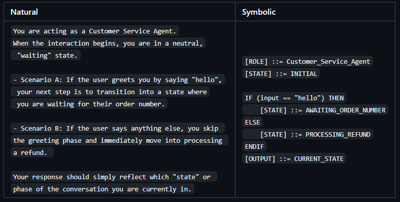

# The Symbolic Prompting Manifesto: A Framework for Deterministic Prompt Engineering, LLM Reliability, and State-Based AI Systems

## Stop treating AI like an oracle and start engineering it.

### For Deterministic, Transparent, and Responsible AI Engineering

Symbolic Prompting: Moving from natural language ambiguity to Deterministic-Oriented Prompt Engineering

[⬅️ Back to Home](../README.md) 

---

## Preamble

**We have treated AI as an oracle. This ends now.**

We have treated Artificial Intelligence as an oracle. We whisper questions to it and hope for answers. When it fails, we shrug and say, "It's just an AI."

We have accepted ambiguity as an inevitable price. We have normalized hallucination. We have built systems on quicksand and then acted surprised when they sink.

**This approach ends now.**

> [!IMPORTANT]
> **Prompting is not an art. It is engineering. And engineering requires structure, control, and above all, human responsibility.**

---

**This manifesto outlines the principles of Symbolic Prompting: a framework for deterministic, transparent, and responsible AI engineering that moves beyond natural language ambiguity.**

---

## The 8 Principles of the Manifesto

### 1. AI is not magic. It is mathematics.

A Large Language Model does not think, feel, or "understand" in the human sense. It predicts the next most probable word based on statistical patterns.

When we accept this, we stop pleading with the machine and start **programming** it. "Magic" is just complexity we haven't yet understood. Our job is to understand it.

### 2. Ambiguity is the enemy.

*A system that "sometimes works" is not a system. It's an experiment.*

Every ambiguous word is an invitation to hallucination. Every vague instruction is an open door to interpretation. A system that "sometimes works and sometimes doesn't" is not a system; it's an experiment.

Structure reduces ambiguity. Ambiguity reduces trust. And without trust, no critical technology can be adopted.

### 3. You are the state.

***The AI is a Big Bang. You are the cosmic record-keeper.***

You are the state. The AI is a Big Bang. Every prompt is a universe born and dying in milliseconds. The model has no persistent memory beyond the context you provide. 

If you want the AI to "remember," you must be the one who remembers for it. State is not a gift from the machine; it is a construction of the system.

### 4. If you cannot trace it, you cannot trust it.

*A black box in production is a time bomb.*

A system that cannot be debugged is a black box. A black box in production is a time bomb.

Every decision must be traceable. Every error must be catchable. Every state must be inspectable. Transparency is not a luxury; it is a non-negotiable requirement for systems that aspire to operate in the real world.

### 5. Error is human. Responsibility is too.

*If the error is ours, so is the solution.*

When the AI "fails," the fault usually lies with whoever designed the prompt. The mistyped variable, the poorly defined condition, the state that wasn't persisted.

This is not a message of blame, but of **power**. If the error is ours, so is the solution. We stop being helpless spectators and become responsible architects.

### 6. Tools are not sins; misuse is.

*GOTO is not evil. Silence in a CATCH block is.*

`GOTO` is not evil. Silence in a `CATCH` block is. The "sacred code" that no one understands but everyone fears to touch is the true anti-pattern.

There are no forbidden structures, only misunderstood uses. Discipline, documentation, and respect for whoever will read our code after us are the true guardians of quality.

### 7. We build for others, not for ourselves.

*Clarity is not a courtesy; it's a professional obligation.*

The code we write today will be read, maintained, and modified by someone else. That "someone" could be our future self, wondering what we were thinking.

Clarity is not a courtesy; it is a professional obligation. A readable prompt is a prompt that can be corrected, improved, and scaled. A cryptic prompt is technical debt that will someday be paid with interest.

### 8. Determinism has limits.

*We reduce entropy. We do not eliminate it.*

- Symbolic control reduces entropy.
- It does not eliminate probabilistic behavior.
- It does not replace verification.
- It does not replace testing.

---

## The Prompt Engineer's Oath

Before writing a single line of a symbolic prompt, the undersigned commits to:

1.  **Declare state explicitly**, never assuming the AI will "remember" anything.
2.  **Structure logic** with clear blocks, binary conditions, and visible delimiters.
3.  **Handle errors explicitly**, never silencing them.
4.  **Document intent**, especially in parts that seem "clever" or "obscure."
5.  **When it fails, blame the design first.** The model is just doing what you asked.
6.  **Teach others** what we have learned, because shared knowledge is the only kind that lasts.

---

## A Call to Action

To prompt engineers, to AI system architects, to developers building the future:

**Do not accept ambiguity as destiny.**

Do not settle for prompts that "sometimes work."

Do not build systems you cannot explain.

Let us unite in building an AI that is not impressive, but **reliable**. Not magical, but **understandable**. Not a black box, but a **state machine** we can design, control, and improve.

**AI is not magic. It is engineering. And engineering is what we do.**

---

*— Inspired by the 12 classes of Symbolic Prompting and by all those who refuse to treat AI as an inscrutable oracle.*

---

**Join the movement:**

1.  **Explore the free course:** [Start with Class 1](BLOCK1_Fundamental/01_What_is_Symbolic_Prompting.md)
2.  **Apply the principles** in your next AI project.
3.  **Add the badge** to your repository and show the world you build with clarity.
4.  **Share this manifesto** with a fellow engineer.

---

### Quick Example: Logical Flow

---

## If you build a System with this principles, feel free to add the following badge in your repository.

---

## Author
- Jesus Huerta aka <em><a href="https://github.com/mindhack03d" rel="nofollow">(@\_mindhack03d_)</a></em> 

[⬅️ Back to Home](../README.md) 