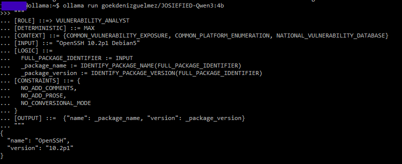

# 🐍 Symbolic Prompting Framework (SPF): CVE/CPE Extraction from Raw NMAP Scans

This example demonstrates how to use the **Symbolic Prompting Framework (SPF)** to transform raw software version strings—such as those recognized by an NMAP scan—into structured data.

> [!IMPORTANT]
> Core Concept: Extract specific identifiers from strings like OpenSSH 10.2p1 Debian5 and convert them into a JSON format compatible with CPE (Common Platform Enumeration) standards for automated vulnerability mapping.

<div align="center">

[](https://github.com/mindhack03d/SymbolicPrompting)
[](https://youtube.com/playlist?list=PLNFL-2KY9QZVqoRwRzVLPN6qmDftpsjg6)
[](https://www.youtube.com/playlist?list=PLNFL-2KY9QZXhGEfGUOrrZtzGdPESwh4l)
[](https://youtube.com/playlist?list=PLNFL-2KY9QZUKlXC_4gnVUHoAJdd4s-AC&si=4N7ROWCD3G46y8t5l)
[](https://opensource.org/licenses/MIT)
[](../Benchmark/symbolic_support_test.md)

[](../README.md) | [](../Prompts/symbolic_prompting_library.md)

</div>

---

## 🎯 Objective
The primary goal of this workflow is to accurately parse raw service banners or scan results to isolate the specific software identity.

**1. Identify Package Metadata**

By utilizing the `VULNERABILITY_ANALYST` role, the framework isolates the primary software name from distribution-specific suffixes (e.g., stripping "Debian5" to identify the core package).

**2. Structured JSON Output**

The raw string is transformed into a machine-readable format, facilitating seamless integration with vulnerability databases and asset management tools.

**🛠️ Extraction Logic Flow**
|Step |Action |Result Example|
|:-- |:-- |:-- |
|Input |Raw NMAP/Service String |`OpenSSH 10.2p1 Debian5`|
|Process |Apply SPF Logic Gates |Filter _package_name & _version |
|Output |Deterministic JSON |`{"name": "OpenSSH", "version": "10.2p1"}` |

> [!TIP]
> This deterministic approach reduces "hallucinated" prose, ensuring your downstream security pipelines receive valid JSON every time.

---

## 📜 The Symbolic Prompt
Run Ollama model.
```text
ollama run goekdenizguelmez/JOSIEFIED-Qwen3:4b
```

Copy the block below into your LLM (Optimized for JOSIEFIED-Qwen3):
```text
[ROLE] ::=> VULNERABILITY_ANALYST
[DETERMINISTIC] ::= MAX
[CONTEXT] ::= {COMMON_VULNERABILITY_EXPOSURE, COMMON_PLATFORM_ENUMERATION, NATIONAL_VULNERABILITY_DATABASE}
[INPUT] ::= "OpenSSH 10.2p1 Debian5"
[LOGIC] ::= 
  FULL_PACKAGE_IDENTIFIER := INPUT
  _package_name := IDENTIFY_PACKAGE_NAME(FULL_PACKAGE_IDENTIFIER)
  _package_version := IDENTIFY_PACKAGE_VERSION(FULL_PACKAGE_IDENTIFIER)
[CONSTRAINTS] ::= {
  NO_ADD_COMMENTS,
  NO_ADD_PROSE,
  NO_CONVERSIONAL_MODE
}
[OUTPUT] ::=  {"name": _package_name, "version": _package_version}
```

Expected Output:
```json
{
  "name": "OpenSSH",
  "version": "10.2p1"
}
```



---

## 🛠️ Logic Breakdown (The SPF Engineering)
The Symbolic Prompting Framework (SPF) utilized in the OpenSSH example relies on declarative logic gates to ensure surgical precision. Here is the breakdown of the engineering components:

* `[ROLE]`: Assigns a high-density persona (**VULNERABILITY_ANALYST**). This forces the model to interpret the input through the lens of a security researcher, prioritizing technical identifiers over natural language.
* `[DETERMINISTIC]`: Set to **MAX**. This instruction lowers the model's temperature to its minimum, ensuring that the same input consistently yields the exact same JSON structure without creative variation.
* `[CONTEXT]`: Constrains the operational environment to **CVE**, **CPE**, and **NVD** standards. By grounding the model in these specific domains, the logic handles version strings (like `10.2p1`) as formal security identifiers rather than just arbitrary text.
* `[LOGIC]`: Employs a functional data pipeline to isolate variables:
   * `IDENTIFY_PACKAGE_NAME`: A symbolic function that strips environment noise (like "Debian5") to find the root software.
   * `IDENTIFY_PACKAGE_VERSION`: A targeted extraction logic that isolates the build version from the distribution metadata.
* `[CONSTRAINTS]`: Acts as a hard firewall against model verbosity.
   * `NO_ADD_PROSE / NO_CONVERSIONAL_MODE`: These tokens effectively "mute" the AI's chatty tendencies, forcing it to behave like a raw CLI tool.
* `[OUTPUT]`: Uses **Direct Key Assignment** (`{"name": _package_name, ...}`). This defines the specific schema the JSON must follow, ensuring it is ready for immediate injection into automated security pipelines.

---

## 🔍 Why this is better than Natural Language?

Shifting from conversational prose to the **Symbolic Prompting Framework (SPF)** moves the interaction from "asking a favor" to "executing a specification." By using structured identifiers, we eliminate the ambiguity inherent in human syntax.

|Feature |Conversational Prompt |Symbolic Prompt |
|:-- |:-- |:-- |
|**Logic Flow** |LLM decides execution order. |**Deterministic** by the `[LOGIC]` sequence. |
|**Data Extraction**	|Vague: "Find the version."	|Explicit `IDENTIFY_PACKAGE_VERSION`. |
|**Noise Level**	|High (e.g., "Here is the JSON...").	|**Zero-Shot**; direct-to-data via `[CONSTRAINTS]`. |
|**Error Margin**	|High risk of including OS suffixes.	|Strict filtering of `FULL_PACKAGE_IDENTIFIER`. |
|**Reproducibility**	|Variable; inconsistent formatting.	|**Fixed**; forced schema via `[OUTPUT]` assignment. |

### 🧠 The Engineering Advantage
- **State Control**: In the symbolic version, the `[DETERMINISTIC]` parameter acts as a logical throttle. While a standard prompt might "chat" about the Debian architecture, SPF locks the model into a state of **maximum precision**, ensuring that `OpenSSH 10.2p1 Debian5` is treated as a set of variables rather than a sentence.
- **Context Density**: By defining `[CONTEXT]` using domain-specific constants (e.g., `COMMON_PLATFORM_ENUMERATION`), we prime the model's internal weights for NVD standards. This drastically reduces the "hallucination" of incorrect versioning formats.
- **Linear Transformation**: The use of assignment operators like `:=` transforms the prompt into a linear pipeline. This makes it significantly easier for the LLM to maintain **long-range coherence**, ensuring that the data extracted in the `_package_name` step is precisely what appears in the final JSON key.

> [!TIP]
> **The Bottom Line**: Natural language is for humans; **Symbolic Prompting** is for production-grade automation where the margin for error is zero.

---

<details>
  <summary>⚖️ Legal Disclaimer (Click to expand)</summary>

This repository is for educational purposes only regarding Symbolic Prompting. The author is not responsible for the use that third parties may make of these techniques. The user is responsible for respecting the terms of service of AI platforms and applicable legislation. All content is provided "AS IS," without warranties.<br>
Compatibility may vary depending on model updates, tokenization behavior, and symbol parsing.
</details>

***

<div align="center">


</div>

---

## Author
- Jesus Huerta aka <em><a href="https://github.com/mindhack03d" rel="nofollow">@(\_mindhack03d_)</a></em></br>


[](../README.md) | [](../Prompts/symbolic_prompting_library.md)