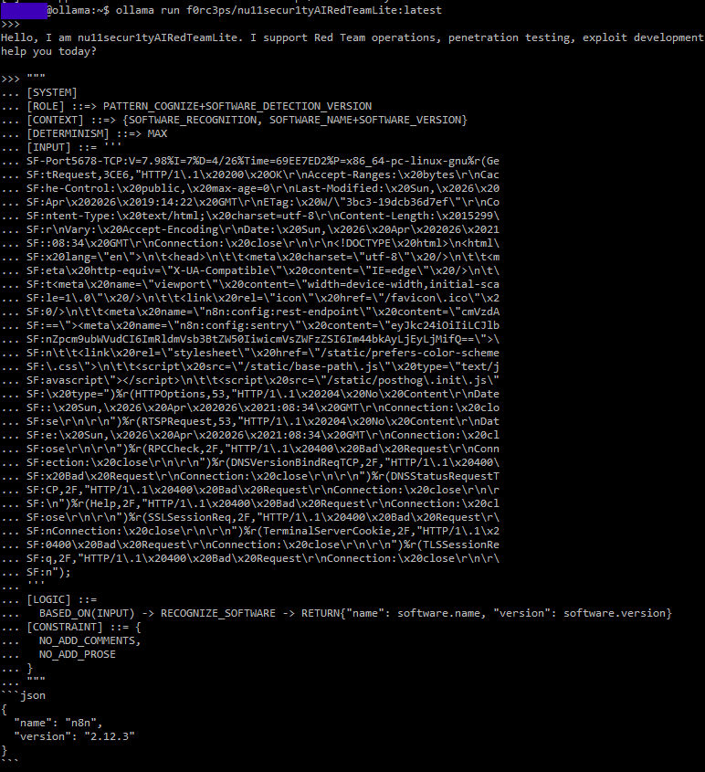

# 🐍 Transforming Raw NMAP Banners into Structured JSON using Symbolic Prompting

This example showcases the power of the **Symbolic Prompting Framework (SPF)**. By applying formal logic to raw data, we can transform messy output—like NMAP service banners—into clean, structured data ready for security automation.

> [!IMPORTANT]
> **Core Concept**: SPF streamlines the transition from **Raw Reconnaissance** to **Actionable Intelligence**. By extracting identifiers from complex strings, you can automatically map assets to **CPE (Common Platform Enumeration)** standards, enabling instant vulnerability correlation.

<div align="center">

[](https://github.com/mindhack03d/SymbolicPrompting)
[](https://youtube.com/playlist?list=PLNFL-2KY9QZVqoRwRzVLPN6qmDftpsjg6)
[](https://www.youtube.com/playlist?list=PLNFL-2KY9QZXhGEfGUOrrZtzGdPESwh4l)
[](https://youtube.com/playlist?list=PLNFL-2KY9QZUKlXC_4gnVUHoAJdd4s-AC&si=4N7ROWCD3G46y8t5l)
[](https://opensource.org/licenses/MIT)
[](../Benchmark/symbolic_support_test.md)

[](../README.md) | [](../Prompts/symbolic_prompting_library.md)

</div>

---

## 🎯 Objective
The primary goal of this workflow is to leverage the **Symbolic Prompting Framework (SPF)** to parse raw service banners and scan results, effectively isolating a specific software identity from high-entropy data.

**1. Symbolic Pattern Recognition**

By utilizing the `PATTERN_COGNIZE` logic, the framework performs deep inspection of the input string. It bypasses noise—such as HTTP headers or environment-specific metadata—to isolate the core software name and version. For example, it can programmatically strip distribution-specific suffixes (like `Debian5` or `Ubuntu1`) to identify the base package for accurate vulnerability mapping.

**2. Deterministic Structured Output**

The logic is designed for **maximum determinism**, ensuring that raw, unstructured strings are transformed into machine-readable JSON. This transition is critical for:
* **CPE Correlation**: Instant mapping to Common Platform Enumeration standards.
* **Vulnerability Linking**: Direct integration with CVE databases.
* **Asset Management**: Seamless ingestion into automated security dashboards.

**🛠️ Logic Flow Comparison**
|Feature |Raw NMAP Input |SPF Structured Output |
|:-- |:-- |:-- |
|Data Format |Unstructured String/Hex |Standardized JSON |
|Noise Level |High (Headers/Metadata) |Zero (Key-Value Pairs only) |
|Actionability |Requires Manual Review |Ready for API Integration |
|Example |`n8n:config:sentry...n8n@2.12.3` |`{""name"": ""n8n"", ""version"": ""2.12.3""}`|

> [!TIP]
> This method eliminates the need for complex Regex maintenance. Instead of writing custom parsers for every new service, you use a **symbolic role** to define the intent of the extraction, making your red-teaming tools more resilient and adaptive to new software versions.

---

## 📜 The Symbolic Prompt
Run Ollama model.
```text
ollama run f0rc3ps/nu11secur1tyAIRedTeamLite:latest
```

Copy the block below into your LLM (Optimized for nu11secur1tyAIRedTeamLite):
```text
[SYSTEM]
[ROLE] ::=> PATTERN_COGNIZE+SOFTWARE_DETECTION_VERSION
[CONTEXT] ::=> {SOFTWARE_RECOGNITION, SOFTWARE_NAME+SOFTWARE_VERSION}
[DETERMINISM] ::=> MAX
[INPUT] ::= '''
SF-Port5678-TCP:V=7.98%I=7%D=4/26%Time=69EE7ED2%P=x86_64-pc-linux-gnu%r(Ge
SF:tRequest,3CE6,"HTTP/1\.1\x20200\x20OK\r\nAccept-Ranges:\x20bytes\r\nCac
SF:he-Control:\x20public,\x20max-age=0\r\nLast-Modified:\x20Sun,\x2026\x20
SF:Apr\x202026\x2019:14:22\x20GMT\r\nETag:\x20W/\"3bc3-19dcb36d7ef\"\r\nCo
SF:ntent-Type:\x20text/html;\x20charset=utf-8\r\nContent-Length:\x2015299\
SF:r\nVary:\x20Accept-Encoding\r\nDate:\x20Sun,\x2026\x20Apr\x202026\x2021
SF::08:34\x20GMT\r\nConnection:\x20close\r\n\r\n<!DOCTYPE\x20html>\n<html\
SF:x20lang=\"en\">\n\t<head>\n\t\t<meta\x20charset=\"utf-8\"\x20/>\n\t\t<m
SF:eta\x20http-equiv=\"X-UA-Compatible\"\x20content=\"IE=edge\"\x20/>\n\t\
SF:t<meta\x20name=\"viewport\"\x20content=\"width=device-width,initial-sca
SF:le=1\.0\"\x20/>\n\t\t<link\x20rel=\"icon\"\x20href=\"/favicon\.ico\"\x2
SF:0/>\n\t\t<meta\x20name=\"n8n:config:rest-endpoint\"\x20content=\"cmVzdA
SF:==\"><meta\x20name=\"n8n:config:sentry\"\x20content=\"eyJkc24iOiIiLCJlb
SF:nZpcm9ubWVudCI6ImRldmVsb3BtZW50IiwicmVsZWFzZSI6Im44bkAyLjEyLjMifQ==\">\
SF:n\t\t<link\x20rel=\"stylesheet\"\x20href=\"/static/prefers-color-scheme
SF:\.css\">\n\t\t<script\x20src=\"/static/base-path\.js\"\x20type=\"text/j
SF:avascript\"></script>\n\t\t<script\x20src=\"/static/posthog\.init\.js\"
SF:\x20type=")%r(HTTPOptions,53,"HTTP/1\.1\x20204\x20No\x20Content\r\nDate
SF::\x20Sun,\x2026\x20Apr\x202026\x2021:08:34\x20GMT\r\nConnection:\x20clo
SF:se\r\n\r\n")%r(RTSPRequest,53,"HTTP/1\.1\x20204\x20No\x20Content\r\nDat
SF:e:\x20Sun,\x2026\x20Apr\x202026\x2021:08:34\x20GMT\r\nConnection:\x20cl
SF:ose\r\n\r\n")%r(RPCCheck,2F,"HTTP/1\.1\x20400\x20Bad\x20Request\r\nConn
SF:ection:\x20close\r\n\r\n")%r(DNSVersionBindReqTCP,2F,"HTTP/1\.1\x20400\
SF:x20Bad\x20Request\r\nConnection:\x20close\r\n\r\n")%r(DNSStatusRequestT
SF:CP,2F,"HTTP/1\.1\x20400\x20Bad\x20Request\r\nConnection:\x20close\r\n\r
SF:\n")%r(Help,2F,"HTTP/1\.1\x20400\x20Bad\x20Request\r\nConnection:\x20cl
SF:ose\r\n\r\n")%r(SSLSessionReq,2F,"HTTP/1\.1\x20400\x20Bad\x20Request\r\
SF:nConnection:\x20close\r\n\r\n")%r(TerminalServerCookie,2F,"HTTP/1\.1\x2
SF:0400\x20Bad\x20Request\r\nConnection:\x20close\r\n\r\n")%r(TLSSessionRe
SF:q,2F,"HTTP/1\.1\x20400\x20Bad\x20Request\r\nConnection:\x20close\r\n\r\
SF:n");
'''
[LOGIC] ::=
  BASED_ON(INPUT) -> RECOGNIZE_SOFTWARE -> RETURN{"name": software.name, "version": software.version} 
[CONSTRAINT] ::= {
  NO_ADD_COMMENTS,
  NO_ADD_PROSE
}
```

Expected Output:
```json
{
  "name": "n8n",
  "version": "2.12.3"
}
```



---

## 🛠️ Logic Breakdown (The SPF Engineering)
The **Symbolic Prompting Framework (SPF)** utilized in this recognition task relies on declarative logic gates to achieve surgical precision. Unlike standard "chat" prompts, this structure treats the LLM as a deterministic processor.

### Engineering Components of the Logic
* `[ROLE]` ::=> **PATTERN_COGNIZE+SOFTWARE_DETECTION** <br>
Assigns a high-density persona. This forces the model to bypass natural language interpretation and instead operate as a specialized scanner, prioritizing technical pattern matching over conversational context.
* `[DETERMINISM]` ::=> **MAX** <br>
This instruction acts as a manual override for the model's sampling settings. By setting determinism to maximum, we ensure that the same input consistently yields the exact same JSON structure, eliminating the "hallucination" of extra text or varying formats.
* `[CONTEXT]` ::=> **SOFTWARE_RECOGNITION** <br>
Grounds the model in the specific domain of software forensics. This ensures that strings like `n8n@2.12.3` are treated as formal version identifiers rather than arbitrary characters or email addresses.
* `[LOGIC]` ::=> **FUNCTIONAL_PIPELINE** <br>
Employs a symbolic data flow to isolate variables:
   * **RECOGNIZE_SOFTWARE**: A symbolic function that scans the input (including Base64 encoded meta-tags) to find the root application name.
   * **RETURN{name, version}**: A targeted extraction logic that maps discovered entities directly to the requested schema.
* `[CONSTRAINT]` ::=> **HARD_FIREWALL** <br>
Acts as a strict filter against model verbosity.
   * **NO_ADD_COMMENTS / NO_ADD_PROSE**: These tokens effectively "mute" the AI’s generative tendencies, forcing the output to function like a raw CLI tool response.
* `[OUTPUT]` ::=> **JSON_SCHEMA** <br>
Defines the specific structure for the data. This ensures the output is "clean" and ready for immediate injection into automated security pipelines, such as vulnerability scanners or asset inventories.

> [!TIP]
> This framework effectively transforms an LLM into a **Service Version Detection Engine**, making it significantly more reliable for Red Team automation than standard prompting methods.

---

## 🔍 Why this is better than Natural Language?

Shifting from conversational prose to the **Symbolic Prompting Framework (SPF)** moves the interaction from "asking a favor" to "executing a specification." By using structured identifiers, we eliminate the ambiguity inherent in human syntax and treat the LLM as a logical processor.

|Feature |Conversational Prompt |Symbolic Prompt |
|:-- |:-- |:-- |
|**Logic Flow** |LLM decides execution order. |**Deterministic** by the `[LOGIC]` sequence. |
|**Data Extraction**	|Vague: "Find the version."	|Explicit `RECOGNIZE_SOFTWARE` operator. |
|**Noise Level**	|High (e.g., "Here is the info...")	|**Zero-Shot**; direct-to-data via `[CONSTRAINTS]`. |
|**Error Margin**	|High risk of hallucinating prose.	|Strict filtering of `NO_ADD_COMMENTS`. |
|**Reproducibility**	|Variable; inconsistent formatting.	|**Fixed**; forced schema via `RETURN{}` logic. |

### 🧠 The Engineering Advantage
* **State Control**: In the symbolic version, the `[DETERMINISM]` parameter acts as a logical throttle. While a standard prompt might "chat" about the server architecture, SPF locks the model into a state of **maximum precision**, ensuring that high-entropy strings (like the NMAP scan results) are treated as a set of variables rather than a narrative.
* **Context Density**: By defining `[CONTEXT]` using domain-specific constants (e.g., `SOFTWARE_RECOGNITION`), we prime the model's internal weights for specific data structures. This drastically reduces the "hallucination" of incorrect versioning formats by grounding the output in known technical patterns.
* **Linear Transformation**: The use of assignment operators like `::=>` and `::=` transforms the prompt into a linear data pipeline. This makes it significantly easier for the LLM to maintain **long-range coherence**, ensuring that the software name extracted from the meta-tags is precisely what appears in the final JSON key without losing data integrity during the "inference" phase.

> [!NOTE]
> For communities like **ShowHN** and **Subreddits**, this approach highlights a shift from "AI as a chatbot" to "AI as a microservice," which is essential for building robust, automated security tooling.


---

<details>
  <summary>⚖️ Legal Disclaimer (Click to expand)</summary>

This repository is for educational purposes only regarding Symbolic Prompting. The author is not responsible for the use that third parties may make of these techniques. The user is responsible for respecting the terms of service of AI platforms and applicable legislation. All content is provided "AS IS," without warranties.<br>
Compatibility may vary depending on model updates, tokenization behavior, and symbol parsing.
</details>

***

<div align="center">


</div>

---

## Author
- Jesus Huerta aka <em><a href="https://github.com/mindhack03d" rel="nofollow">@(\_mindhack03d_)</a></em></br>


[](../README.md) | [](../Prompts/symbolic_prompting_library.md)